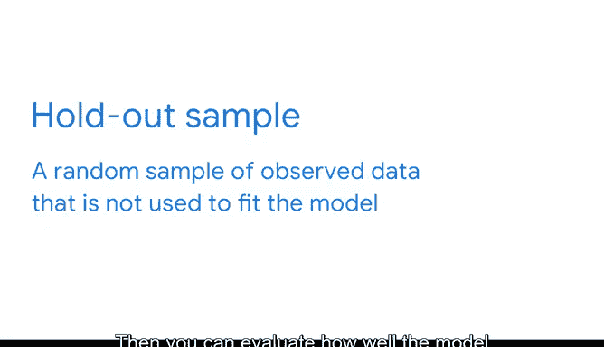

# 015：模型评估指标 📊

在本节课中，我们将学习如何评估线性回归模型的质量。我们将重点介绍一个核心评估指标——R平方，并探讨如何使用“保留样本”来测试模型的泛化能力。理解这些评估方法对于确保你的分析结果可靠、可信至关重要。

---

## 模型评估的重要性

到目前为止，我们已经完成了回归建模PACE框架中的“计划”和“分析”阶段。我们甚至通过实际构建一个线性回归模型，开始了“构建”阶段。

上一节我们介绍了模型的构建，本节中我们来看看如何评估这个模型。我很高兴能继续指导你进行模型评估。我们离“执行”阶段越来越近了，届时你将分享数据背后的故事。

使用多种评估指标可以增强数据专业人士对其分析所产生见解的信心。这些指标是负责任地传达结果的关键。如果模型不准确或不精确，那么基于这些见解所做的决策也可能不准确。

以下是三种你可能会遇到的评估指标：
*   **R平方**
*   **均方误差**
*   **平均绝对误差**

学术界、研究人员和数据专业人士在评估回归模型时使用的主要指标是**决定系数**，或称 **R平方**。所以我们将重点讨论它。

---

## 核心指标：R平方

你可能已经注意到，在你之前构建的OLS模型输出中，有一个部分标记为“R-squared”，这就是我们要讨论的。

**R平方**衡量的是**因变量 y** 的变化中，有多少比例可以由**自变量 x** 来解释。为了更透彻地解释这个指标，让我们再次思考一下关于企鹅和线性回归的例子。

你已识别出企鹅的喙长（毫米）与其体重（克）之间存在线性关系。根据你的回归分析，你找到了最佳拟合线：
`体重（克） = -1707.30 + 141.19 * 喙长（毫米）`

但是，数据点只是聚集在这条最佳拟合线周围。许多数据点实际上并不在线上。这意味着喙长只能解释体重变化的一部分。

R平方帮助数据专业人士确定X变量的变化在多大程度上解释了Y变量的变化。
*   R平方最大可以等于 **1**，这意味着x解释了y中100%的方差。
*   如果R平方等于 **0**，则意味着x解释了y中0%的方差。

OLS汇总表显示该模型的R平方为 **0.769**。这意味着喙长解释了体重中约 **77%** 的方差。体重中仍有约 **23%** 的方差是模型无法解释的。这种差异可能归因于其他因素，或是企鹅个体间自然存在的、无法解释的差异。

R平方没有一个必须达到的基准值，但一般来说，**R平方越高越好**，因为它能增强你基于分析所提建议的有效性。

---

## 提升评估：使用保留样本

R平方是一个有用的指标，可以帮助你评估模型，但还有一些流程可以加强模型的评估。

通常，当我们有一个数据集时，我们会使用至少一部分数据来构建和测试回归模型。计算机使用数据来计算实际值与预测值之间的差异度量，例如残差平方和。然后，基于计算机的计算，它可以找到最佳拟合线。

但有时，我们希望我们的模型能够很好地预测我们尚未收集或尚不存在的数据。例如，让我们回到当地动物园的企鹅。他们迎来了一群新的企鹅加入他们的“不会飞的鸟类”栖息地。如果能了解新企鹅的结构测量值与其体重的关系，将会很有帮助。

因此，在这些情况下，我们想知道我们构建的模型在它学习过的数据上表现如何，以及它在尚未见过的数据上表现如何。

在这种情况下，我们需要在构建模型之前保存一个**保留样本**。**保留样本**是观测数据的一个随机样本，不用于拟合模型。然后，你可以评估模型对用于构建模型的数据的拟合程度，也可以评估模型对保留样本的拟合程度。

---

## 总结

本节课中我们一起学习了评估线性回归模型的不同方法。我们重点探讨了**R平方**这一核心指标，它量化了模型解释数据变异的比例。我们还介绍了使用**保留样本**来测试模型泛化能力的重要性。掌握R平方和保留样本将在许多情况下为你提供帮助，使你能自信地分享你所发现的见解。我很期待很快能讨论“执行”阶段以及如何沟通模型发现。😊