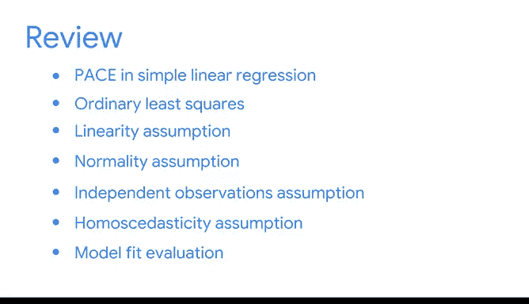

# 017：简化复杂数据关系》📊

## 概述

在本节课中，我们将总结简单线性回归分析的核心内容，并回顾你已经掌握的关键技能。我们将从模型构建、假设检验、评估方法到结果呈现，系统梳理整个分析流程。

---

## 回顾分析流程与工具

上一节我们完成了第一个回归模型的构建。现在，我们来总结你已添加到数据分析工具箱中的核心技能。

线性回归分析是数据科学的基础技术。目前你已经熟悉了在简单线性回归分析中遵循的 **PA** 流程：计划、分析、构建和执行。

以下是你在本阶段掌握的主要步骤：

*   **计划**：明确分析目标和变量。
*   **分析**：进行探索性数据分析并检验假设。
*   **构建**：使用Python和OLS方法构建模型。
*   **执行**：评估模型并解释结果。

---

## 掌握核心建模方法

在构建模型环节，你使用了普通最小二乘法进行估计。

你在Python中应用了**OLS**来获得最佳拟合线，这条线最小化了预测值与实际值之间的误差。其核心目标是找到参数，使得残差平方和最小，公式表示为：

**min Σ(y_i - ŷ_i)²**

---

## 理解并检验模型假设

接下来，你学习了简单线性回归的四个主要模型假设。

以下是需要满足的四个关键假设：

1.  **线性**：自变量和因变量之间存在线性关系。
2.  **残差的正态性**：模型的残差应近似服从正态分布。
3.  **观测值独立**：各个观测值之间相互独立。
4.  **同方差性**：残差的方差应保持恒定。

你通过探索性数据分析和Python实践，检验了数据是否满足这些假设，从而判断线性回归模型的适用性。

---

## 评估模型性能

你使用Python构建了模型，并学习了如何评估模型拟合优度。

评估主要依赖以下几个工具：

*   **R平方**：衡量模型解释数据变异的比例。
*   **保留样本**：通过将数据分为训练集和测试集来验证模型的泛化能力。
*   **不确定性度量**：如**置信区间**和**P值**，用于评估估计值的可靠性和显著性。

---

## 将分析结果转化为洞察

最后，你将数字和统计结果转化成了有说服力的故事。

你探索了企鹅数据集，展示了数据分析专业人员如何用清晰、简单的术语向他人呈现发现。你学习了在Python中创建可视化图表的价值，以便向利益相关者传达简单线性回归模型的结果。这是一项宝贵的技能，你将在整个数据分析旅程中持续使用。

---

## 总结与展望

本节课中，我们一起学习了简单线性回归的完整**PA**流程。你取得了长足的进步，应该为自己感到骄傲。

目前，我们已经完成了一次简单线性回归的完整循环，但学习并未止步。接下来，我们将把简单线性回归的知识扩展到多元线性回归模型。

简单线性回归非常适合处理只有一个自变量的问题。然而，问题越复杂，可能产生影响的因素就越多。这正是多元线性回归发挥作用的地方。

你取得了惊人的进步，正在成长为一名未来的数据分析专业人士。😊