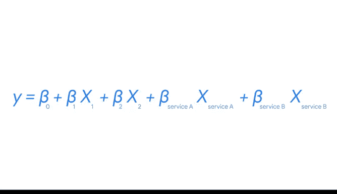

# 020：表示分类变量 📊

在本节课中，我们将要学习如何处理回归分析中的分类变量。具体来说，我们将探讨一种名为“独热编码”的数据转换技术，它能够将非数值型的分类数据转换为计算机可以理解的数值形式，从而将其纳入回归模型进行分析。

作为数据分析专业人员，你可能会遇到一些场景，其中感兴趣的变量不是连续的。这些变量可能是分类变量。例如，在分析网站点击量和广告效果时，一些广告是黑白的，而另一些是彩色的；或者一些广告包含行动号召，而另一些没有；又或者产品广告投放在不同的流媒体服务上。这些都是可能与网站收到的点击量相关的分类变量。

当我们有一个分类自变量时，必须将类别表示为数字，以便计算机理解数据。处理分类数据主要有两种方法：独热编码和标签编码。在本视频中，我们将学习独热编码。

## 什么是独热编码？ 🔢

独热编码是一种数据转换技术，它将一个分类变量转换为几个二元变量。

让我们以广告是否包含行动号召为例。我们会在数据中创建一个新变量，称之为 `action`，在数学上我们将其表示为 **`X_action`**。如果一则广告包含行动号召，则 **`X_action = 1`**。如果一则广告不包含行动号召，则 **`X_action = 0`**。

我们的回归方程将变为：
**`y = β_0 + β_1 * X_1 + β_2 * X_2 + β_action * X_action`**

其中，`X_1` 衡量广告中的人数，`X_2` 衡量广告的长度。现在，假设我们有两则广告，它们的 `X_1` 和 `X_2` 相同，但一则包含行动号召，另一则不包含。那么我们可以推断，包含行动号召的广告比不包含的广告多带来 **`β_action`** 次网站点击。

## 处理多类别变量 🧩

现在，让我们移除行动号召变量。如果我们感兴趣的是广告投放在哪个流媒体平台上呢？假设公司在三个服务上投放广告：A、B 和 C。同时假设广告一次只能在一个平台上播放。所以，如果一个广告在服务 A 上，它就不在服务 B 或 C 上。

现在我们有一个具有三种可能性的分类变量 `X`。为了表示两种可能性（有行动号召 vs 没有行动号召），我们使用了一个二元变量。为了表示三种可能性，我们需要两个二元变量。让我们看看这是如何运作的。

想象我们有一个二元变量 **`X_service_A`**。如果 **`X_service_A = 1`**，我们知道广告在服务 A 上播放。但我们也知道另外两条信息：广告不在服务 B 上播放，也不在服务 C 上播放。

如果 **`X_service_A = 0`**，我们只知道广告不在流媒体服务 A 上。广告可能在服务 B 或 C 上播放。由于信息缺失，我们需要另一个二元变量来帮助我们和计算机弄清楚情况。

让我们添加一个变量 **`X_service_B`**。如果 **`X_service_A = 1`**，我们已经掌握了所有信息：广告在服务 A 上播放，所以 **`X_service_B`** 必须等于 0（广告不在服务 B 上播放），我们也知道它不在服务 C 上播放。

但如果 **`X_service_A = 0`**，我们可以从 **`X_service_B`** 获取更多信息。如果 **`X_service_B = 1`**，那么我们知道广告在服务 B 上播放，进而知道广告不在服务 C 上播放。

最后，如果 **`X_service_A = 0`** 且 **`X_service_B = 0`**，那么我们知道广告既不在服务 A 也不在服务 B 上播放，所以广告必须在服务 C 上播放。现在，我们仅用两个变量就获得了所需的全部信息。

## 更新回归方程 📝

让我们再次修订方程。现在我们有了：
**`y = β_0 + β_1 * X_1 + β_2 * X_2 + β_service_A * X_service_A + β_service_B * X_service_B`**

你会注意到方程中没有变量 `X_service_C`，因为它不会为我们提供更多信息。但解释略有不同。我们可以将服务 C 视为默认的流媒体服务。

因此，**`β_service_A`** 表示两则完全相同的广告在网站点击量上的差异，其中一则广告在服务 C 上播放，另一则在服务 A 上播放。类似地，**`β_service_B`** 表示两则完全相同的广告在网站点击量上的差异，其中一则广告在服务 C 上播放，另一则在服务 B 上播放。

## 总结与展望 🎯

在本视频中，你学习了独热编码如何允许我们将一个分类变量转换为几个二元变量。现在，我们可以开始根据广告相关的变量来估计网站将获得多少点击量。

接下来，我们将介绍如何使用 Python 对分类变量进行独热编码。我们将一起重温回归建模的整个过程，包括模型假设、模型构建、模型评估和模型解释。

到目前为止做得很好，期待在下一个视频中与你相见！