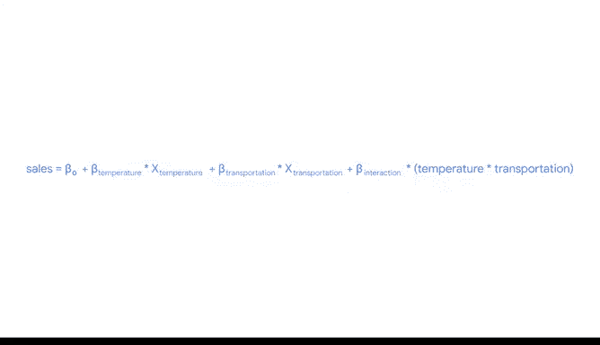

# 022：解释多元回归系数 📊

在本节课中，我们将学习如何构建多元线性回归模型，并详细解释其系数的含义。我们将从简单的线性回归入手，逐步过渡到包含多个变量以及变量间交互作用的复杂模型。

## 从简单线性回归开始

上一节我们介绍了简单线性回归的基本概念。本节中，我们来看看如何将其原理扩展到多个变量。

简单线性回归用于分析两个变量之间的关系。例如，我们绘制了气温与冰咖啡销量的数据，散点图显示数据点大致沿一条向上的对角线分布。

我们可以用一个简单的方程来描述这种关系：
`销量 = -44 + 2.2 * 气温`

这个结果可以解释为：**气温每升高1度，冰咖啡的销量预计会增加2.2份**。这个模型很好，可能解释了销量在大部分情况下的变化。

## 引入第二个变量：多元回归

但是，影响销量的因素不止气温。如果你在一家大型咖啡公司工作，你可能还想研究那些可控的因素，比如店铺选址或广告投放。

幸运的是，我们现在正在学习多元线性回归。作为数据分析师，你可以帮助公司回答这些问题。因此，我们在方程中增加一个变量：店铺附近是否有广告。

我们相应地修改方程：
`销量 = β₀ + β_气温 * X_气温 + β_广告 * X_广告`

这里的广告变量是一个**二元变量**，它只有两种可能的情况。

以下是两种具体场景的计算：

*   **场景一：附近有广告（X_广告 = 1）**
    假设气温是75华氏度。方程变为：
    `销量 = β₀ + β_气温 * 75 + β_广告 * 1`
    我们估计，广告的存在与销量的某个增长量（β_广告）相关。

*   **场景二：附近没有广告（X_广告 = 0）**
    在同样75华氏度的气温下，方程变为：
    `销量 = β₀ + β_气温 * 75 + β_广告 * 0`
    简化后得到：`销量 = β₀ + β_气温 * 75`
    此时，β_广告项因为乘以0而消失。没有广告时，销量仅仅是气温的函数。

## 解释连续变量的系数

现在，我们移除广告变量，引入一个新问题：店铺与公共交通站点的距离。

变量“交通距离”将衡量咖啡店距离公交、火车或地铁站有多少公里。方程变为：
`销量 = β₀ + β_气温 * X_气温 + β_交通距离 * X_交通距离`
其中，气温和交通距离都是连续变量。

对于这个模型，系数的解释需要遵循一个关键原则：

*   在**保持交通距离不变**的情况下，气温每升高1度，我们预计冰咖啡销量会增加 **β_气温** 份。
*   在**保持气温不变**的情况下，店铺离公共交通每远1公里，我们预计冰咖啡销量会减少 **β_交通距离** 份。

**注意：在解释多元回归中某个变量的系数时，必须假设其他变量保持不变。** 后面的数学原理会解释为什么必须这样做。

## 引入变量间的交互作用

到目前为止，我们讨论了如何处理几个独立的变量。但在某些情况下，我们可能预期两个变量会相互影响。

例如，在气温和交通距离的例子中，我们可能预期，在天气较凉时，交通距离对销量的影响会有所不同。如果我们想考虑两个变量的值如何共同影响结果，就需要引入一个**交互项**。

交互项代表了两个自变量之间的关系如何与因变量均值的变化相关联。通常，交互项用两个相关自变量的乘积来表示。

回到咖啡店销量的例子，如果我们怀疑交通距离对销量的影响会因气温不同而不同，就可以加入交互项“气温 × 交通距离”。

最初的方程是：
`销量 = β₀ + β_气温 * X_气温 + β_交通距离 * X_交通距离`

如果我们想包含气温和交通距离的交互作用，可以将方程修订为：
`销量 = β₀ + β_气温 * X_气温 + β_交通距离 * X_交通距离 + β_交互 * (X_气温 * X_交通距离)`
其中，交互作用用乘号 `*` 表示。

在这个例子中，我们通过加入交互项，考虑到了自变量之间的相互作用。在本课程中，我们将继续学习如何解读回归模型和系数的这些细微差别。

## 总结

本节课中我们一起学习了多元线性回归系数的解释方法。

我们从简单的单变量回归出发，理解了如何解释一个变量的系数。接着，我们引入了第二个变量，学习了在解释其中一个变量的系数时，必须**保持其他变量恒定**的原则。最后，我们探讨了更复杂的情况，即变量之间可能存在**交互作用**，并通过在模型中加入交互项（变量的乘积）来捕捉这种关系。

我们已经涵盖了很多内容，练习将帮助你建立对这些概念的信心。请花时间利用本课程提供的资源，帮助你使用多元回归、解释结果并讲述数据故事。接下来，我们将继续深入探讨多元回归。