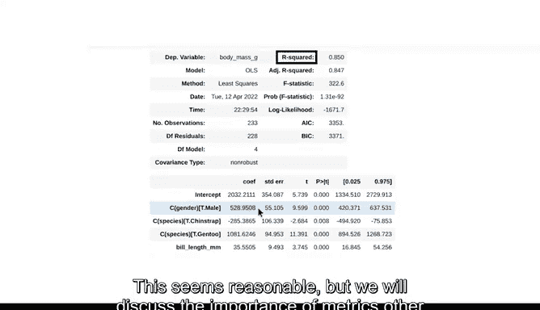

# 023：使用Python解释多元回归结果 🐧📊


在本节课中，我们将学习如何使用Python来运行和解释多元回归模型的结果。我们将以企鹅数据集为例，探索如何预测企鹅的体重，并理解模型中各个变量的影响。

---

我们已经探讨了多元回归能帮助我们回答的一些有趣且更复杂的问题，并概述了如何解释多元回归模型。现在，让我们转向Python。

与简单线性回归类似，我们将通过最小化残差平方和（一种误差度量）来找到最佳拟合线。虽然我们可以花大量时间一步步执行普通最小二乘估计，但Python有一些内置函数可以帮助我们构建模型。这样，作为数据分析专业人员，我们可以将时间用于探索数据和传达从计算中获得的见解。

我们将重新使用之前的企鹅数据集，看看是否能了解更多关于企鹅体重的信息。我们已经完成了一些探索性数据分析和数据清洗，并将数据保存为名为 `penguins` 的变量。

---

### 数据概览

首先，使用pandas的 `head` 函数快速查看数据摘要。

数据集包含四个不同的变量：以克为单位的体重、以毫米为单位的喙长、性别和物种。对于本问题，数据相对干净，你将尝试基于其他变量来预测体重。

---

### 准备数据

接下来，将数据划分为自变量（X）和因变量（Y）。这一步有助于为你将用于创建训练集和测试集的函数准备数据。

使用Scikit-learn库中的 `train_test_split` 函数来创建训练数据集和测试（或保留）数据集。首先导入该函数。

```python
from sklearn.model_selection import train_test_split
```

现在，使用准备好的数据将数据划分为训练集和测试集。

```python
X_train, X_test, y_train, y_test = train_test_split(X, y, test_size=0.3, random_state=42)
```

请注意，`test_size` 变量是你随机分配给测试数据集的数据比例。在本例中，你保留了30%的数据来测试模型。根据具体情况，保留更多或更少的数据可能是合适的。

`random_state` 变量不一定需要设置，但你将其赋值为42，以便可以复现我们的结果。你会在代码文档中经常遇到数字42。这个数字在一部流行的科幻小说中具有重要意义，并被计算机科学界广泛采用。如果你为 `random_state` 变量输入不同的值，你会得到不同的结果。输入什么数字并不重要，但设置 `random_state` 允许他人复现你的工作。

---

### 构建多元回归模型

现在，我们需要考虑我们的多元回归公式。我们的自变量是喙长、性别和物种。

我们将使用statsmodels模块来运行回归，就像你对简单线性回归所做的那样。statsmodels的普通最小二乘函数（OLS）需要知道你的回归公式。将其保存为一个变量。

```python
import statsmodels.formula.api as smf

ols_formula = 'body_mass_g ~ bill_length_mm + C(sex) + C(species)'
```

请注意，我们在性别和物种周围添加了大写字母C和括号。这种表示法让statsmodels的OLS函数知道性别和物种是分类变量。然后，该函数将对变量进行编码。

如果你尚未导入OLS函数，请使用以下代码行导入。数据已保存为名为 `ols_data` 的DataFrame。你可以将公式和DataFrame输入到OLS函数中。最后，使用OLS对象的 `fit` 方法将模型实际拟合到数据。

```python
model = smf.ols(formula=ols_formula, data=ols_data).fit()
```

---

### 解释回归结果

使用statsmodels的OLS函数的好处之一是，它为我们提供了一个相关统计量的紧凑摘要表。我们可以轻松找到每个自变量的系数、标准误差、t统计量、p值和置信区间。

这些值让我们能够快速、轻松地解释回归结果。使用 `summary` 函数访问OLS摘要表。

```python
print(model.summary())
```

以下是摘要表中关键部分的解读：

**解读系数与显著性**

让我们探索“系数”列下的“male”变量。有一行标记为 `C(sex)[T.male]`。变量的编码方式是：雄性为1，雌性为0。这意味着基线或参考点是雌性企鹅。因此，该系数表示仅在性别上不同的两只企鹅的体重差异。

假设雄性和雌性企鹅属于同一物种且具有相同的喙长，我们预计雄性企鹅的体重大约比雌性企鹅多528.95克。p值非常小，因此该系数具有统计显著性。

现在，考虑“bill_length_mm”所在的行。假设两只企鹅性别和物种相同，如果喙长增加1毫米，我们预计喙较长的企鹅体重大约会增加35.55克。p值非常小，因此该估计值具有统计显著性。

**评估模型拟合度**



OLS摘要表还提供了模型评估指标，如R平方。这里的R平方是0.85，表明你的模型解释了体重中约85%的方差。这看起来是合理的，但我们稍后将在处理多元线性回归时讨论除R平方之外的其他指标的重要性。

---

### 总结与探索

现在，你已经知道如何将模型拟合到数据并获取统计摘要表，并且探索了系数和p值。表中还有很多内容，因此你可以研究本课程中尚未涉及的任何指标。我们鼓励你仔细阅读本课的阅读材料，并亲自尝试代码。所有这些统计量构成了解释结果和与利益相关者沟通的基础。

到目前为止，做得很好。我们下次再见。