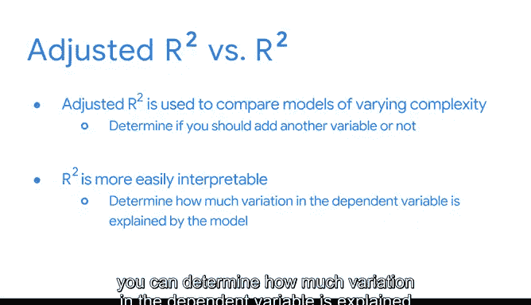

# 024：过拟合问题 🎯

在本节课中，我们将要学习回归分析中的一个核心挑战——过拟合问题。我们将了解什么是过拟合，它为何会产生，以及如何通过调整R平方和留出样本等方法来评估和预防它，从而构建更稳健的回归模型。

---

到目前为止，我们已经将简单线性回归扩展到了多元回归。多元回归是一个强大的工具，因为它允许我们回答各种各样的问题。每当我们使用几个不同的自变量来估计一个连续变量时，多元回归都是一个很好的第一步。

但是，每个工具都有其局限性。当我们最初讨论简单线性回归时，我们重点关注R平方，将其作为评估线性回归的最常用指标。

回顾一下，R平方是因变量y的方差中，由自变量x（或多个x）解释的比例。这似乎是一个合理且高度可解释的指标，用于确定线性回归模型的好坏。

如果你还记得，当我们检查多元回归模型的输出时，R平方仍然是列出的指标之一。但是，当我们开始向方程中添加更多自变量时，R平方就变得复杂了。

每当你向多元回归模型添加另一个自变量时，R平方都会无一例外地增加。但并非所有添加到模型中的变量都对理解y的变化有同等贡献。这是一个问题，因为高R平方可能具有误导性。

如果我们只是为了获得高R平方而不考虑每个变量的贡献，那么模型就会变得非常特定于构建它时所使用的数据。因此，该模型不再适用于更广泛的总体。作为数据分析专业人士，我们称这种现象为过拟合。

现在，既然我们了解了过拟合，我们将重点关注如何处理它。

---

### 理解过拟合 🧩

上一节我们介绍了R平方在多元回归中的局限性，本节中我们来看看什么是过拟合。

在数据领域，过拟合是指模型过于具体地拟合了观测数据或训练数据，以至于无法为总体生成合适的估计。回归模型的结论不再适用于我们试图得出结论的总体，而仅适用于用于构建模型的数据。

过拟合往往发生在模型过于复杂或包含过多变量时。

---

### 预防过拟合的策略 🛡️

了解了过拟合的定义后，我们需要知道如何预防它。以下是两种关键的评估技术。

**留出抽样**
防止过拟合的原因之一是我们使用像留出抽样这样的模型评估技术。留出抽样是指我们预留一部分已有的数据，但不用于拟合模型。通过使用留出样本，我们可以观察模型在尚未接触过的数据上是否表现同样良好。

**调整R平方**
除了留出抽样，我们还可以使用另一个称为调整R平方的指标来评估多元回归模型。调整R平方是R平方回归评估指标的一个变体，它会惩罚不必要的解释变量。就像R平方一样，调整R平方的取值范围也是0到1。

调整R平方用于比较不同复杂度的多个模型。而R平方在解释回归模型的结果时更有用，因为你可以确定因变量的变化有多少是由模型解释的。

---

### 总结与展望 📈

本节课中，我们一起学习了过拟合问题及其对回归模型的危害。我们探讨了使用留出抽样来验证模型泛化能力，以及使用调整R平方来更合理地评估包含多个变量的模型。

现在我们已经回顾了过拟合问题以及一些更好地评估多元回归模型的方法，我们可以转向变量选择。毕竟，我们需要一种方法来确定在模型中包含和排除哪些变量。我们将在本课后续部分兴奋地探索变量选择及其他技术。