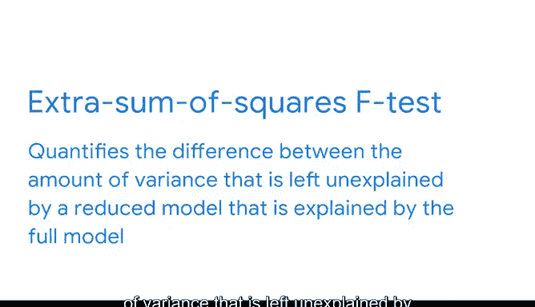

# 025：顶级变量选择方法 🎯

在本节课中，我们将学习如何为多元回归模型选择最合适的自变量。我们将重点介绍两种基于统计检验的逐步变量选择方法：**前向选择**与**后向消除**，并解释其背后的核心统计概念——**额外平方和F检验**。掌握这些方法能帮助你构建更简洁、更强大的预测模型。

---

## 模型评估与过拟合回顾

在之前的课程中，我们将**过拟合**定义为模型对观测数据或训练数据拟合得过于具体，以至于无法对总体生成合适估计的问题。

为了更好地评估模型质量并考虑过拟合，一种方法是使用**调整后R平方**。该指标会惩罚模型中不必要的变量。当我们需要比较使用不同自变量子集的多个模型时，调整后R平方最为有效。

上一节我们介绍了模型评估指标，本节中我们来看看如何系统性地选择进入模型的变量。

---

## 变量选择简介

**变量选择**，也称为**特征选择**，是确定在给定模型中应包含哪些变量或特征的过程。与本课程中讨论的许多过程一样，变量选择是迭代进行的。随着你成长为数据分析专业人士，你将培养出如何进行变量选择的更强直觉。

在本视频中，我们将介绍基于**额外平方和F检验**的**前向选择**和**后向消除**。这些简单的技术将使你能够继续探索多元回归的世界，并为后面将介绍的更高级技术做好准备。

---

## 前向选择 🚀

前向选择和后向消除本质上从问题的两个相反方向进行工作。我们知道，一个没有自变量的模型（零模型）可能不是最佳选择。同样，一个包含所有可能自变量的模型（全模型）也可能不是最佳选择。

**前向选择**是一种逐步变量选择过程。它从**零模型**（没有自变量）开始，并考虑所有可能添加的变量。根据所选指标和阈值，它将**对模型解释力贡献最大**的自变量纳入模型。该过程一次添加一个变量，直到没有更多变量可以添加到模型中。

以下是前向选择的核心步骤逻辑：
1.  从零模型开始。
2.  对于每个未被纳入的变量，计算将其加入模型后的统计量（如F检验的p值）。
3.  选择贡献最显著（如p值最小）的变量。
4.  如果该变量的显著性超过预设阈值，则将其加入模型。
5.  重复步骤2-4，直到没有变量满足加入条件。

---

## 后向消除 🔙

**后向消除**是一种逐步变量选择过程，它从**全模型**（包含所有可能的自变量）开始，根据所选指标和阈值，**移除对模型解释力贡献最小**的自变量。该过程一次移除一个变量，直到没有更多变量可以从模型中移除。

以下是后向消除的核心步骤逻辑：
1.  从包含所有候选变量的全模型开始。
2.  计算模型中每个变量的统计量（如p值）。
3.  找到贡献最不显著（如p值最大）的变量。
4.  如果该变量的显著性低于预设阈值，则将其从模型中移除。
5.  重复步骤2-4，直到所有剩余变量都满足保留条件。

---

## 额外平方和F检验 📊

前向选择和后向消除都需要一个截止点或阈值来决定何时添加或移除变量。一个常见的检验是**额外平方和F检验**。

该检验量化了**全模型**所解释的方差与**简化模型**（比全模型更简单的模型）未解释的方差之间的差异。公式的核心思想是评估增加或减少一个变量所带来的解释力变化是否具有统计显著性。

与其他假设检验一样，数据专业人员通常基于 **P值** 进行评估。如果与变量相关的P值很小（例如小于0.05），我们就有相当把握认为该变量解释了重要的方差。

我们将在本课程后面讨论假设检验和估计分类变量时，再次深入探讨F检验。

---

## 总结与展望

本节课中我们一起学习了变量选择的基础方法。我们涵盖了**前向选择**、**后向消除**以及**额外平方和F检验**。这为变量选择和在构建多元回归模型时做出有意识的决策提供了一个良好的开端。

接下来，我们将介绍如何使用Python执行变量选择，并继续探索控制过拟合的方法。