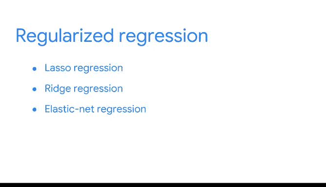

# 026：正则化-Lasso、岭回归和弹性网络回归 🎯

在本节课中，我们将要学习线性回归模型中的一个重要概念：正则化。我们将探讨模型过拟合问题、偏差-方差权衡，并介绍三种常见的正则化技术——Lasso回归、岭回归和弹性网络回归，以帮助我们构建更稳健的预测模型。

---

## 模型过拟合与偏差-方差权衡 ⚖️

上一节我们介绍了线性回归模型在影响商业决策和策略方面的多功能性。但没有任何工具是完美的。之前，我们介绍了当回归模型与训练数据拟合过于紧密，因而难以正确估计总体数据时，会出现过拟合问题。

过拟合问题与偏差-方差权衡有关，这是统计学和机器学习的核心概念。

偏差-方差权衡平衡了模型的两种特性：偏差和方差。为了最小化未观测数据的总体误差，理想的模型应具有一定偏差和一定方差。

*   **偏差**通过假设变量关系来简化模型预测。一个高偏差的模型可能会过度简化关系，导致对观测数据欠拟合，并产生不准确的估计。例如，给定一些数据，我们可以假设 `y = 2`，这就是一个高偏差模型。
*   **方差**允许模型具有灵活性和复杂性，使模型能够从现有数据中学习。但一个高方差的模型可能会对观测数据过拟合，并对未见数据产生不准确的估计。请注意，此处的方差不应与数据分布的方差混淆。

我们可以将偏差和方差想象成天平的两端。我们不希望偏差或方差过大。因此，作为数据专业人员，我们必须问自己：如何平衡一定的偏差和方差，以最小化误差并获得尽可能好的模型。

---

## 数据专业人员的持续学习之路 📚

谈到平衡，作为数据分析专业人员，我们必须平衡认知，即使随着经验增长，也总有更多东西需要学习。始终保持学习并避免自满至关重要，就像大家目前正在做的一样。

就个人而言，我每年至少参加两次会议，以了解行业动态并与其他数据专业人士建立联系。我也非常喜欢协作和提问，并发现通过这种方式从同事那里学到了很多。

要知道，在现阶段，大家已经拥有了非常扎实的基础，我们希望继续与大家合作，进一步扩展词汇量和工具包。

---

## 正则化回归简介 🛡️

现在，是时候学习正则化回归了。

正则化是一组回归技术，它将回归系数估计值向0收缩，通过缩小估计值来引入偏差以降低方差。正则化有助于避免模型过拟合的风险。

以下是三种常见的正则化技术：
*   **Lasso回归**
*   **岭回归**
*   **弹性网络回归**

我们不会深入探讨这些技术的所有数学基础，但本课程和网上有很多资源可供感兴趣的同学进一步探索。

---

## 三种正则化技术详解 🔧

对于所有三种正则化回归，都会引入一些偏差以降低模型方差。

*   **Lasso回归**：完全移除对预测目标变量 `Y` 不重要的变量。
*   **岭回归**：最小化相关性较低变量的影响，但所有变量都不会从方程中剔除。如果你想包含所有变量，岭回归是一个很好的选择。
*   **弹性网络回归**：在处理大型数据集时，我们并不总能确定是否希望变量从模型中剔除。此时，我们可以使用弹性网络回归，一次性测试Lasso、岭回归以及两者混合回归的益处。

每种正则化回归技术都试图帮助我们更好地拟合模型，但请记住，与简单线性回归或多元回归相比，其估计参数的解读要困难得多。

---

## 总结与展望 🌟

本节课中，我们一起学习了正则化和偏差-方差权衡的基础知识。我们了解到，正则化技术通过平衡模型的偏差和方差，可以有效防止过拟合，提升模型的泛化能力。

现在大家已经了解了正则化和偏差-方差权衡的基础知识，可以继续学习如何找到最佳的回归模型。请继续保持出色的学习状态，我期待与大家继续回归分析的探索之旅。