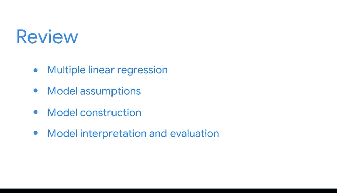

# 027：总结与回顾 📊

在本节课中，我们将对多元线性回归的核心内容进行总结，并深入探讨模型评估、过拟合问题及其解决方案。我们将从简单线性回归的扩展开始，逐步过渡到多元回归的假设检验、模型解释，最后重点讨论如何通过变量选择和正则化技术来提升模型的泛化能力。

***

## 从简单到多元：回归模型的扩展 🔄

上一节我们介绍了简单线性回归的基础。本节中我们来看看如何将其扩展到多元线性回归。

简单线性回归模型描述了一个自变量 **X** 和一个连续型因变量 **Y** 之间的线性关系，其公式为：
`Y = β₀ + β₁X + ε`

而多元线性回归则建模了两个或更多自变量与一个因变量之间的线性关系，公式扩展为：
`Y = β₀ + β₁X₁ + β₂X₂ + ... + βₙXₙ + ε`

允许使用多个自变量使数据分析师能够提出更多样化的问题。

***

## 多元线性回归的模型假设 ✅

我们回顾了简单线性回归的模型假设，并将其延伸至多元回归。以下是适用于多元线性回归的模型假设：

以下是需要检验的五个核心假设：
1.  **线性关系**：因变量与每个自变量之间存在线性关系。
2.  **观测独立性**：各个观测值之间相互独立。
3.  **残差正态性**：模型的残差近似服从正态分布。
4.  **同方差性**：残差的方差在所有预测值水平上保持恒定。
5.  **无多重共线性**：自变量之间不应存在高度相关性。

我们展示了如何使用数学方法、Python内置函数或探索性数据分析中的可视化方法来检验这些假设。其中，**多重共线性**是多元回归特有的重要假设，需要特别关注。

***

## 在Python中实现与解读多元回归 🐍

我们随后提供了一些在Python中编写多元回归代码的示例。编码多元回归与简单线性回归有相似之处，但也存在一些关键差异。

接下来，我们将重点放在如何**解读和评估**多元回归的结果上。由于现在涉及多个自变量，理解计算机输出对于提供准确、细致的分析叙事至关重要。

作为模型解释和评估的一部分，我们回顾了**过拟合**问题及其应对方法。

***

## 理解与应对过拟合问题 ⚖️

当模型与训练数据集或观测数据匹配得过于紧密，以至于无法预测未见数据或推广到总体时，就会发生**过拟合**。

为了对抗过拟合，我们讨论了两种变量选择技术：
以下是两种基于统计检验的变量选择方法：
*   **前向选择**：从一个空模型开始，逐步添加最显著的变量。
*   **后向消除**：从包含所有变量的模型开始，逐步移除最不显著的变量。

这两种方法都使用**额外平方和F检验**来决定是否添加或移除一个变量。

***

## 正则化：控制模型复杂度 🛡️

在总结变量选择之后，我们概述了**正则化**技术，它有助于防止过拟合。要理解正则化，需要先定义**偏差-方差权衡**，这是许多数据科学和机器学习模型决策的核心。

*   具有**高偏差**的模型可能**欠拟合**数据，使模型过于简化。
*   具有**高方差**的模型可能**过拟合**数据，使模型过于复杂。

我们介绍了三种正则化技术：
以下是三种通过增加偏差来减少方差的常用正则化方法：
1.  **Lasso回归**：在损失函数中添加回归系数绝对值之和作为惩罚项。
2.  **岭回归**：在损失函数中添加回归系数平方和作为惩罚项。
3.  **弹性网络回归**：结合了Lasso和岭回归的惩罚项。

在处理大型数据集时，正则化尤其有用，因为预先确定哪些变量重要或不重要可能很困难。

***

## 课程总结 🎯

本节课中我们一起学习了多元线性回归的完整流程。我们从简单线性回归的扩展出发，深入探讨了多元回归的模型假设、Python实现、结果解读与评估。我们重点分析了过拟合这一关键挑战，并学习了通过变量选择（如前向选择、后向消除）和正则化技术（如Lasso、岭回归、弹性网络）来提升模型泛化能力的方法。理解偏差-方差权衡是掌握这些模型优化技术的核心。

到目前为止，我们涵盖了许多概念。所有我们一起学习的内容都可供您随时复习。祝您好运，我们下次课再见。😊