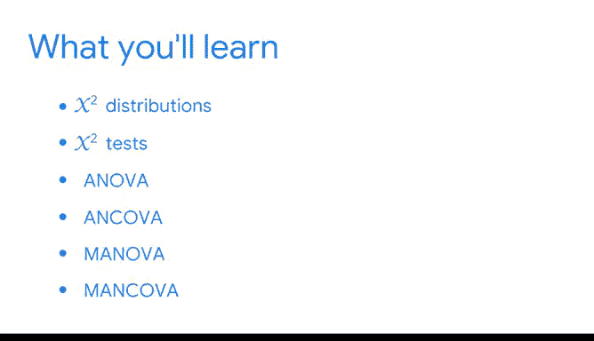

# 028：28_04_01_欢迎来到模块4

## 📊 课程概述

在本节课中，我们将学习如何扩展数据分析工具包，以处理分类变量。我们将重点介绍假设检验，特别是卡方检验，并预览方差分析等高级方法，从而能够探索更广泛的数据关系问题。

## 🔄 从回归分析到分类变量分析

上一节我们介绍了用于分析连续变量的线性和多元回归模型。这些工具能帮助我们探索诸如数字视频广告和平面广告如何共同影响产品销量等问题。

本节中，我们将开始更多地关注分类变量，通过引入更多假设检验方法来扩展我们的分析工具。这使我们能够提出并解答不同类型的问题。

以下是我们可以开始探索的新问题类型：
*   三个或更多组别之间的差异是否具有统计显著性？
*   观测数据的分布是否与我们的预期不同？

## 🧪 假设检验的核心作用

假设检验是一种统计程序，它使用样本数据来评估关于总体参数的假设。你通过检验关于总体的假设，来判断是否存在显著差异。

例如，在进行网站用户研究时，你可以使用假设检验来确定，使用不同网站布局的几个组别之间的用户参与度是否存在差异。你可以测试这样的假设：更改订阅按钮的颜色或图片的位置，可能会改变用户在网站上花费的时间。

## 🧰 组合使用分析工具

你可以利用数据工具箱中的不同模型和检验来回答各种问题。你也可以将一些技术结合使用。

例如，有时你可能希望将回归模型与假设检验或一系列假设检验结合起来使用。数据分析的核心原则适用于每一种技术：我们都希望探索并更好地理解不同变量之间的关系，并利用所学知识讲述关于数据的引人入胜的故事。

## 📈 选择合适的方法

根据我们拥有的数据类型，我们可以确定哪种检验或模型最合适。但有时，在确定回答问题的最佳方法之前，我们必须使用多种检验和模型。

## 🎯 本节重点：卡方检验

在本视频中，我们将从卡方分布和卡方检验开始。卡方是希腊字母表中的第22个字母，看起来很像英文中花体的大写X。我们的讨论将建立在之前关于T检验和假设检验的学习基础上。

卡方检验将帮助我们确定两个分类变量是否相互关联，以及一个分类变量是否遵循预期的分布。

例如，如果我们多次抛掷一枚两面硬币，我们预期大约有一半的次数某一面朝上，另一半的次数另一面朝上。

## 🔮 后续内容预览

接下来，我们将研究方差分析（ANOVA）及其变体：协方差分析（ANCOVA）、多变量方差分析（MANOVA）和多变量协方差分析（MANCOVA）。

通过重点分析分类数据来剖析变量关系，我们将能够扩展可有效使用的数据类型，从而为行业中的各种决策、策略和实践得出结论。

## 📝 本节总结

本节课中，我们一起学习了如何将分析重点从连续变量回归扩展到分类变量假设检验。我们回顾了假设检验的核心概念，介绍了卡方检验的用途，并预览了后续将学习的方差分析系列方法。这为我们使用更丰富的数据类型来支持决策奠定了基础。