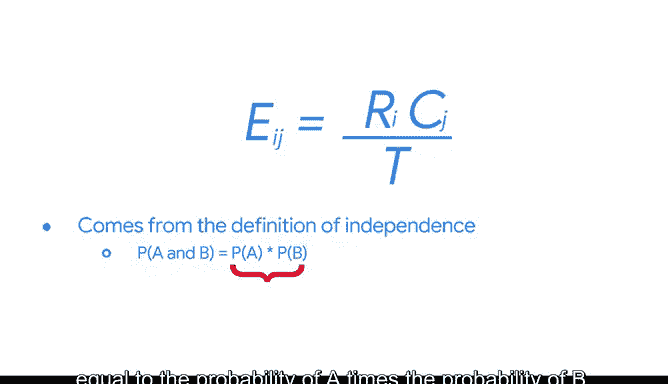

# 029：卡方假设检验 🧮

在本节课中，我们将学习两种用于分析分类数据的假设检验方法：卡方拟合优度检验和卡方独立性检验。我们将了解它们如何帮助我们比较观测数据与期望数据，并判断变量之间是否存在关联。

## 从T检验到卡方检验 🔄

上一节我们介绍了单尾和双尾T检验形式的假设检验。T检验帮助我们判断两个不同群体的均值是否存在显著差异。

本节中，我们将探讨如何判断我们的数据是否符合预期。我们将引入两种假设检验：卡方拟合优度检验和卡方独立性检验。这些检验将帮助我们比较期望数据和观测数据。

与T检验类似，在定义卡方检验时，我们也会重温零假设和备择假设的概念。

## 为何需要卡方检验？ 🤔

在使用线性回归时，我们主要关注连续变量。但如果我们的变量不是连续的呢？卡方检验可以处理涉及分类变量的问题。

例如，假设你在一个电影院工作，该影院销售小、中、大和超大份的爆米花。你有一份关于每种尺寸预期销售量的预测或图表。

仅凭观察，很难确定预期销量在统计上是否与观测销量相同。但你可以运行卡方拟合优度检验来回答这个问题。

## 卡方拟合优度检验 📊

卡方拟合优度检验用于确定一个观测到的分类变量是否遵循预期的分布。

作为前述电影院的数据从业者，你正在处理爆米花销售问题。一名员工声称，在任何一天，每种尺寸的订单都占25%。

现在，你可以根据某一天购买爆米花的人数创建一个计数表。假设昨天有100人购买了爆米花。那么你可以将百分比乘以总数，计算出表格中每个单元格的期望计数。

100的25%是25。因此，你预期有25人购买了每种尺寸的爆米花。

对于卡方拟合优度检验，零假设陈述为：在任何一天，每种尺寸的爆米花都有25人购买。基本上，零假设表明变量遵循预期分布。

如果我们接受零假设，那么我们可以说观测到的爆米花销售分布与员工声称的一致。

备择假设陈述为：变量不遵循预期分布。基本上，观测数据的分布与我们预期的分布存在显著差异。这意味着在任何一天，购买每种尺寸爆米花的人数不同。

在这种情况下，卡方统计量等于观测值减去期望值的平方，再除以期望值后的总和。

**公式：**
`χ² = Σ [ (观测值 - 期望值)² / 期望值 ]`

一旦你收集了关于爆米花销售的观测数据，就可以使用卡方统计量来计算P值，并在给定的置信水平下判断是否可以拒绝零假设。

## 卡方独立性检验 🔗

下一个检验称为卡方独立性检验，有时也称为同质性检验。卡方独立性检验用于确定两个分类变量是否相互关联。

例如，假设你想知道天气是否与爆米花销量有关。也许下雨时，人们更可能购买黄油爆米花。

为了陈述假设，你首先需要确定爆米花案例中的变量。第一个变量可以是是否下雨。第二个变量可以是购买爆米花的人数是否超过100人，或者是否少于或等于100人。

现在我们准备好陈述假设了。

独立性检验中的零假设是：变量是独立的，彼此没有关联。备择假设是：变量不是独立的，彼此有关联。

对于卡方检验，构建一个2x2的计数表以查看每个类别下有多少观测值非常重要。

假设我们拥有夏季和秋季爆米花销售的数据。共收集了275天的数据，包括83个下雨天和192个非下雨天。在135天里，超过100人购买了爆米花；在140天里，少于100人购买了爆米花。

然后，你可以用每个类别的天数计数来填充表格中的每个单元格。

接着，你可以使用以下公式计算2x2表格中每个单元格的期望值。

**公式：**
`期望值(第i行, 第j列) = (第i行总计 × 第j列总计) / 表格总计数`

这个公式源于独立性的定义：如果两个事件是独立的，那么它们同时发生的概率 `P(A 且 B)` 等于 `P(A) × P(B)`。

观测值就是第i行第j列单元格的计数。

然后，你可以使用与拟合优度检验相同的公式来计算卡方统计量。

与拟合优度检验一样，你可以使用卡方统计量来计算P值，并判断这两个分类变量是否独立。

## 总结 📝

本节课中，我们一起学习了两种重要的卡方假设检验。

*   **卡方拟合优度检验**：用于判断单个分类变量的观测分布是否符合某个预期分布。
*   **卡方独立性检验**：用于判断两个分类变量之间是否存在关联。

我们了解了如何根据问题建立零假设和备择假设，并介绍了计算卡方统计量的核心公式。这些检验将数据分析的能力从连续变量扩展到了分类变量，是数据分析师工具包中的重要组成部分。

在接下来的阅读材料中，我们将更深入地介绍卡方检验的一些假设条件以及如何执行这些检验。关键是将你已学过的假设检验概念与这些卡方检验联系起来。很快，你将能回答更多关于分类变量的问题。