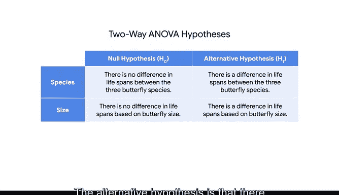

# 030：方差分析介绍 📊

在本节课中，我们将要学习方差分析。这是一种用于检验三个或更多组之间均值差异的统计方法。我们将了解其基本概念、类型以及如何构建假设。

充分了解我们的数据有助于我们确定能用数据做什么。它帮助我们理解可以运行哪些检验、不能运行哪些检验，以及如果我们对数据进行一些转换后可能可以运行哪些检验。

在之前的视频中，我们展示了连续变量和分类变量之间的区别。到目前为止，本课程的大部分内容都在讨论线性回归，它可以估计我们感兴趣的连续变量。但现实中存在大量的分类数据。此前，我们已经学习了卡方拟合优度检验和独立性检验。这两种检验都用于检查分类变量之间的关系。

现在，我们将重点介绍方差分析，它有助于检验分类变量与连续变量之间的关系。

## 什么是方差分析？🔍

方差分析通常被称为 ANOVA，是一组用于检验三个或更多组之间均值差异的统计技术。

如果这听起来很熟悉，你可能会想起 T 检验，这是一种常见的统计检验。方差分析是 T 检验的扩展。T 检验检验两组之间的均值差异，而方差分析可以检验多个组之间的均值。

假设你在一个植物园工作，你想知道不同种类的蝴蝶是否有不同的寿命。方差分析测试在这种情况下可以提供帮助。

## 方差分析的类型 📝

方差分析主要有两种类型：单因素方差分析和双因素方差分析。

### 单因素方差分析

单因素方差分析比较一个连续因变量在三个或更多组中的均值，我们将使用一个分类变量来代表这些分组。

以下是使用方差分析时的步骤：

1.  建立假设：我们有一个原假设和一个备择假设。
2.  设定场景：假设你正在测量三种不同蝴蝶物种的寿命：帝王蝶、晨衣蝶和燕尾蝶。
3.  提出原假设：你的同事认为，无论蝴蝶种类如何，寿命可能都是相同的。由于原假设是寿命相等，因此单因素方差分析是合适的。这意味着帝王蝶的寿命等于晨衣蝶的寿命，也等于燕尾蝶的寿命。

我们可以将原假设 H₀ 写作：μ_帝王蝶 = μ_晨衣蝶 = μ_燕尾蝶。

概括来说，当原假设声明每个组的均值相等时，我们可以使用单因素方差分析。

备择假设则是：这三种蝴蝶物种的寿命并不完全相同。用数学符号表达这一点有些困难，因此你可以在原假设前直接写上“并非”，即：并非 μ_帝王蝶 = μ_晨衣蝶 = μ_燕尾蝶。

只要有一个平均寿命不同，就足以拒绝原假设。我们将备择假设表示为 H₁。

### 双因素方差分析

单因素方差分析是一个很好的工具，但有时你可能会遇到这样的情况：有两个因素与连续因变量相关联。

在植物园的例子中，假设你想研究蝴蝶的寿命是否与蝴蝶的种类和蝴蝶的体型有关。想象一下，蝴蝶可以分为小、中、大三种体型。

现在，数据根据两个因素变化：种类和体型。双因素方差分析测试基于两个分类变量，比较一个连续因变量的均值。

以下是双因素方差分析中需要同时检验的三组假设：

1.  第一组假设：关注物种与寿命之间的关系。原假设声明三种蝴蝶物种之间的寿命没有差异。备择假设声明三种蝴蝶物种之间的寿命存在差异。
2.  第二组假设：关注我们的第二个新分类变量——体型。原假设是基于蝴蝶体型，寿命没有差异。备择假设是基于蝴蝶体型，寿命存在差异。
3.  第三组假设：检验两个变量之间的交互作用。这个概念可能在我们进行多元回归时就很熟悉了。原假设声明物种对寿命的影响独立于蝴蝶体型的影响，反之亦然。备择假设声明蝴蝶体型和物种对寿命存在交互影响。

## 总结与过渡 🎯

在本节中，我们一起学习了方差分析的基本概念及其两种主要类型：单因素和双因素方差分析。我们还学习了如何为蝴蝶场景中的每种检验陈述原假设和备择假设。

回归分析让你理解自变量如何影响因变量。方差分析则允许你聚焦于其中的一些关系，通过以成对的方式解析关系来讲述一个完整的故事。

做得很好。在下一个视频中，我们将学习计算机和 Python 如何帮助我们运行方差分析检验。