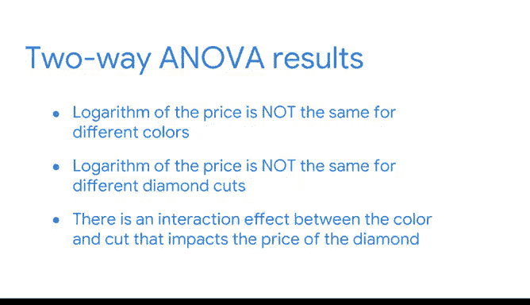

# 031：简化复杂数据关系》📊


在本节课中，我们将学习如何使用Python进行单因素与双因素方差分析检验。我们将通过一个钻石价格的数据集，探索不同变量（如颜色、切工）如何影响价格，并理解方差分析与回归分析在讲述数据故事时的不同作用。

---

## 概述：回归分析与方差分析的核心

我们所有回归分析和统计的核心是讲述数据故事。我们希望理解不同变量之间的关系。

虽然回归分析和方差分析可以帮助回答相似的问题，但在特定情况下，其中一种方法可能更有用。回归分析有助于全面了解多个不同变量是否以及如何影响一个结果变量。另一方面，方差分析有助于解构这些变量子集之间的成对比较，以更好地理解推动回归分析的各元素之间的细微差别。

方差分析就像一个放大镜，可以聚焦于回归故事的特定部分。

---

## 使用Python探索单因素方差分析

现在，让我们使用一个关于钻石的数据集子集来在Python中探索方差分析。您可以通过Seaborn库加载原始数据集。我们已经清理了数据并转换了一些变量。我们有两个变量：钻石价格的对数和每个钻石的颜色等级。

以下是加载和初步探索数据的步骤：

1.  使用pandas加载CSV文件。
    ```python
    import pandas as pd
    df = pd.read_csv('diamonds_cleaned.csv')
    ```
2.  加载数据集后，检查数据。导入seaborn包并绘制箱线图，以确定价格如何随颜色等级变化。
    ```python
    import seaborn as sns
    sns.boxplot(x='color', y='log_price', data=df)
    ```
    数据集中有几种不同的颜色等级：D、E、F、H和I。价格的对数似乎存在一些差异，但尚不清楚是否基于颜色等级存在显著差异。

因此，让我们使用单因素方差分析进行检验。您将使用StatsModels模块。

首先，使用OLS函数创建一个回归模型，然后使用`fit`方法将模型拟合到数据。这将允许您使用Anova函数来查看组间价格是否存在统计学上的显著差异。

**请注意**：在OLS公式中，必须在`color`周围添加大写字母C和括号，以指示`color`是一个分类变量。
```python
import statsmodels.api as sm
from statsmodels.formula.api import ols

# 拟合模型
model = ols('log_price ~ C(color)', data=df).fit()
```

基于模型结果，您可以观察到钻石颜色和价格之间存在统计学上的显著关系，但尚不清楚不同颜色之间的价格是否存在差异。为了了解更多信息，您可以运行单因素方差分析检验。

您可以使用`statsmodels`的`anova_lm`函数创建方差分析表。该表将为您提供关于颜色变量的统计信息。

回想一下，单因素方差分析检验基于一个连续因变量，比较一个分类自变量的三个或更多组。

让我们陈述零假设和备择假设：
*   **零假设**：基于颜色等级的钻石价格没有差异。
*   **备择假设**：基于颜色等级的钻石价格存在差异。

**请注意**：方差分析有不同类型（1型、2型和3型），您可以在文档中阅读相关内容。
```python
from statsmodels.stats.anova import anova_lm
anova_table = anova_lm(model, typ=2)
print(anova_table)
```
方差分析表为您提供了颜色变量及其残差的平方和与自由度，以及颜色变量的F统计量和P值。

从结果来看，P值非常小，这意味着您可以拒绝“所有钻石颜色等级的价格均值相同”的零假设。

---

## 探索双因素方差分析

现在，让我们在分析中添加另一个分类变量：钻石的切工。数据中包含三种切工类型：理想、优质和非常好。

您可以加载已经清理好的数据。您将执行与之前相同的操作，首先拟合一个回归模型，但方程将处理切工和颜色之间可能的交互效应。

冒号表示颜色和切工这两个分类变量之间的交互作用。
```python
# 加载包含切工的数据
df_with_cut = pd.read_csv('diamonds_with_cut.csv')

# 拟合包含交互项的双因素模型
model_two_way = ols('log_price ~ C(color) + C(cut) + C(color):C(cut)', data=df_with_cut).fit()
```

在运行双因素方差分析检验之前，让我们回顾一下将要检验的三对假设：
1.  第一对是关于基于颜色的钻石价格的零假设和备择假设。
2.  第二对是关于基于切工的钻石价格的假设。
3.  最后一对是关于颜色和切工对钻石价格的交互作用的假设。

现在，使用相同的`anova_lm`函数获取双因素方差分析检验的结果。
```python
anova_table_two_way = anova_lm(model_two_way, typ=2)
print(anova_table_two_way)
```
该表包含两行，分别对应两个分类变量，以及一行对应切工和颜色之间的交互作用。

由于所有三者的P值都非常小，因此您可以拒绝所有三个零假设。

---

## 总结与结论 🎯



在本节课中，我们一起学习了单因素和双因素方差分析的差异、零假设与备择假设，以及如何在Python中编写代码并解释结果。

总结如下：
*   价格的对数对于不同的颜色并不相同。
*   价格的对数对于不同的钻石切工也不相同。
*   最后，颜色和切工之间存在影响钻石价格的交互效应。

到目前为止，我们已经涵盖了很多内容。在接下来的视频和阅读材料中，我们将继续探索方差分析检验的强大功能。