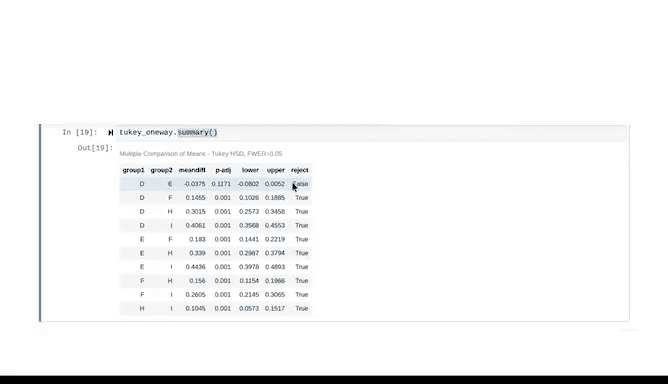

# 032：使用Python进行方差分析事后检验 🧪


在本节课中，我们将要学习如何在进行方差分析后，进一步使用事后检验来确定具体是哪些组之间存在显著差异。我们将重点介绍Tukey HSD检验，并使用Python代码来实现它。

---

## 概述

上一节我们介绍了方差分析，它可以帮助我们判断一个分类变量是否对一个连续变量有显著影响。然而，ANOVA的结果只能告诉我们“至少有一组是不同的”，但无法指明具体是哪几组不同。本节中，我们来看看如何使用**事后检验**来解决这个问题。

## 为什么需要事后检验？

当我们对三个或更多组进行比较时，ANOVA的零假设（H₀）是：所有组的均值都相等。如果结果显著，我们只能拒绝这个零假设，得知并非所有均值都相等。

**公式表示零假设：**
H₀: μ₁ = μ₂ = ... = μₖ

但在实际应用中，我们往往需要知道具体是哪些组之间存在差异。例如，在比较多种建筑材料的强度时，工程师需要确切知道材料A是否强于材料B。

直接进行多次两两t检验会带来一个问题：**多重比较谬误**。每进行一次检验，都有一个小概率（如5%）犯**第一类错误**（错误地拒绝真实的零假设）。检验次数越多，至少犯一次错误的总体概率就会迅速增加。

事后检验（如Tukey HSD）在**一次性比较所有组对**的同时，会控制这个整体错误率。

## 实施Tukey HSD检验

以下是使用Python进行Tukey HSD检验的步骤。我们继续使用钻石数据集，探究颜色对价格的影响。

首先，确保你已经导入了必要的包并加载了数据。

```python
# 假设已从之前课程导入包和数据
# diamonds = pd.read_csv(...)
# 创建线性模型
import statsmodels.api as sm
from statsmodels.formula.api import ols

model = ols('price ~ C(color)', data=diamonds).fit()
```

### 步骤一：执行单因素方差分析

在进行事后检验前，必须先确认ANOVA结果是显著的。

```python
# 执行ANOVA
anova_table = sm.stats.anova_lm(model, typ=2)
print(anova_table)
```

如果输出的P值（`PR(>F)`）远小于0.05，则结果显著，可以拒绝“所有颜色等级钻石均价相同”的零假设。

### 步骤二：导入并运行Tukey HSD检验

接下来，我们从`statsmodels`模块中导入函数并进行事后检验。

```python
# 导入Tukey HSD函数
from statsmodels.stats.multicomp import pairwise_tukeyhsd

# 运行Tukey HSD检验
tukey_results = pairwise_tukeyhsd(endog=diamonds['price'],  # 连续变量（因变量）
                                  groups=diamonds['color'],  # 分类变量（组别）
                                  alpha=0.05)               # 显著性水平
```

**参数说明：**
*   `endog`: 需要比较的连续变量（本例中是价格）。
*   `groups`: 定义组别的分类变量（本例中是颜色）。
*   `alpha`: 显著性水平，通常设为0.05，对应95%的置信度。

### 步骤三：解读结果

你可以通过两种方式查看检验结果。

**方法一：使用摘要函数**
```python
print(tukey_results.summary())
```

**方法二：直接打印结果（更直观的表格）**
```python
print(tukey_results)
```

输出结果将包含所有颜色等级之间的两两比较。以下是需要关注的核心列：

*   `group1` & `group2`: 正在比较的两个组。
*   `meandiff`: 两组均值的差值。
*   `p-adj`: **调整后的P值**。这是控制了多重比较后的P值，是我们做判断的依据。
*   `lower` & `upper`: 均值差值的95%置信区间。
*   `reject`: 最重要的列。如果显示`True`，则可以在0.05的显著性水平上**拒绝零假设**，认为这两组的均值存在显著差异。如果显示`False`，则不能拒绝零假设，认为两组均值无显著差异。

**结果解读示例：**
假设比较H级和I级钻石，`reject`列为`True`，且`p-adj`为0.001。这意味着我们可以拒绝“H级和I级钻石价格相同”的零假设，结论是这两种颜色等级的钻石价格存在统计上的显著差异。

---



## 总结

本节课中我们一起学习了方差分析的事后检验。我们了解到，当ANOVA结果显示显著时，可以进一步使用像**Tukey HSD**这样的检验方法来精确找出具体是哪些组对之间存在差异。这种方法通过控制整体错误率，解决了多重比较带来的问题。我们使用Python代码完整演示了从ANOVA到Tukey HSD检验的流程，并学会了如何解读输出结果中的调整后P值和拒绝决策列。

掌握这些组合工具，能让你更深入、更准确地分析分类变量对结果的影响。