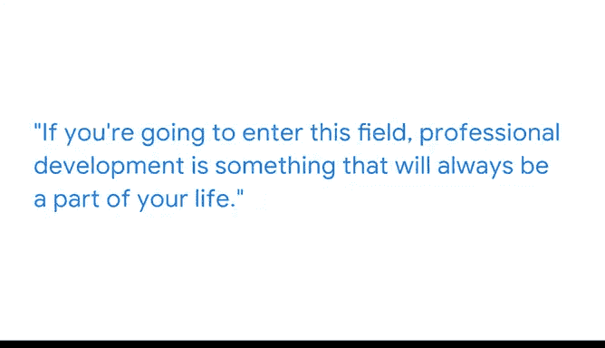

# 033：职业发展各阶段的发现 🧭

在本节课中，我们将跟随经济学家伊格纳西奥的分享，了解数据分析师在职业生涯不同阶段的学习与成长路径。我们将探讨如何持续学习新技能，以及如何将所学应用于实际工作，从而推动职业发展。

## 个人背景与职业轨迹

我的名字是伊格纳西奥，我是首席经济学家团队的一名高级经济学家。我出生在阿根廷。出生在阿根廷的一个中产阶级家庭意味着，在我成长的关键岁月里，我经历了所有你能想象到的经济危机。这可能让我对经济学产生了兴趣，有些人称经济学为“最初的数据科学”。我开始在公共政策领域工作，试图帮助卫生和教育领域的决策者利用数据来为他们必须做出的艰难决策提供信息。

在从事了五年公共政策工作后，我转入了科技行业，开始在谷歌工作。在这里，我使用同样的工具包来为商业决策提供信息。

## 持续学习的重要性

如果你要进入这个领域，职业发展将是你生活中始终存在的一部分。

当我完成博士学位时，我认为自己已经掌握了工具包，可以去回答任何问题了。但事实并非如此。在我开始第一份政策研究工作后不久，我记得一位资深的统计学家来找我，他说我做的工作很棒，但如果使用一些不同的工具，效果会好得多。我很快意识到，有些东西是我可以在工作中学习，但在研究生院没有学到的，这些知识能帮助我把工作做得更好。

我做出了投资自己的决定。这基本上意味着，在周末我会早起，观看别人推荐给我的YouTube讲座，或者阅读别人推荐的书。一旦我学会了我想学的东西，我记得当时和我的老板说：我们刚刚为客户做了这件事，但现在我想用不同的方式再做一次。我也想展示给他们看，看看他们的想法如何。

到我离开上一份工作时，我100%的工作都在使用我在工作期间学会的新工具包。我预计，五年后我将要使用的工具，很可能几乎全是我现在还没学过的东西。

## 给学习者的建议

所以，你可能即将完成你的高级数据分析认证，并且正在问自己接下来该做什么。我的猜测是，你是一个自我驱动的人，可以自学。如今做到这一点相当容易，因为资源可以在网上免费获取。

以下是你可以利用的资源和方法：
*   你可以在家参加虚拟会议。
*   你可以在YouTube上观看讲座。
*   你可以关注经济学领域的推特，了解方法论上的最新创新，这些可能有助于你解决当天正在处理的商业问题。

一旦你开始进入这个世界，你就可以深入探索，学习越来越多的知识。

## 总结

本节课中，我们一起学习了数据分析师职业发展的核心：**持续学习**。从伊格纳西奥的经历中我们看到，学术教育只是起点，真正的专业成长来自于在工作中主动学习新工具和方法。利用丰富的在线资源，保持好奇心并深入探索，是适应快速变化的领域、保持职业竞争力的关键。请记住，你今天掌握的工具可能在未来被更新、更好的工具所取代，因此，将学习视为一项终身事业至关重要。