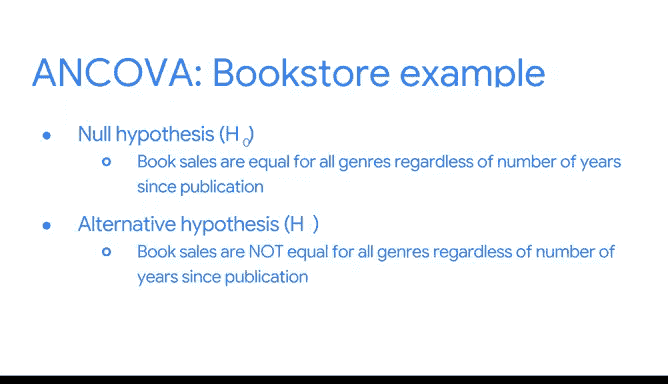

# 034：协方差分析 📊

在本节课中，我们将要学习一种名为“协方差分析”的统计方法。它可以帮助我们在控制其他变量影响的前提下，更准确地比较不同组别之间的差异。

---

## 从方差分析到协方差分析

上一节我们介绍了方差分析，它用于比较不同分组下连续型因变量的均值差异。然而，现实中的数据关系往往更复杂。

本节中我们来看看协方差分析。这是一种统计技术，用于在控制一个或多个协变量影响的同时，检验三个或更多组别之间的均值差异。

**协变量**是指那些并非我们直接研究兴趣所在，但可能对结果变量产生影响的其他变量。通过控制协变量，我们可以更清晰地分离出我们感兴趣的**分类自变量**与**连续型因变量**之间的关系，从而得出更准确的结论。

---

## 为何使用协方差分析？🤔

你可能会问，既然我们已经有了线性回归分析，为何还需要协方差分析？两者确实有许多相似之处。

例如，两者都允许包含连续型和分类型的自变量，都关注一个连续型的因变量，并且都致力于理解变量间的关系。

但它们的**使用场景**取决于我们最想理解哪个变量：
*   在**协方差分析**中，我们并不聚焦于协变量本身，而是通过纳入协变量来更清晰地理解分类自变量的效应。
*   在**回归分析**中，我们可能对所有自变量都感兴趣，或者专注于利用模型对未知数据进行预测。

---

## 协方差分析实例：书店销售

让我们通过一个例子来具体理解协方差分析能帮助我们回答什么问题。

假设你在一家书店工作，想研究图书**体裁**与**销量**之间的关系。新书往往因为作者宣传而获得更多关注，因此出版年份可能是一个干扰因素。

以下是该分析中的关键要素：
*   **分类自变量**：图书体裁
*   **协变量**：书籍自出版以来的年数
*   **连续型因变量**：过去一个月的图书销量

在进行任何假设检验前，明确假设至关重要：
*   **零假设**：在控制出版年份后，所有体裁的图书销量均值相等。
*   **备择假设**：在控制出版年份后，并非所有体裁的图书销量均值都相等。

运行检验后（例如使用Python），我们主要关注**P值**。通常，如果P值小于0.05，我们就有足够的证据拒绝零假设，即认为在控制协变量后，不同体裁的销量存在显著差异。

---

## 总结与回顾

本节课中我们一起学习了协方差分析。我们了解到，它是方差分析的扩展，通过控制**协变量**来更精确地评估分类变量对结果的影响，避免得出有偏差的结论。

我们已经涵盖了单因素方差分析、双因素方差分析、协方差分析以及各种线性回归模型。这些都是数据分析专业人员需要掌握的重要概念。请记住，你无需死记硬背所有公式和细节。关键在于理解其核心思想与应用场景。在实际项目中，你可以随时回顾课程、搜索资料或请教他人来解决问题。

祝你学习顺利！继续探索有趣的问题，并用数据讲述引人入胜的故事吧！🚀