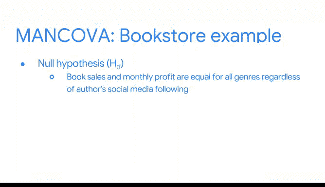

# 035：MANOVA与MANCOVA 🧮

在本节课中，我们将学习如何将分析模型从单一因变量扩展到多个因变量。我们将介绍多元方差分析（MANOVA）和多元协方差分析（MANCOVA），了解它们与之前学过的ANOVA和ANCOVA的关系，并探索其应用场景。

回顾你的数据分析学习之旅，你已经从最基本的模型和检验出发，逐步构建并扩展了它们，使其能够包含更多变量和不同类型的数据。在探索各种模型的过程中，你遇到了可以回答的不同问题以及每种模型的不同用例。

上一节我们介绍了从ANOVA到ANCOVA的转变，这类似于将简单线性回归扩展到多元回归。我们通过添加更多自变量来帮助分离每个X变量对Y变量的影响。本节中，我们将添加更多因变量，以便进行全新且不同类型的比较分析。

我们将要介绍的两种检验是MANOVA和MANCOVA。从名称上你可能已经猜到它们与ANOVA和ANCOVA的关系。

## MANOVA：多元方差分析 📊

MANOVA，即多元方差分析，是ANOVA的扩展。它用于比较两个或多个连续结果变量如何根据分类自变量的不同而变化。与ANOVA类似，MANOVA最常见的两种形式涉及一个或两个分类自变量，分别被称为单因素和双因素MANOVA。

以下是使用MANOVA的关键前提：
*   自变量必须是分类变量。
*   结果变量必须是连续变量。

由于我们仍在处理假设检验，因此需要一些假设来进行检验。让我们回到书店的例子，生成并检验关于影响图书销售因素的新假设。

假设我们有一个分类变量：图书类型。两个连续的因变量可以是：每月售出的图书数量和图书销售的利润。

如果我们进行的是单因素MANOVA检验，那么：
*   零假设（H0）是：对于每一种图书类型，两个连续变量的均值都相等。即，每种图书类型的月销量相同，且每种图书类型的销售利润也相同。
*   备择假设（H1）是：对于每一种图书类型，两个连续变量的均值并不都相等。这表明，在我们所考察的结果变量中，至少有一个变量在不同图书类型间存在差异。

例如，自助类书籍的利润可能与科幻类书籍的利润不同，或者每月售出的图像小说数量可能与历史小说不同。无论哪种情况，你都可以拒绝零假设。

MANOVA允许我们将每个数据点视为具有多个特征（即我们想要理解的连续Y变量），这些特征基于我们关心的一组或两组分类（即一个或两个分类X变量）。

## MANCOVA：多元协方差分析 🎯

然而，如果我们只对一个分类变量感兴趣，但希望控制另一个变量的影响，我们可以使用MANCOVA。

MANCOVA，即多元协方差分析，是ANCOVA和MANOVA的扩展。它在控制一个或多个协变量的同时，比较两个或多个连续结果变量如何根据分类自变量的不同而变化。

假设你仍然关心图书类型是否与销量和利润有关，但你想控制作者知名度的影响。那么你可以使用MANCOVA。

以下是MANCOVA的变量设置：
*   分类X变量仍然是：图书类型。
*   但现在你增加了一个协变量：作者在各大社交媒体平台上的粉丝数量（这是你正在控制的变量）。
*   两个Y结果变量保持不变：每月售出的图书数量和月利润。

在这种情况下：
*   零假设（H0）是：在控制作者社交媒体粉丝数的情况下，所有图书类型的销量和月利润均相等。
*   备择假设（H1）是：在控制作者社交媒体粉丝数的情况下，所有图书类型的销量和月利润并不都相等。

## 总结与展望 🚀

本节课中，我们一起学习了如何通过引入多个因变量来扩展我们的分析工具。我们探讨了MANOVA和MANCOVA，理解了它们作为ANOVA/ANCOVA的多元版本，在同时分析多个连续结果变量时的应用。

随着你继续扩展你的数据分析工具包，你会遇到更多相互构建的检验、工具和模型。作为一名数据专业人士，识别这些方法之间的关联及其适用场景至关重要。期待你继续检验各种假设，探索数据的奥秘。