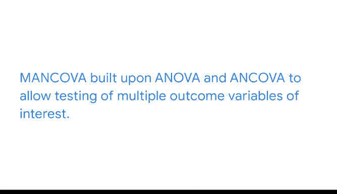

# 036：分类变量分析总结 📊

在本节课中，我们将总结关于分类变量分析的一系列方法。我们回顾了如何利用不同的统计工具探索分类变量，从而从数据中揭示更丰富的信息。

---

到目前为止，我们所涵盖的内容让我们能够以多种方式探索分类变量。我们充分利用了与分类变量相关的各种工具。我们将能够在数据中讲述更多样化的故事。毕竟，我们是科学家。有时我们需要尝试多种检验，才能弄清数据所蕴含的故事。

从理解单个分类变量开始，我们研究了**卡方拟合优度检验**。该检验用于确定一个变量是否符合理论分布。

接着，**独立性检验**帮助我们判断两个分类变量是否相互独立。

---

在超越卡方分布后，我们发现了**方差分析**。方差分析构成了本节所涵盖的所有其他检验的基础。

**单因素方差分析**是一种强大的方法，用于确定您感兴趣的组别之间，在一个连续结果变量上是否存在差异。其核心思想是比较组间方差与组内方差。

**双因素方差分析**让您能获得类似的洞察，同时还能纳入另一组分组因素。

**协方差分析**在方差分析的基础上，允许我们控制另一个变量，从而将分组效应与协变量的影响分离开来。

**多元协方差分析**则在方差分析和协方差分析的基础上，允许对多个感兴趣的结果变量进行检验。

与任何假设检验一样，所有这些检验都有**原假设**和**备择假设**。陈述这些假设有助于阐明您希望通过运行这些检验学到什么。

---

我鼓励您继续使用假设检验来处理各种场景。您提出的问题越多，数据揭示的信息就越多。请记住每种检验的数据要求，并且始终存在出错的空间。通过练习和时间，您很快就能讲述令人印象深刻的故事。

下次课程再见。