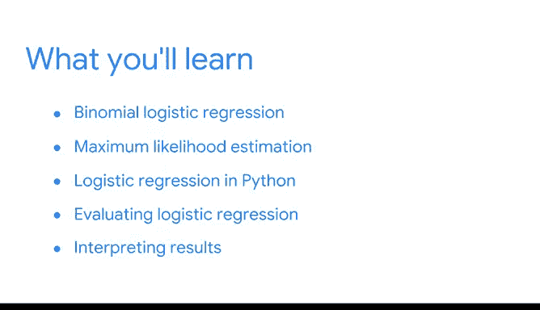

# 037：37_05_01_欢迎来到模块5

## 📚 课程概述

在本节课中，我们将学习逻辑回归分析。我们将探讨如何使用逻辑回归来建模事件发生的概率，并理解其与线性回归的区别。课程将涵盖逻辑回归的基本概念、适用场景以及分析流程。

很高兴再次与大家相聚。当我们学习线性回归时，我们开始思考回归分析能帮助我们回答的各种问题。例如，我们可以考虑影响企鹅体重的因素，或者影响网站点击率的因素。

现在，我们将扩展所能提出的问题类型。本次课程将重点放在建模事件发生的概率上。

有许多问题值得我们探索。例如，哪些因素会影响客户再次从公司购买产品的几率？什么会影响员工获得高绩效评级的可能性？什么因素促使用户对视频发表评论或不发表评论？

逻辑回归可以在这些情况下帮助我们。

## 🔍 逻辑回归核心概念

上一节我们回顾了回归分析的应用范围，本节中我们来看看逻辑回归的具体定义。

请记住，逻辑回归是一种基于一个或多个自变量 `X` 来建模分类因变量 `Y` 的技术。因变量可以有两个或更多可能的离散值。

我们将主要关注**二项逻辑回归**。它基于一个或多个自变量，对观测值落入两个类别之一的概率进行建模。我们使用一个二元变量 `Y` 来指示类别。

例如，假设你是一名为篮球队工作的数据专业人员，你想了解球队中任何一名球员在一场比赛中得分超过10分的概率。

你可能需要考虑许多变量。例如，该球员上赛季表现如何？他们的平均上场时间是多少？他们本赛季得了多少分？

这看起来可能像一个多元线性回归问题，但请考虑结果变量：球员在一场篮球比赛中得分是否会超过10分。这是一个二元结果变量。

由于只有两种可能的结果，我们无法像线性回归那样绘制最佳拟合线。

例如，如果你绘制上场时间与球员得分是否超过10分的关系图，你的数据看起来会是两条水平线：一条在 `y = 0` 处，一条在 `y = 1` 处。这与你在先前场景中观察到的线性关系非常不同。

在后续课程中，我们将更深入地学习二项逻辑回归，并回顾回归分析的阶段和步骤。

我们将通过尽可能理解模型假设来分析数据，并确保我们有一个二元结果变量。我们将构建模型并使用几种不同的指标对其进行评估。然后，我们将执行分析并与利益相关者和其他团队成员分享结果。

## 🚀 课程启动

逻辑回归是一个多功能且强大的模型，我很高兴能与大家一起探讨。让我们开始吧。

## 📝 本节总结

本节课中，我们一起学习了逻辑回归的引入和基本概念。我们明确了逻辑回归适用于对二元或多元分类结果进行概率建模的场景，并指出了其与线性回归在处理分类变量时的根本区别。下一节我们将开始深入逻辑回归模型的具体构建与评估方法。