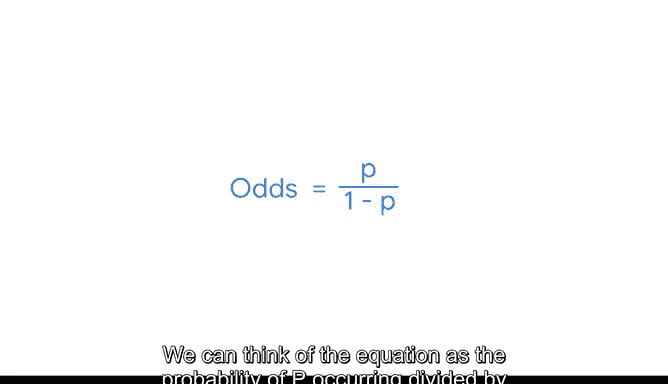
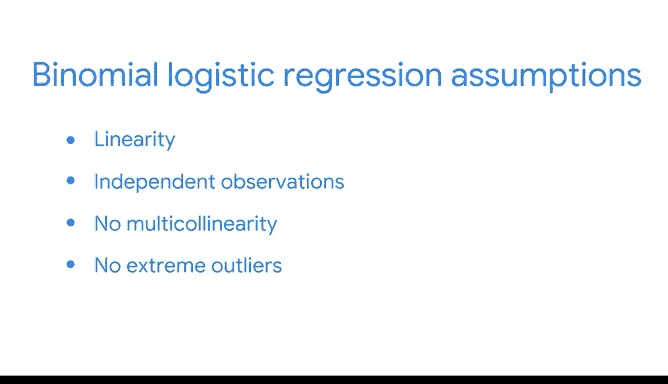

# 038：为数据寻找最佳逻辑回归模型 📈

在本节课中，我们将要学习二项逻辑回归模型的核心假设，并了解如何为给定数据集寻找最佳的模型参数。我们将重点讨论线性关系、观测独立性、多重共线性以及异常值处理等关键概念，并介绍最大似然估计这一核心方法。

---

## 逻辑回归的基本假设

上一节我们介绍了逻辑回归是一种用于建模二元结果概率的方法。本节中，我们来看看为了确保模型结果可靠，数据需要满足哪些主要假设。这些假设有些与线性回归相似，有些则不同。

以下是逻辑回归的四个核心假设：

1.  **线性关系假设**：每个自变量 `x` 与因变量 `y` 发生概率的 **Logit** 值之间存在线性关系。
2.  **观测独立性假设**：数据中的各个观测值之间是相互独立的。
3.  **无多重共线性假设**：模型中的多个自变量之间不应存在高度相关性。
4.  **无极端异常值假设**：数据中不应包含对模型有过度影响的极端异常值。

---

## 深入理解线性关系与Logit

第一个也是最重要的假设是线性关系假设。要理解它，我们必须先定义几个核心概念。

**几率** 是指某个事件发生的概率与不发生的概率之比。其公式为：
`几率 = P / (1 - P)`
其中 `P` 是事件发生的概率。

**Logit函数**，或称 **对数几率**，是几率的自然对数。其公式为：
`logit(P) = ln( P / (1 - P) )`
Logit函数是将自变量 `x` 与事件发生概率 `P` 线性连接起来的最常用“链接函数”。

因此，线性关系假设具体指的是：每个自变量 `x` 与 `logit(P)` 之间存在线性关系。我们可以将此关系表达为一个线性方程：
`logit(P) = β₀ + β₁*x₁ + β₂*x₂ + ... + βₙ*xₙ`
其中，`β` 是模型需要估计的系数，`n` 是自变量的数量。

---

## 寻找最佳模型：最大似然估计

与线性回归类似，我们并非随意选择一组系数 `β`，而是要找到能最好地拟合数据的那一组。在逻辑回归中，我们通常使用 **最大似然估计** 来寻找最佳模型。

**最大似然估计** 是一种估计参数 `β` 的技术，其目标是找到能使模型 **生成当前观测数据的可能性最大化** 的那组参数。我们可以将“似然”理解为：在给定一组特定参数 `β` 的条件下，观测到实际数据的概率。

这里用到了第二个假设——观测独立性。由于观测值相互独立，观测到整个数据集的联合概率就等于每个数据点概率的乘积。因此，我们可以计算所有样本数据的整体似然值。

**最佳的逻辑回归模型**，就是能最大化这个整体似然值的、带有特定 `β` 系数集的模型。

---

## 其他重要假设

在理解了最大似然估计的工作原理后，我们再来看看另外两个假设。

**无多重共线性**：如果我们模型中包含多个自变量，它们之间不应高度相关。这与线性回归的要求一致。

**无极端异常值**：异常值在回归建模中是一个复杂的话题，通常可以在模型拟合后进行检测。有时可以通过转换或调整变量来维持模型有效性，有时则可能需要移除异常数据。

---

## 总结

本节课中，我们一起学习了二项逻辑回归的主要假设，包括自变量与Logit值的线性关系、观测独立性、无多重共线性和无极端异常值。我们还深入探讨了如何通过 **最大似然估计** 方法来拟合出最佳的模型参数。下一节，我们将探索如何在Python中使用真实数据来构建和评估一个逻辑回归模型。