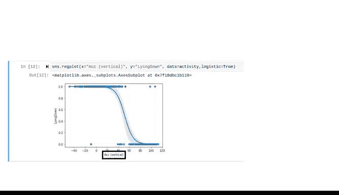

# 039：使用Python构建逻辑回归模型 🐍


在本节课中，我们将学习如何使用Python的`scikit-learn`库构建一个逻辑回归模型。我们将通过一个关于老年人运动检测的实际数据集示例，一步步完成数据准备、模型构建和初步可视化。

---

## 概述

上一节我们回顾了逻辑回归的理论基础。本节我们将进入构建阶段，动手使用Python实现一个二项逻辑回归模型。我们将使用一个包含老年人垂直方向加速度和是否躺下状态的数据集，目标是构建一个模型，根据加速度来预测人是否处于躺下状态。

---

## 数据准备与探索

首先，我们需要加载并了解我们将要使用的数据。数据集已被加载到一个名为`activity`的`DataFrame`中。

以下是了解数据基本统计信息的方法：

```python
activity.describe()
```
执行上述代码会显示数据集中每个变量的统计信息，包括行数、均值、标准差、最小值、最大值以及各分位数值。当前数据集包含494行数据。

接下来，我们可以查看数据的前几行以了解其结构：

```python
activity.head()
```
数据集中包含两个变量：
1.  第一个变量测量垂直方向的加速度。
2.  第二个变量是一个指示变量，标记一个人是否躺下。

我们的目标是使用逻辑回归，根据垂直加速度来预测人是否躺下。

---

## 分割数据集

为了遵循良好的数据实践，我们需要将数据分割为训练集和测试集（或称保留集）。测试集将用于后续评估模型性能。

首先，导入必要的函数：

```python
from sklearn.model_selection import train_test_split
from sklearn.linear_model import LogisticRegression
```

接着，将`DataFrame`分割为特征变量（X）和目标变量（y）。在本例中，我们只使用一个特征变量：垂直加速度。

```python
X = activity[['AC(vertical)']]  # 特征
y = activity['lying_down']       # 目标
```

现在，使用`train_test_split`方法分割数据：

```python
X_train, X_test, y_train, y_test = train_test_split(X, y, random_state=42)
```
我们设定了`random_state`参数以确保结果可复现。如果使用不同的随机状态，得到的数据分割结果会有所不同。

---

## 构建逻辑回归模型

数据准备就绪后，我们可以开始构建逻辑回归模型。

创建一个逻辑回归分类器实例，通常将其变量名命名为`clf`（classifier的缩写）：

```python
clf = LogisticRegression()
```

接下来，使用训练数据来拟合（训练）这个模型：

```python
clf.fit(X_train, y_train)
```

模型训练完成后，我们可以查看其参数估计值，即回归系数（β1）和截距（β0）：

```python
coefficient = clf.coef_
intercept = clf.intercept_
```
对于当前模型，系数β1的估计值约为-0.118，截距β0的估计值约为6.102。

---

## 可视化模型结果

为了更直观地理解模型，我们可以将逻辑回归曲线可视化。这里我们使用`seaborn`绘图库。

首先，确保已导入`seaborn`（通常别名为`sns`）：

```python
import seaborn as sns
```

然后，使用`regplot`函数绘制逻辑回归曲线：

```python
sns.regplot(x='AC(vertical)', y='lying_down', data=activity, logistic=True)
```
在函数调用中，我们需要指定：
*   `x`参数：特征变量所在的列，即`‘AC(vertical)’`。
*   `y`参数：目标变量所在的列。
*   `data`参数：数据来源。
*   `logistic=True`参数：声明绘制逻辑回归曲线。

生成的图表将显示一条清晰的S形曲线。曲线周围的阴影区域表示置信带。图中数据点会形成两条水平线：一条对应目标变量为1（躺下）的情况，另一条对应目标变量为0（未躺下）的情况。

---

## 总结与下节预告

本节课中，我们一起完成了使用Python构建逻辑回归模型的实践。我们指导计算机根据垂直加速度数据，找到了预测某人是否躺下的最佳似然估计方法。我们还初步学习了如何解读模型参数（系数和截距），并成功将模型结果可视化。



在接下来的课程中，我们将探讨多种评估模型质量的方法，并学习如何围绕数据讲述一个有意义的故事。