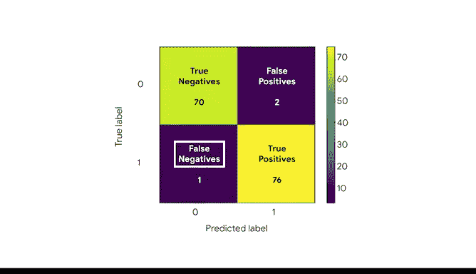

# 040：评估二项逻辑回归模型 📊


在本节课中，我们将学习如何评估一个二项逻辑回归模型的质量。我们将重点介绍混淆矩阵，这是一种直观展示模型分类准确性的工具，并学习如何在Python中生成和解读它。

你已经构建了你的第一个二项逻辑回归模型，并能够计算参数估计值和绘制回归曲线。在本视频中，我们将利用Python生成的指标和图表来评估你的模型实际表现如何。

回顾一下，你正在处理测量加速度以及人员是否躺下的活动数据。你之前已将数据保存为训练集和保留集，并将逻辑回归模型保存为变量 `clf`。

## 生成预测结果

现在，将保留数据集输入到模型的 `predict` 方法中，以获取模型预测的标签。将这些预测保存为一个名为 `y_pred` 的变量。

请注意，机器学习模型预测的是一个观测值属于0类或1类的**概率**。而 `scikit-learn` 中的 `predict` 函数实际上会为每个观测值分配一个0或1的标签。该函数的工作原理是假设阈值为 **0.5**。因此，如果模型预测的概率值 **>= 0.5**，`predict` 函数会将该观测值标记为1。如果预测值 **< 0.5**，则标记为0。

另一方面，`predict_proba` 函数允许你查看为每个数据点预测的具体概率值。

## 理解混淆矩阵

现在你有了每个观测值是0或1的预测，可以创建一个混淆矩阵，它能快速概述你的模型对保留数据集中每个数据点的分类效果。

混淆矩阵是一种图形化表示，展示了分类器在预测分类变量标签时的准确性。它显示了分类器为每个类别准确分类的数据点数量，网格中的其他方格则传达了被错误分类的数据点数量。

接下来，我们将构建你自己的混淆矩阵，并一起回顾图的每个部分。

## 在Python中构建混淆矩阵

使用 `scikit-learn` 的 `metrics` 模块来创建混淆矩阵。为了绘制混淆矩阵，你可以使用 `metrics` 模块中的两个方法：`confusion_matrix` 和 `ConfusionMatrixDisplay`。

首先，使用 `confusion_matrix` 生成矩阵的值，并将输出保存为变量 `cm`。
```python
from sklearn.metrics import confusion_matrix, ConfusionMatrixDisplay
cm = confusion_matrix(y_true, y_pred)
```
然后，使用 `ConfusionMatrixDisplay` 方法将图形保存为变量 `disp`。
```python
disp = ConfusionMatrixDisplay(confusion_matrix=cm, display_labels=[0, 1])
```
最后，通过绘制混淆矩阵显示函数的输出来展示混淆矩阵。
```python
disp.plot()
```

## 解读混淆矩阵

从左上角到右下角的对角线显示了分类器为每个类别准确分类的数据点数量。网格中的其他方格则显示了被错误分类的数据点数量。

在混淆矩阵的坐标轴上，有标签指示数据点的类别为0或1。
*   **0** 表示在该观测中，人员被标记为“未躺下”。数据专业人士将标记为0的数据点称为**负例**。
*   **1** 表示在该观测中，人员被标记为“躺下”。标记为1的数据点称为**正例**。

以下是混淆矩阵中各个部分的详细说明：

*   **左上角（True Negatives， 真阴性）**：分类器预测为“未躺下”（0），且实际也“未躺下”的观测数量。
*   **右下角（True Positives， 真阳性）**：分类器预测为“躺下”（1），且实际也“躺下”的观测数量。

现在，让我们看看模型预测错误的地方：

*   **右上角（False Positives， 假阳性）**：分类器预测人员“躺下”，但实际“未躺下”的观测数量。
*   **左下角（False Negatives， 假阴性）**：分类器预测人员“未躺下”，但实际“躺下”的观测数量。



在一个优秀的模型中，我们应该观察到**高比例的真阳性和真阴性**，以及**低比例的假阳性和假阴性**。


## 课程总结

在本节课中，我们一起学习了如何评估二项逻辑回归模型。我们重点介绍了**混淆矩阵**这一强大工具，它可以帮助你更深入地解读和讲述逻辑回归模型的故事。通过混淆矩阵，我们可以清晰地量化模型的分类性能，识别出模型在哪些情况下容易出错。

在接下来的视频中，我们将讨论更多评估逻辑回归模型质量的方法。


