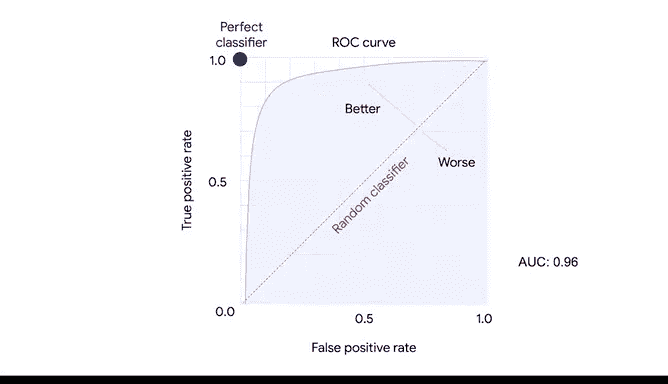
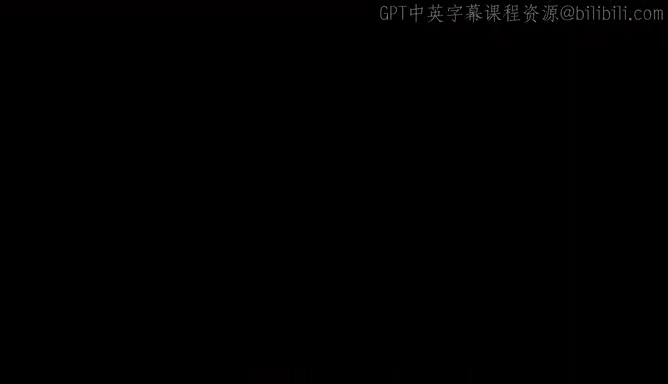

# 041：评估逻辑回归结果的关键指标 📊


在本节课中，我们将学习如何评估逻辑回归模型的性能。我们将介绍几个关键的评估指标，它们能帮助我们量化模型预测的准确性，并理解模型在不同方面的表现。

上一节我们介绍了混淆矩阵，它能直观地展示和量化逻辑回归模型的预测结果。本节中，我们来看看如何用几个具体的指标来总结混淆矩阵中的信息。

## 核心评估指标

我们将讨论三个核心指标：精确率、召回率和准确率。您可以通过Scikit-Learn库的`metrics`模块来使用计算这些指标的函数。我们将继续使用活动数据的例子进行分析。

### 精确率

精确率衡量的是模型预测为正例的样本中，真正为正例的比例。

其计算公式为：
**精确率 = 真阳性 / (真阳性 + 假阳性)**

在我们的例子中，精确率告诉我们，在所有被模型预测为“躺下”的人中，实际有多少人真的在“躺下”。Scikit-Learn的`metrics`库提供了一个便捷的函数来为我们计算。

以下是使用代码计算精确率的示例：
```python
from sklearn.metrics import precision_score
precision = precision_score(y_true, y_pred)
```
我们向函数输入测试集中的真实`y`值，以及模型根据测试集`X`值预测出的`y`值。精确率的范围是0到1，得分0.97表示模型性能非常出色。

### 召回率

召回率衡量的是模型在所有实际为正例的样本中，能正确识别出的比例。

其计算公式为：
**召回率 = 真阳性 / (真阳性 + 假阴性)**

请记住，假阴性是指那些实际为“躺下”但模型未能检测出来的情况。因此，召回率衡量的是，在所有实际“躺下”的人中，模型正确识别出的比例。

我们使用与计算精确率相同的数据，但调用Scikit-Learn的`recall_score`函数：
```python
from sklearn.metrics import recall_score
recall = recall_score(y_true, y_pred)
```
我们得到的召回率约为0.98。由于召回率范围也是0到1，这个模型的表现相当好。

### 准确率

准确率衡量的是所有数据点中被正确分类的比例。

其计算公式为：
**准确率 = (真阳性 + 真阴性) / 预测总数**

在我们的活动例子中，准确率将衡量模型正确识别出“躺下”和“未躺下”的人的比例。我们可以使用Scikit-Learn的`accuracy_score`函数：
```python
from sklearn.metrics import accuracy_score
accuracy = accuracy_score(y_true, y_pred)
```
在这个案例中，我们的模型获得了0.97的准确率得分。但请注意，大多数时候，精确率、召回率和准确率不会都这么高，这是正常现象。

## 其他评估技术：ROC曲线与AUC

除了上述指标，在处理分类器时，还有两种常见且有用的评估技术：ROC曲线和AUC（曲线下面积）。这些概念与分类阈值、真阳性率和假阳性率相关。

虽然我们通常使用0.5作为阈值来生成预测，但有时阈值需要根据具体场景来确定。请注意，当我们降低阈值时，真阳性率会上升（因为我们预测更多的观测值为正例），但假阳性率也会随之增加。模型的真阳性率和假阳性率在每个阈值下都会变化。

对于一个理想的模型，会存在一个阈值，使得真阳性率很高而假阳性率很低。我们可以使用ROC曲线和AUC来检查在每个阈值下，真阳性率和假阳性率是如何一起变化的。



数据专业人士在比较不同分类模型时可能会使用ROC曲线和AUC，我们将在本课程的后续部分深入探讨它们。

---

本节课中我们一起学习了评估逻辑回归模型的几个关键指标：精确率、召回率和准确率，并简要了解了ROC曲线与AUC的概念。这些概念彼此相似且相互关联，不要期望在第一次学习时就掌握所有细节。请给自己一些额外的时间和练习，以理解如何最好地应用这些测量工具，来支撑你用数据讲述的故事。



接下来，我们将开始构建可以用逻辑回归来分享的各种数据分析故事。