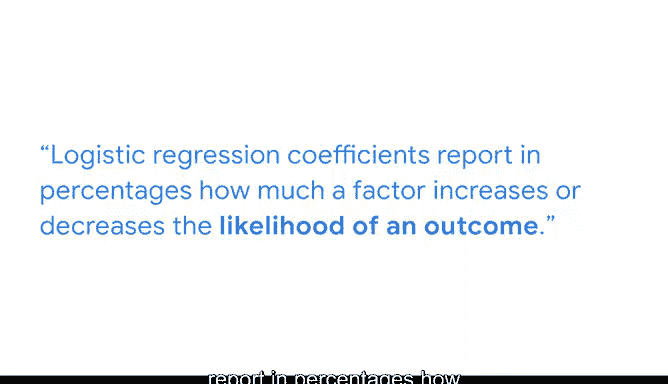

# 043：简化复杂数据关系》📊


## 课程概述

在本节课中，我们将学习如何根据具体的数据分析问题，选择合适的统计模型或检验方法。我们将回顾线性回归、假设检验和逻辑回归等核心工具，并通过三个不同行业的实际案例，演示如何运用PACE框架来指导分析决策。

---

## 模型回顾与问题匹配 🔍

上一节我们介绍了二项逻辑回归及其适用场景。本节中，我们来看看如何将已学的多种分析技术，与工作中遇到的实际问题相匹配。

截至目前，你已经学习了以下核心方法：
*   **线性回归模型**
*   **假设检验**（特别是卡方检验和方差分析）
*   **逻辑回归**

同时，你也使用了**PACE框架**（计划、分析、构建、执行）来指导工作流程。你从“计划”阶段开始，理解需要优先处理的需求，并根据被提出的问题以及可获取的数据，决定哪种模型或检验最为合适。

---

## 案例一：音乐流媒体分析 🎵

想象你是一家录音工作室的数据分析师。在一次团队会议中，大家讨论每首歌曲的播放次数。提出的问题包括：
*   哪些因素会影响音乐的流媒体播放量？
*   每个因素对播放量的影响程度有多大？

由于“音乐流媒体播放量”是结果变量，且它是一个连续变量，你可以考虑使用线性回归或假设检验。但因为问题明确询问“每个因素的影响程度”，**线性回归是回答此问题的更好模型**。

记住，线性回归允许通过系数和R平方值进行直观解释，从而说明哪些因素影响结果变量以及影响的程度。

**公式：** `y = β₀ + β₁x₁ + β₂x₂ + ... + ε`

但你需要确保模型假设得到满足，以增强结论和见解的有效性。

---

## 案例二：咖啡馆销售分析 ☕️

假设你为一家咖啡馆工作。他们正在品尝来自不同国家的咖啡豆，并想弄清楚哪种咖啡豆更畅销。团队已经对豆子的销售情况做了一些预测，但他们好奇咖啡豆的销售是否独立于糕点销售。咖啡豆的原产国是一个已知的区分因素，而糕点销售更像是一个协变量。

在这种情况下，虽然结果变量“销售额”仍然是连续的，但问题的焦点在于比较不同组别（例如不同种类的咖啡豆、不同的原产国）。因此，你应该更侧重于**假设检验**，这是进行A/B测试的好方法。

**零假设**：咖啡馆售出的每种咖啡豆类型的袋数大致相同。
**备择假设**：咖啡馆售出的每种咖啡豆类型的袋数并不相同。

通过进行一系列检验，你可以根据特定的P值接受或拒绝零假设，从而帮助理解模型对趋势的解释程度。团队将能更好地了解应该订购哪种咖啡豆，以便在咖啡馆卖出更多咖啡。

---

## 案例三：社交媒体内容预测 📱

考虑最后一个例子，你在一个社交媒体公司工作，有兴趣探索为什么有些帖子会走红而有些不会。你确定了一个问题：**我如何预测一个帖子是否会走红？**

由于结果变量是二元的（帖子要么走红，要么不走红），**二项逻辑回归**可能是你首先考虑的模型。

确定逻辑回归是否合适的最佳方法是构建并评估模型。幸运的是，你可以使用许多评估指标，包括：
*   P值
*   混淆矩阵
*   精确率
*   召回率
*   准确率
*   ROC曲线下面积
*   AIC和BIC

选择最佳指标将取决于具体情况。在解释逻辑回归模型的系数时，请记住要将其**取指数**。

**代码示例（Python逻辑回归系数取指数）：**
```python
import numpy as np
# 假设 model.coef_ 是逻辑回归模型的系数
odds_ratios = np.exp(model.coef_)
```

回忆一下，在分享结果时，逻辑回归系数以百分比形式报告，说明某个因素增加或减少结果发生可能性的程度。

---



## 总结与展望 🚀

本节课中，我们一起学习了如何作为一名数据分析师，针对不同业务场景下的具体问题，选择合适的分析模型。我们通过录音室、咖啡馆和社交媒体公司的案例，实践了如何运用线性回归回答影响程度问题，使用假设检验进行组间比较，以及采用逻辑回归处理二元分类预测。


记住，通过专注于每种模型的核心优势，你将能够在实践中找到运用这些工具的方法。未来面对复杂的数据关系时，这种问题驱动的模型选择思路将帮助你更高效、更准确地获得洞察。