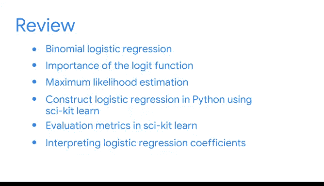

# 044：简化复杂数据关系》课程总结 🎯


在本节课中，我们将回顾并总结整个课程的核心内容，特别是关于二项逻辑回归的知识点。我们将梳理从基础概念到实际应用的关键步骤，帮助你巩固所学。

---

## 课程回顾 📚

我们已经到达了课程的终点。祝贺你。

你应该为自己所学到的知识以及未来作为数据分析专业人士所能应用的能力感到自豪。

在结束之前，让我们回顾一下你所学到的内容。

---

## 二项逻辑回归的定义与核心概念 🔍

上一节我们介绍了回归分析的整体框架，本节中我们来看看二项逻辑回归的具体定义。

我们将二项逻辑回归定义为基础的数据技术，用于模拟一个或两个结果发生的概率。

在学习二项逻辑回归时，我们重点关注了**Logit函数**的重要性。

它既是逻辑回归的一个假设，也关系到如何解释结果。

其核心公式可以表示为：
`logit(p) = ln(p / (1 - p))`
其中 `p` 代表事件发生的概率。

---

## 模型构建与参数估计 ⚙️

在理解了基础概念后，接下来我们探讨如何构建模型并估计参数。

你学习了**最大似然估计**，这是一种常用的技术，用于估计最佳参数，以最大化观察到的、用于构建逻辑回归模型的数据的可能性。

然后，你学习了如何使用 **Scikit-learn** 库在 Python 中构建逻辑回归模型。

以下是一个简单的代码示例：
```python
from sklearn.linear_model import LogisticRegression
model = LogisticRegression()
model.fit(X_train, y_train)
```

---

## 模型评估与指标解读 📊

构建模型后，评估其性能至关重要。以下是常用的评估方法。

你考虑了一些评估指标，包括混淆矩阵、精确率、召回率和准确率。

Scikit-learn 提供了许多便捷的函数来帮助你评估和解释逻辑回归模型。

但有时你可能需要其他 Python 库或包。例如，在学习线性回归、卡方检验和方差分析时使用过的 **Statsmodels** 库可能会很有帮助。

像回归模型这样的 Python 包各有其优缺点。

你作为数据专业人士的持续经验将帮助你为每种情况选择最合适的工具。

---

## 结果解释与场景应用 💡

最后，我们来看看如何解释模型结果并将其应用于实际问题。

你还学习了如何解释逻辑回归的系数，以及根据你试图回答的问题选择指标和图表时应考虑哪些因素。



最后，你回顾了示例场景，以弄清楚为什么某些模型或测试在每种情况下可能是最合适的。

---

## 总结与展望 🌟

在本节课中，我们一起学习了二项逻辑回归从理论定义、模型构建、参数估计、评估验证到结果解释的全过程。你掌握了Logit函数、最大似然估计等核心概念，并学会了使用Python工具进行实践。

到目前为止，你工作非常努力。请珍视你所学到的一切，并思考在整个学习旅程中提出和回答的许多问题。


你已经走上了正轨，请继续保持良好的工作状态。