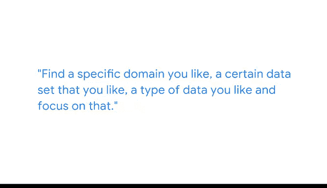

# 046：分享模型和建模技术的策略

## 概述

在本节课中，我们将学习如何有效地向他人（特别是面试官）展示你的数据模型和建模经验。课程将分享如何清晰、简洁地介绍你的工作，以及如何通过个人项目来展示你的热情与技能。

---

## 主讲人介绍

我是Leah，一名数据架构师。我的工作是为数据科学家和数据分析师构建数据模型，帮助他们从数据中获得洞察。

我的背景非常规。我并非来自计算机科学领域。我曾在法国学习社会学和哲学，之后回到美国，获得了一份知识工程师的工作。这份工作让我真正进入了知识工程领域。

---

## 面试中如何展示数据模型

上一节我们介绍了主讲人的背景，本节中我们来看看在求职面试中展示数据模型的关键策略。

在面试时，谈论你曾参与构建的数据模型并以简洁的方式向面试官解释你的工作，这一点非常重要。

当你介绍自己的数据建模经验时，可以从以下几个方面展开：

以下是你可以谈论的三个核心方面：

1.  **解决的问题**：阐述你通过模型旨在解决的具体业务或分析问题。
2.  **使用的技术**：说明你采用了哪些建模技术和工具（例如，线性回归模型 `y = β₀ + β₁x₁ + ... + βₙxₙ + ε`）。
3.  **如何向利益相关者传达结果**：解释你如何将复杂的模型结果转化为易于理解的洞察，并传达给非技术背景的利益相关者。这是一个至关重要的步骤。

---

## 构建你的作品集

仅仅谈论经验还不够，拥有可视化的成果更能证明你的能力。接下来，我们探讨如何构建一个吸引人的作品集。

你可以将本课程中完成的项目成果，以及其他你真正充满热情的事物结合起来，着手创建一个网站、一个Jupyter Notebook、一个GitHub页面或类似的东西，并分享其链接。这非常重要。

当我在数据分析领域进行面试时，我非常乐于看到候选人拥有个人网站、GitHub链接、证书等。这些能向我展示，即使在工作之外，他们也致力于其他项目，并且对此充满热情，乐于分享。

我可以访问他们的网站，看到一个展示精良的项目。他们会在高层次上解释所涉及的概念或要解决的问题，然后逐步深入细节。

---

## 找到你的热情所在

一个成功的作品集往往源于真正的兴趣。本节将讨论如何围绕你的热情构建项目。

找到一个你喜欢的特定领域、某个你感兴趣的数据集或你偏爱的数据类型，并专注于它。我注意到，我对自己的兴趣项目会感到非常兴奋，并且愿意投入更多精力。这帮助我真正推进项目并使其充满趣味，因为我本身对此就充满热情。

---

## 总结

本节课中，我们一起学习了如何有效地展示数据建模技能。关键点包括：在面试中结构化地介绍你的模型（问题、技术、传达），积极构建在线作品集（如网站、GitHub）来展示你的项目，以及围绕个人热情领域深耕，这能让你的工作和展示更具感染力和深度。记住，清晰的表达和可见的成果是证明你能力的最佳方式。