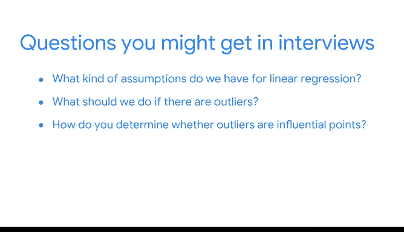

# 048：期末项目总结与持续职业成功建议 📊

在本节课中，我们将回顾你在课程项目中的进展与成就，并为你未来的数据职业生涯提供准备建议。

再次问候。我回来查看你目前的进展。

你已经完成了许多工作。除了构建和分析A/B测试、整理有序数据集以及创作数据可视化图表。

你还构建了一个多元线性回归模型。

花点时间反思我们每个作品集项目，这创造了一个真正认可你迄今为止所学、所练和所获成就的机会。

这些项目共同为你开始探索数据职业领域、应对未来面试做准备。你的项目策略文档包含了供你参考的关于流程、考量和完成作品集中这些成果的步骤的笔记。

这些都是你在面试期间与潜在雇主和招聘经理讨论时需要的内容。

到目前为止，你认识到了理解线性回归假设的重要性。你练习了评估模型，并且学会了认识到在运用回归模型时解释自身流程的重要性。

当你开始准备面试时，你需要思考可能会被问到的问题，例如：我们对线性回归有哪些假设？如果存在异常值，我们应该怎么做？我们如何确定异常值是否为有影响力的点？

你如何检查多重共线性？如果存在多重共线性，应该怎么做？当然，在你的面试中还会有其他问题需要你回答。

你甚至可能会遇到这样的情况：潜在雇主和招聘经理要求你描述，在几乎没有领域知识的情况下，你将如何着手一个项目。

这个作品集项目要求你评估一个独特的商业场景。作为回应，你构建了一个包含方差分析（Anova）测试的多元线性回归模型。

除了展示你的建模技能，你还在专业报告中展示了有效沟通发现的能力，其中包括数据可视化、模型的评估与解读以及关键的商业洞察。

接下来，你将全面学习机器学习模型。然后你将有机会通过构建自己的模型来解决问题。

你在整合作品集方面做得非常出色。

---

## 课程总结

本节课中我们一起回顾了课程项目成果，总结了在构建多元线性回归模型过程中掌握的技能，并为即将到来的数据职业面试提供了实用的准备建议。核心收获包括：理解并应用线性回归的统计假设、掌握模型评估与解释的方法，以及学会如何通过作品集有效展示你的分析能力和商业洞察力。