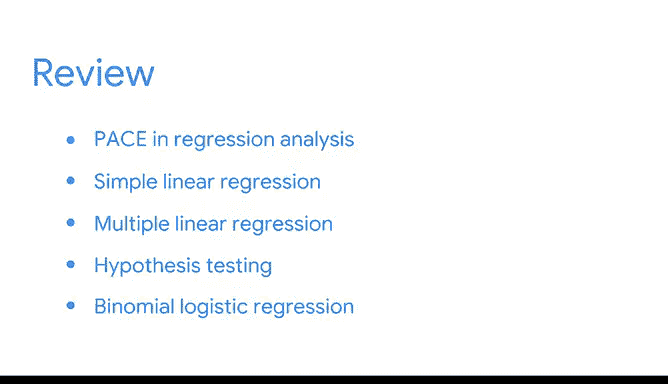

# 049：简化复杂数据关系》课程总结 🎯

在本节课中，我们将对《回归分析：简化复杂数据关系》这门课程的核心内容进行回顾与总结。我们将梳理从数据分析框架到多种回归模型的关键知识点，并展望后续的学习路径。

---

## 课程内容回顾 📚

恭喜你完成这门课程的学习。这是一项了不起的成就。

希望你花一点时间来庆祝，并回顾在整个课程乃至整个项目中学习和完成的所有内容。

### 从PACE框架到基础模型

你首先应用了PACE框架——计划、分析、构建和执行——来建模变量之间的关系，并学习了两个基础模型：**线性回归**和**逻辑回归**。

上一节我们介绍了数据分析的起点，本节中我们来看看你是如何深入实践这些模型的。

### 简单线性回归的实践

接着，你学习了如何检验假设，以及如何使用实例来**构建、评估和解释一个简单线性回归模型**。

以下是你在该阶段掌握的核心技能：
*   使用Python对真实数据进行建模练习。
*   应用简单线性回归的核心概念。

### 扩展到多元线性回归

你将简单线性回归的理解扩展到了**多元线性回归**。

随着变量增多，模型的解释变得更为复杂，需要考虑的因素也增加了。然而，你能够提出和解答的问题范围也随之大大扩展。

### 分类变量与假设检验

接下来，你将焦点转向了涉及分类变量的**假设检验**。

你学习了t检验、卡方检验和方差分析。这使你能够探究不同组别之间的差异。

### 二项逻辑回归

最后，你学习了**二项逻辑回归**，该模型专注于某一特定结果发生的概率。

---

## 技能总结与展望 🚀

希望你为自己写下的每一行代码、提出的每一个问题感到自豪。能够谈论并应用我们所涵盖的概念，无论你在哪个行业工作，或是在数据分析职业生涯中担任何种角色，都将使你受益。

你现在拥有了一个更庞大的技能组合，其中包括回归模型、评估指标和假设检验。

在后续的项目学习中，你将能够运用统计学和回归建模来建立联系。

在下一门课程中，你将向谷歌同事Susila学习机器学习概览。你将探索监督式和非监督式机器学习。你将学习许多新颖有趣的技术，并解决大数据问题。

我非常感激能陪伴你完成这段回归分析的学习之旅。希望你对自身的数据专业知识更有信心，并已准备好持续提升你的技能。

你已经准备好，作为一名数据分析专业人士，迈向职业生涯的下一步。

---

**本节课中我们一起学习了**：从应用PACE框架和掌握线性与逻辑回归基础开始，到构建、评估回归模型，进行假设检验，最终建立起一个包含回归模型、评估指标和假设检验的完整数据分析技能体系。这门课程为你后续深入机器学习领域奠定了坚实的统计与建模基础。