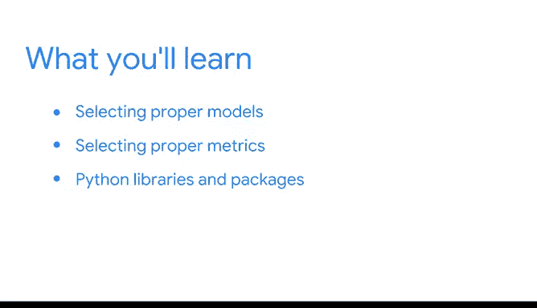

# 001：《机器学习的基础知识》 🧠

在本课程中，我们将学习机器学习的基础知识，了解如何构建能够进行预测的算法模型。我们将从机器学习的核心概念出发，探索不同类型的机器学习方法，并学习如何在实践中应用它们。课程结束时，你将掌握构建和评估复杂模型所需的关键技能。

---

你是否曾好奇，你的互联网搜索浏览器如何预测你将要输入的内容？例如，算法知道在你输入“will dinosaurs”之后，你很可能会接着输入“come back”。

但程序员究竟如何构建一个经过训练的算法来进行这类预测呢？在本课程中，你将学习创建复杂模型的过程，这些模型可用于对各种事物提出建议。这些模型的工作原理是应用先前收集的数据，对从恐龙到你听的音乐，再到你可能选择的上班路线等一切事物做出有根据的猜测。如果没有才华横溢的数据专业人士和他们创建的机器学习模型，我们就无法在整个互联网中享受这些有用的功能。

除了模型本身，你还将探索机器学习的主要特性，并继续发展你的Python技能。

在我们开始之前，请允许我对你迄今为止所取得的一切成就表示祝贺。你已经练习了数据清洗，回顾了关键的统计学概念，并探索了回归模型。在此过程中，你已经为应对数据专业人士工作中更复杂的部分做好了更充分的准备。

在我们从宏观视角审视机器学习和复杂模型的世界时，我将作为你的向导。我叫Suila，是一名数据科学家，在谷歌的YouTube部门从事项目工作。在YouTube，我们每天使用机器学习向用户推送内容，从音乐评论到旅行视频博客，再到我个人最喜欢的猫咪视频。我很高兴能与你一起探索机器学习。

正如你之前所学，**机器学习**是使用和开发算法及统计模型，以教会计算机系统分析和发现数据中的模式。它的应用非常广泛，从优化微芯片设计和改进地震预测，到推荐在YouTube上观看的视频等等。

本课程将帮助你在成为数据专业人士的旅程中更进一步，使你能够使用机器学习来处理与我刚才提到的应用类似的项目。

在开始之前，回顾一下本课程计划早期涵盖的线性和逻辑回归以及统计模型可能会有所帮助。

术语“复杂模型”和“机器学习”经常互换使用。在本课程中，当我们使用“复杂模型”这个术语时，我们指的是广义上的数学或计算模型，包括从回归到深度学习的一切。

首先，你将学习不同类型的机器学习，例如**监督学习**和**无监督学习**。然后，你将学习如何实现其中的一些类型。每种类型都将按其特性进行分解，以便明确每种类型的用途和目的。

接下来，我们将从数据科学工作流的另一个视角来思考，并发现如何将PACE框架应用于机器学习。此外，你还将学习探索性数据分析（EDA）如何与机器学习相关联。

你还将练习其他技能，例如**特征工程**。你进入机器学习领域的另一部分介绍将是选择相关的模型和评估指标。你将根据你的目的和数据确定最合适的模型。你将学习使用哪些工具来评估模型的性能。

你还将继续使用Python进行工作。你将探索用于特定类型机器学习的最常用的Python库和包，并且你将使用谷歌数据专家在工作中依赖的相同资源。

到本课程结束时，你将拥有一个装满工具的虚拟工具箱，这些工具是你构建和改进复杂模型所需要的。最后，你将有机会在一个基于数据专业人士常见工作场景的作品集项目中，练习你新学的、符合工作要求的技能。

机器学习对于数据专业人士来说是一个令人兴奋的领域。它一直在不断发展和演进，每天都有新的应用出现。本课程中的概念将帮助你为加入这个领域并在数据科学领域推进你的职业生涯做好准备。

---

**本节课总结**

在本节课中，我们一起学习了机器学习课程的介绍和概述。我们了解了机器学习如何驱动日常应用中的预测功能，明确了本课程的学习目标，包括探索机器学习类型、应用PACE框架、进行特征工程以及选择模型和评估指标。我们还认识到，掌握这些技能将为我们构建和评估复杂模型，并最终在数据科学领域发展职业生涯奠定基础。