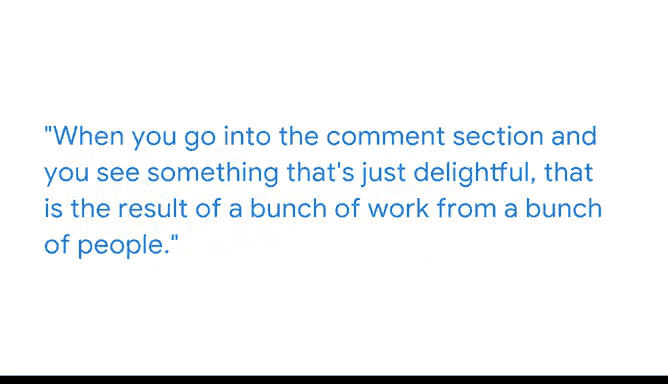

# 002：数据科学家的日常与影响 📊

在本节课中，我们将跟随谷歌高级数据科学家Sila，了解数据科学家在谷歌（特别是YouTube团队）的典型工作内容、他们如何利用数据解决问题，以及数据科学工作对产品与用户产生的实际影响。

---

我是Sila，谷歌的一名高级数据科学家。我的工作是与YouTube团队合作，利用数据回答他们关于产品的各种问题。

我典型的工作日安排因星期几而异。我喜欢在一周中预留出几天会议很少的时间。这段时间是我进行深度、专注工作的宝贵机会。通常在这期间，我会处理当前的分析任务、规划未来的分析、撰写结果总结、准备演示文稿等。这些都是需要我长时间专注、不受干扰地处理单一任务的工作。

在其他日子里，我通常会有很多会议，需要与软件工程师伙伴、产品经理以及任何能为我的问题提供背景信息的人交流。

作为一名数据科学家，我最喜欢的一点是能够真正对人们的生活产生影响，尤其是在YouTube这样的产品上。在我的职责范围内，我做了大量关于评论质量的测量工作。为此，我们拥有多种类型的数据：我们有日志数据，可以查看诸如用户阅读了多少条评论、撰写了多少条评论、观看了多少分钟视频等信息；我们还有调查数据，会询问用户“你觉得这条评论怎么样？”、“它让你满意吗？”、“你喜欢它吗？”等。这些分类回答非常有帮助，我们会将其转化为二元指标，以便将评论分类为好或坏。

当你在评论区看到一些令人愉悦的内容时，那是许多人共同努力的结果。而支撑这些结果的算法正是建立在这些数据之上的。当我们改进评论区功能时，它会对人们的真实生活产生影响。用户的产品体验会变得更好。YouTube是一个触达亿万用户的产品，能够以这种方式感觉自己参与了他人生活的一部分，是一种非常奇妙的体验。

数据科学领域以及进入这个领域可能会让人望而生畏。这可能是一个令人感到畏惧的领域，似乎每个人都拥有复杂的模型和宏大的演示，而你还没有这些东西，还不知道如何去做。但请坚持下去。你会学会的。每个人都有一个起点。回想我当初面试数据科学职位时，那可能是我一生中感觉准备最不充分的时刻。我并非一生都在为那个特定时刻做准备，但我最终通过了，因为我只是坚持不懈地努力。

---

本节课中我们一起学习了数据科学家Sila在谷歌的工作日常，了解了数据科学家如何通过分析日志和调查数据来驱动产品（如YouTube评论区）的改进，并深刻体会到数据科学工作如何通过算法和模型对亿万用户的真实体验产生积极影响。我们也认识到，进入这个看似复杂的领域需要坚持和不断学习。