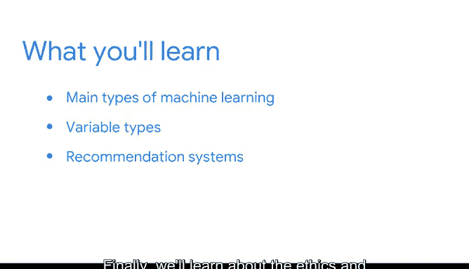

# 003：模块1概述 🎯

在本节课中，我们将要学习机器学习的基础知识，包括其主要类型、变量类型、推荐系统的工作原理，以及机器学习中的伦理与应用。这些内容是构建和理解机器学习模型的重要基石。

---

## 机器学习的主要类型 🤖

上一节我们介绍了课程的整体框架，本节中我们来看看机器学习的主要类型。

机器学习主要分为三种类型：监督学习、无监督学习和强化学习。

以下是这三种类型的简要说明：

*   **监督学习**：模型从带有标签的训练数据中学习，目标是学习一个从输入到输出的映射函数。例如，根据历史房价数据预测新房屋的价格。
*   **无监督学习**：模型在没有标签的数据中发现内在结构或模式。例如，根据客户的购买行为将客户分成不同的群组。
*   **强化学习**：智能体通过与环境互动并根据获得的奖励或惩罚来学习最佳行为策略。例如，阿尔法围棋（AlphaGo）学习下棋的策略。

---

## 机器学习的变量类型 📊

了解了机器学习的主要类型后，我们需要认识构建模型所使用的不同变量类型。

在机器学习中，数据通常以变量的形式表示，理解其类型对于选择正确的算法和预处理步骤至关重要。

以下是三种常见的变量类型：

*   **连续变量**：可以在给定范围内取任意数值的变量。例如，身高、温度、价格。其数学表示通常为 **`x ∈ ℝ`**（x属于实数集）。
*   **分类变量**：表示类别或组别的变量，其值通常是有限的、离散的标签。例如，性别（男/女）、产品类型（A/B/C）。在代码中，常使用字符串或整数编码表示，如 `df[‘category’] = [‘A’, ‘B’, ‘A’, ‘C’]`。
*   **离散变量**：取值为可数数目（通常是整数）的变量。例如，家庭孩子数量、订单中的商品件数。

---

## 推荐系统简介 🎬

掌握了变量类型后，我们可以探索一个重要的机器学习应用：推荐系统。

推荐系统通过分析用户偏好和行为，主动向用户推荐他们可能感兴趣的内容或商品。

以下是两种核心的推荐技术：

*   **基于内容的过滤**：根据物品本身的属性特征（内容）和用户的历史偏好进行推荐。例如，如果用户喜欢看科幻电影，系统就会推荐其他具有科幻标签的电影。其核心思想是计算物品特征之间的相似度：**相似度(物品A, 物品B) = f(特征A, 特征B)**。
*   **协同过滤**：根据大量其他用户的行为（如评分、购买）来预测目标用户的喜好。其基本假设是，如果用户A和用户B在过去对某些物品的喜好一致，那么他们对新物品的喜好也可能一致。一种常见方法是用户-物品评分矩阵的分解。

---

## 机器学习的伦理与应用 ⚖️

最后，我们将探讨机器学习中一个至关重要但常被忽视的方面：伦理与应用。

因为机器学习模型非常强大，数据专业人员必须考虑其工作可能带来的伦理影响。接下来，我们将提供一些工具，帮助您避免常见错误，这些错误可能决定一个项目是问题重重还是成功顺利。

数据专业人员在规划、分析、构建和执行模型时，必须审视以下关键问题：

*   模型是否存在偏见？训练数据是否代表了多样化的群体？
*   模型的预测结果将如何影响个人或社会？是否存在潜在的伤害？
*   我们是否保护了用户的隐私和数据安全？
*   模型是否透明、可解释？其决策过程能否被理解？

---

本节课中我们一起学习了机器学习的基础知识。我们回顾了监督学习、无监督学习和强化学习这三种主要类型，区分了连续、分类和离散变量，介绍了基于内容过滤和协同过滤这两种推荐系统核心技术，并重点探讨了在机器学习实践中必须考虑的伦理问题与应用准则。理解这些概念是成为一名负责任且高效的数据专业人员的第一步。