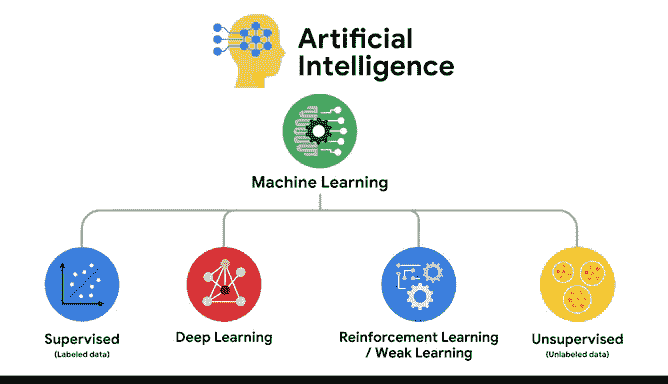

# 004：机器学习的主要类型 🧠

在本节课中，我们将要学习机器学习的主要类型。我们将探讨监督学习和无监督学习的核心区别，并简要介绍强化学习和深度学习。理解这些类型是选择合适算法解决实际问题的关键。

---

## 监督学习与无监督学习

上一节我们介绍了回归模型的应用场景。本节中我们来看看，当面对更复杂的数据时，数据专业人士如何选择不同类型的机器学习方法。

根据可用数据的类型和待解决问题的性质，你通常会选择两种主要的机器学习类型之一：**监督学习**和**无监督学习**。由于监督学习在工作场所中出现得更频繁，数据专业人士最常使用这种类型。

### 监督学习：使用带标签的数据

监督机器学习使用**带标签的数据集**来训练算法，以对结果进行分类或预测。数据专业人士使用监督机器学习进行预测。

以下是关于“带标签数据”的核心概念：
*   **带标签的数据**是指被标记了代表特定度量、属性或类别标识的标签的数据。

例如，想象你需要一个算法，根据身高来预测一只鸟是企鹅还是鸵鸟。你有一个包含身高值的数据集，以及一个指明该测量值来自企鹅还是鸵鸟的指示符。身高值是 **X 数据**，指示符就是**标签**或 **Y 数据**。

另一个例子是，你拥有一家餐厅。你拥有每月顾客数量和每月收入的数据。如果 **X** 是顾客数量，**y** 是收入金额，那么你可以使用一个算法，基于预计的顾客数量来预测下个月的收入。

无论是测量鸟类还是预测收入，你都需要带标签的数据来进行监督学习。

接下来，思考“分类”和“预测”这两个术语在监督学习中的应用。我们可以用鸟类和餐厅的例子来帮助理解。

以下是两种主要的监督学习任务：
1.  **分类**：在鸟类例子中，算法旨在将不同类型的数据归类到不同的类别、等级或组别中。
2.  **预测（回归）**：在餐厅预测收入的例子中，算法的目标是基于已有数据来**预测或估计一个数值**。

总结来说，监督机器学习算法使用**已经包含答案的数据**，并通过分类或估计未来数据来生成更多答案。

作为数据专业人士，你将手动调整这类模型以满足业务需求。运用你在数据清洗、统计学和回归方面的知识，你将学会训练、调整和优化复杂模型，以提供更准确的结果。

### 无监督学习：探索未标记的数据

数据专业人士使用的另一种最常见的机器学习类型是**无监督学习**。

无监督机器学习使用算法来分析和**聚类未标记的数据集**。在这种类型中，数据专业人士要求模型提供信息，而不告诉模型答案应该是什么。

此时，你可能对“未标记数据”的含义有了概念。回想我们之前讨论的鸵鸟例子。未标记数据将描述一组不会飞的鸟，并且不包含任何标签、标记或分类。当你收到这样的数据集时，目标是根据模型检测到的模式，将鸟类按相似性进行分组，而不一定存在一个正确答案。

一旦算法部署，无监督学习将管理输入的数据并对其进行分类或分析。例如，当新闻聚合器按主题对文章进行分类，或媒体平台按类型对视频进行分类时，这都是由无监督学习算法完成的。

在本课程的后续部分，你将学习这些算法在概念层面如何工作、如何实现它们，以及如何将它们应用到工作中会遇到的数据集上。

---

## 其他机器学习类型

除了监督学习和无监督学习，还有其他几种机器学习类型。

### 强化学习：基于奖励与惩罚

强化学习常用于机器人技术，其原理基于对计算机行为进行奖励或惩罚。

以下是强化学习的基本流程：
1.  计算机会根据其学习到的**策略**或规则集采取行动。
2.  如果行动导致有利结果，它将获得**奖励**；如果导致不利结果，它将受到**惩罚**。
3.  根据获得奖励还是惩罚，计算机会更新其策略，试图**优化奖励**或**最小化惩罚**。
4.  这个过程会重复，直到找到一个令人满意的策略。

### 深度学习：多层神经网络

深度学习模型由相互连接的节点层组成。

以下是深度学习的核心结构描述：
*   每一层节点接收来自其前一层的信号。
*   被其接收的输入激活的节点，然后将转换后的信号传递给另一层或最终输出。

---

## 机器学习与人工智能

另一个你经常听到的与机器学习相关的术语是**人工智能**。人工智能包含了所有类型的机器学习，因此在本课程中，我们将不依赖这个术语。相反，我们将专注于监督学习和无监督学习。这是机器学习最常见的应用，在这些领域拥有强大的技能对潜在雇主来说非常有价值。

监督学习和无监督学习使用了许多与强化学习和深度学习相同的原理，因此你将拥有所需的基础，以便未来自行进一步探索这些主题。

现在，你已经熟悉了机器学习的概况。在本课程中，机器学习属于人工智能的范畴。机器学习和人工智能指的是同一个核心原则：**训练计算机检测数据中的模式，而无需对其进行明确的编程**。

在机器学习的范畴下，你还会找到我们讨论过的所有其他学习类型。

---

## 总结与核心要点

本节课中我们一起学习了机器学习的主要类型：监督学习、无监督学习，并简要了解了强化学习和深度学习。我们明确了监督学习需要带标签的数据进行分类或预测，而无监督学习则用于探索和聚类未标记的数据。

最后，有一个关于机器学习和数据科学的方面是每位数据专业人士都应该知道的：**质量比数量更重要**。对于数据专业人士来说，少量多样且具有代表性的数据通常比大量有偏见且不具代表性的数据更有价值。