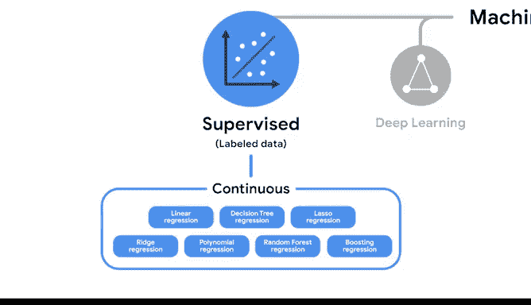

# 005：确定特征何时为无限 📊➡️♾️

在本节课中，我们将要学习如何区分机器学习中的连续特征与离散特征，理解“无限”这一概念在数据中的含义，并了解这对选择机器学习模型的重要性。

---

无限的概念可能难以理解。无论是烹饪一顿饭还是阅读一本书，人类参与的大多数活动都有开始、过程和结束。换句话说，它们是有限的。但正如你在之前的课程中学到的，我们数据专业人员一直在处理无限，这在构建复杂模型时也是如此。

正如在本课程计划早期所学，**连续特征**可以取一个**无限且不可数**的值的集合。理解这个概念对于选择机器学习模型以及选择检查该模型效用的度量标准至关重要。

想象你拥有一个柑橘农场，你想了解今年金桔收成的平均重量。整个收成或总体是100蒲式耳。使用简单随机抽样，你从每蒲式耳中取出3个金桔并分别称重。

所有这些金桔记录下来的个体重量被视为连续数据，因为一个金桔的可能重量值是无限且不可数的。换句话说，一个金桔的重量不恰好是15克。在你称重的300个金桔中，它们的重量可能被测量到小数点后两位，如15.76、16.09和15.56，但测量是连续的，因为重量可以是这些测量点之间的任何无限数字，例如15.762950。

简而言之，**重量是一个连续特征，因为它具有一组不可数的可能值**。

相反，你100蒲式耳中金桔的总数是一个固定的数量。因此，金桔的总数不是一个连续特征。作为一名数据专业人员，了解输入到机器学习算法中的特征是连续的还是固定的，对于选择正确的模型以及该模型的评估指标至关重要。

在决定使用哪种机器学习模型时，识别数据特征是否连续并不是唯一需要考虑的指标，但它是一个非常有用的指标。

以下是我们的机器学习地图，其中添加了一些新信息。在“监督学习”下方，你会发现一组用于预测连续结果的模型，包括几个回归器。

用于在连续统上进行预测的监督学习模型被称为**回归算法**。其中一些模型在本课程计划早期已介绍过，其他模型将在本课程后面定义。目前，你只需要知道数据专业人员使用这些类型的模型来处理连续数据。

这些模型的目标是基于提供的数据集预测结果或值。在这种情况下，数据专业人员工作的本质是训练模型，以尽可能准确地预测值，而这正是你接下来要学习的内容。

---

**总结**

本节课中我们一起学习了：
1.  **连续特征**的定义：其可能取值构成一个**无限且不可数**的集合（例如重量、温度）。
2.  连续特征与离散（固定数量）特征的区别。
3.  识别特征是否连续，是选择合适机器学习模型（特别是回归算法）和评估指标的关键一步。
4.  在监督学习中，用于预测连续结果的模型被称为**回归算法**。