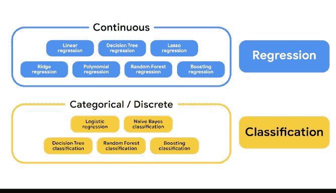

# 006：分类特征与分类模型 🧠

在本节课中，我们将要学习如何根据数据特征选择合适的监督机器学习模型。我们将重点探讨分类特征、离散变量与连续变量的区别，并通过实例理解它们在模型选择中的关键作用。

---

## 变量类型回顾

上一节我们介绍了机器学习的基本概念，本节中我们来看看不同类型的数据变量。理解变量类型是选择正确模型的第一步。

连续变量可以取无限且不可数的值集合。例如，一棵树的高度是连续变量。

分类变量包含有限数量的组别或类别。例如，车辆类型（汽车、摩托车、公交车）是分类变量。

离散变量在任意两个给定值之间具有可数个值。例如，公园中树木的数量是离散变量。

离散变量可以被计数，分类变量可以被分组。例如，房屋的油漆颜色是分类变量，而社区中漆成薰衣草色的房屋数量是离散变量。

---

## 监督学习中的分类变量

回忆监督机器学习的定义：它使用带标签的数据集训练算法，以对结果进行分类或预测。分类变量和离散变量是该定义的一部分。

许多机器学习算法使用将数据输入分为两个或更多组的大型数据集进行训练。了解数据集中的特征类型以及您期望的结果，将帮助您确定最适用的机器学习模型。

---

## 实例分析：毛绒玩具制造

让我们考虑一个来自制造业的例子。假设您是一家毛绒玩具制造商的领先数据科学家。

### 问题一：分类识别

您有一个自动化系统，可以同时填充、缝合和标记毛绒猫和狗。零售商现在要求猫和狗分开销售。工厂经理要求您使用摄像头识别猫和狗，以便自动分离。

基于摄像头图像的猫狗分组算法将使用分类数据作为监督机器学习模型的一部分。算法会问：这是狗还是猫？您将使用视觉数据训练计算机识别和分离传入的狗和猫。

**核心概念**：这是一个二分类问题，模型输出是类别标签（猫/狗）。

### 问题二：数量预测

随后，您被要求构建一个模型来预测运输所有毛绒动物需要多少个集装箱。

这具有离散的目标变量，因为您是在计算集装箱的数量。

**核心概念**：这是一个回归问题（预测数量），但目标变量是离散的。

---

## 机器学习模型地图：分类区域

现在，让我们重新审视我们的机器学习地图，其中新添加了分类区域。您会发现一些新术语。

分类是逻辑回归、决策树分类器、朴素贝叶斯分类器等模型所属的广泛类别。

请注意，决策树、随机森林和提升模型同时出现在连续区域和分类区域中，既作为回归器也作为分类器。

就像任何其他研究领域一样，有些功能和应用无法仅归入一个组。随着您对这些模型理解的加深，它们在两个区域中的位置将更有意义。我们将在课程后面花更多时间讨论这些算法。很快，您将开始构建自己的模型。

---

## 总结

本节课中我们一起学习了：
1.  **连续变量**、**分类变量**和**离散变量**的定义与区别。
2.  分类变量和离散变量在监督机器学习中的核心作用。
3.  如何通过实际问题（如毛绒玩具的分类与计数）理解模型选择。
4.  机器学习模型地图中分类区域的构成，以及一些模型（如决策树）既可处理分类问题也可处理回归问题的特性。

理解数据的本质是选择和应用正确机器学习模型的关键基础。