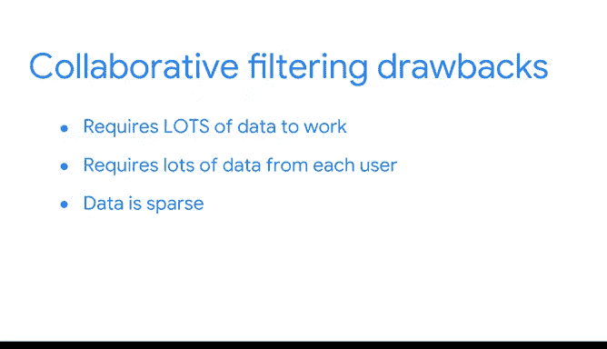

# 007：推荐系统基础 🎯


在本节课中，我们将要学习机器学习中一个非常常见且实用的应用：**推荐系统**。我们将探讨推荐系统如何工作，并深入了解其两种主要类型：基于内容的过滤和协同过滤。

---

## 概述

推荐系统是机器学习算法的一个子类，旨在为用户提供相关的建议。它们通过量化事物之间的相似性，并利用这些信息来推荐密切相关的选项，从而帮助用户更轻松地找到他们可能喜欢的信息、产品或内容。

---

## 推荐系统如何工作

上一节我们介绍了机器学习中不同类型的特征。本节中，我们来看看这些特征如何在一个你可能非常熟悉的模型类型中共同使用。

想象一下，你在流媒体服务上听完一张专辑后，系统自动开始播放一首你从未听过但非常喜欢的新歌。这是如何实现的？答案就是推荐系统。

推荐系统的主要目标是量化一件事物与另一件事物的相似程度，并利用这些信息来推荐一个密切相关的选项。

### 基于内容的过滤

首先，你在音乐流媒体服务上选择了一首歌。当歌曲结束时，服务会播放更多与你最初选择相关的音乐。这就是**基于内容的过滤**的一个例子。

在这种方法中，比较是基于内容本身的属性进行的。系统会将你所播放音乐的属性与其他音乐的属性进行比较，以确定相似性。

要进行这种比较，必须有关于每首歌的数据，这些数据是对其属性的解构。换句话说，歌曲的每一个独特之处都被识别和标记，例如歌手的嗓音类型、节奏或节拍，或者是否以某种乐器为特色。

以下是其工作原理的简化表示：
```python
# 伪代码示例：基于歌曲属性计算相似度
def calculate_similarity(song_a_attributes, song_b_attributes):
    # 比较两个歌曲的属性列表（例如，流派、节奏、情绪）
    similarity_score = compare_attributes(song_a_attributes, song_b_attributes)
    return similarity_score
```

然后，当你搜索一首歌时，基于内容的推荐系统会访问该歌曲及其库中所有其他歌曲的属性列表。最后，系统会使用相同的属性列表对它们进行比较。优秀的歌曲推荐系统会对比数百个属性。

#### 基于内容过滤的优缺点

以下是基于内容过滤的主要优点和缺点：

**优点：**
*   **易于理解**：其逻辑相对直观。
*   **精准推荐**：有助于推荐更多用户喜欢的内容，甚至是少数人感兴趣的利基内容。
*   **独立性**：不需要其他用户的任何信息即可工作。
*   **灵活性**：不仅限于比较物品（如歌曲），还可以将用户和物品映射到同一空间，然后推荐最接近用户典型偏好的内容。

**缺点：**
*   **重复性**：总是推荐更多同类型的内容，可能导致用户无法接触到与他们过去选择不同或全新的内容。
*   **手动工作量大**：通常需要为所有物品手动选择和映射属性，这是一项巨大的工作。
*   **跨类型推荐无效**：由于不同类型的内容不使用相同的特征，因此无法进行跨类型推荐。例如，一本书没有“每分钟节拍数”这个属性，因此同一个流媒体服务无法利用你的歌曲偏好来推荐一本新小说。

### 协同过滤

在音乐流媒体的例子中，你实际上没有对任何内容进行评分。你只是听了播放列表，算法找到了相似的歌曲。然而，在视频流媒体平台上，你可能会对你喜欢的内容进行评分或评论。

推荐系统也可以利用你的反馈来推荐你可能喜欢的其他视频。在这个例子中，你不仅观看了内容，还通过点赞你喜欢的视频主动参与了反馈过程。这种推荐方法的一个缺点是，你可能喜欢关于各种主题的视频，但系统只会利用你的反馈来推荐与你喜欢的视频相似的内容。

另一种基于用户反馈的推荐系统工作原理是**协同过滤**。

当用户通过评分或给予好评来主动表示喜欢某个内容时，就会引发协同过滤。推荐系统将使用协同过滤，基于还有谁喜欢该内容来进行比较，然后向具有相似偏好的其他人推荐视频。

协同过滤与基于内容的过滤不同，因为推荐系统不需要知道关于内容本身的任何信息。唯一重要的是你是否喜欢它。这是一种不同风格的推荐系统。

#### 协同过滤示例：冰淇淋口味

假设我们想知道大卫会喜欢哪种冰淇淋口味。一个协同过滤系统会将他过去喜欢的物品与其他人的喜好进行比较。

因为大卫的喜好与法蒂玛的非常相似，算法会预测他也会喜欢“软糖布朗尼”口味，因为法蒂玛喜欢。

协同过滤的工作原理与物品本身无关。口味不重要，甚至是不是冰淇淋也不重要。它可以是汽车、餐厅或护发产品。唯一重要的是大卫和法蒂玛有相似的品味。

#### 协同过滤的优缺点

以下是协同过滤的主要优点和缺点：

**优点：**
*   **跨类型推荐**：这是协同过滤的主要优势之一。
*   **发现隐藏关联**：能够在数据中发现隐藏的相关性。
*   **无需手动映射**：不需要繁琐的手动属性映射工作。

**缺点：**
*   **冷启动问题**：这些系统需要大量数据才能开始获得有用的结果，并且每个用户都必须向系统提供大量数据。
*   **数据稀疏性**：协同过滤数据通常非常稀疏，这意味着存在大量缺失值。以电影为例，世界上有成千上万部电影，但大多数人只看过其中一小部分。因此，每个人的电影数据中，对于所有他们没看过的电影都会有缺失值。



一个推荐系统需要使用先进的过滤技术来管理所有这些空白空间。

---

## 总结


本节课中，我们一起学习了推荐系统的基础知识。大多数推荐系统都非常复杂，并使用**混合模型**，综合利用了基于内容过滤和协同过滤的元素。但即使在最简单的用例中，也存在不同的需求、资源和策略可供数据专业人员使用。数据专业人员的职责就是推荐最佳的问题解决方法。