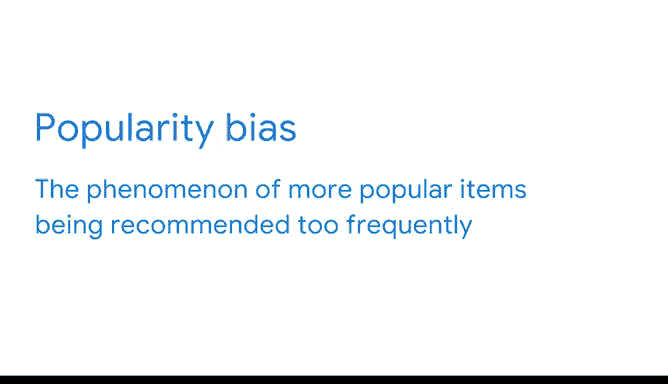
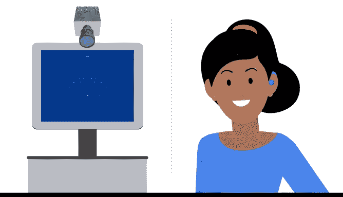
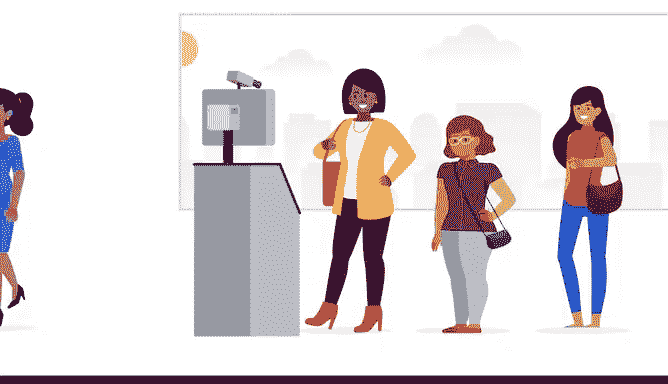
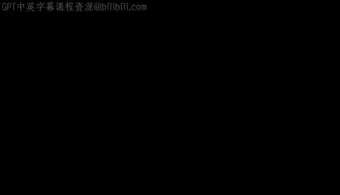

# 008：机器学习中的公平与公正 🧠⚖️

在本节课中，我们将要学习机器学习模型开发中一个至关重要的议题：公平与公正。我们将探讨模型可能产生意外甚至有害后果的原因，并通过一个具体案例理解数据偏见如何影响模型性能。最后，我们会介绍一些在建模过程中减少风险的基本方法。

---

## 推荐算法的局限性与偏见

上一节我们介绍了推荐算法如何帮助用户发现新事物。本节中我们来看看这些算法可能存在的局限性。

最近，你学习了推荐算法，以及它们如何帮助用户发现从新的流媒体音乐到尝试新的护发产品，再到与朋友和家人一起玩的新游戏等各种事物。

这些算法可以非常准确，但也可能出错。例如，推荐工具的一个局限性是流行度偏见问题，即更受欢迎的物品被推荐得过于频繁。这导致大多数其他物品，即可能同样令用户满意的物品，没有得到应有的关注。

---

## 机器学习应用中的风险与责任

随着机器学习变得更加普及，其能力被应用于日益广泛的挑战领域，模型产生意外甚至有害后果的潜力也随之增大。

因此，作为数据专业人士，优先考虑你所拥有和使用的数据的公平性至关重要。这种负责任的数据管理的一部分，是采取措施减少机器学习应用产生意外后果的可能性。

数据专业人士还必须考虑风险。他们可能需要做出可能使企业及其服务对象面临负面后果的决策。认识到存在偏见的可能性将有助于最小化风险。

---

## 机器学习中偏见的隐蔽性

机器学习中的偏见尤其具有欺骗性，因为它源于人类的偏见，但由于是计算机做出预测，结果很容易显得客观。通常，这种偏见是无意的。

让我们考虑一个创建无意中不道德模型的例子。

假设你正在构建一个面部识别模型，作为某太阳镜零售商服务的一部分进行部署。为了生成面部模板数据库，你招募办公室的人进行面部扫描。

最终，你获得了数百次扫描，你认为这足以生成所需的模板。你兴奋地测试你的成果，于是请另一个部门的人作为测试组。测试结果超出了你的预期。你甚至将项目开源，以便其他人可以使用并在此基础上进行构建。

---

## 偏见导致的意外后果

但当服务上线后，其表现远不如预期。一个原因可能是你没有考虑到使用该服务的全部人群范围。

如果所有用于生成模板的人年龄都大于30岁，那么该服务可能对年轻人效果不佳。或者，你可能使用了某一性别端远多于另一端的人群。

由于你的工作已向公众发布，其他人现在可能在他们自己的模型中使用你的模板，而没有意识到模板和面部识别模型可能存在问题。

这一切都不是由不良意图引起的。负面后果是训练数据中偏见的结果，而这种偏见又源于数据收集过程中的偏见。具体来说，用于生成模板的面孔没有代表足够广泛的人群。

通过使用这个资料库来构建你的模型，你最终得到了一个存在**数据类别不平衡**的数据集。换句话说，在建模开始之前，输入数据就已经存在偏见了。

---

## 总结与展望

本节课中我们一起学习了机器学习中公平与公正的重要性。这只是一个例子，说明了机器学习解决方案如何可能带来与公平和公正相关的意外后果。

在本课程后续内容中，你将学习到其他例子。你还将学习到在建模过程的每个步骤中可以提出的一些基本问题，以帮助降低模型造成伤害的风险。