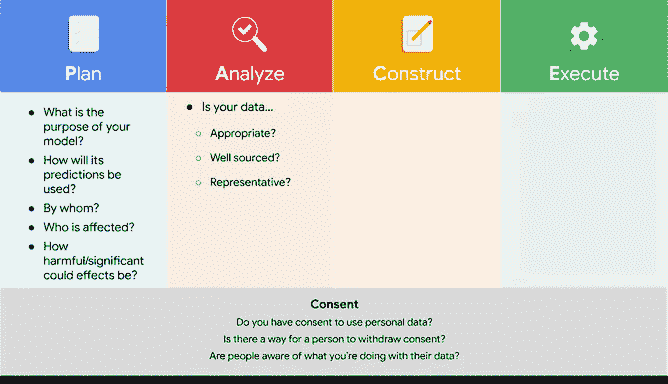
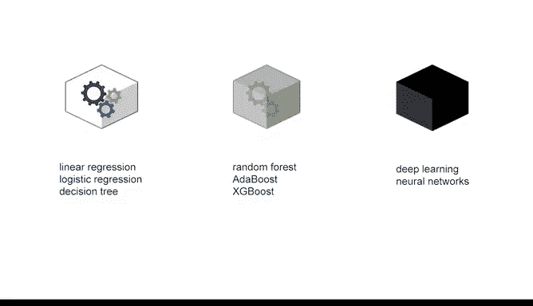
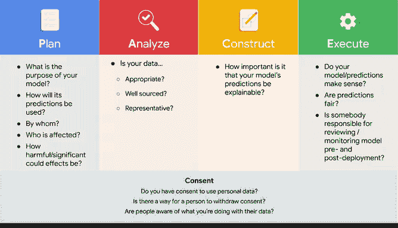

# 009：构建伦理模型 🧠⚖️

在本节课中，我们将要学习如何构建一个符合伦理的机器学习模型。预测模型是机器学习的核心，具有巨大的潜力，但同时也伴随着风险。因此，数据专业人员确保其模型符合伦理至关重要。

## 理解伦理模型的意义

首先，我们需要明确“伦理模型”意味着什么。这没有一个简单的指南，因为存在多种应用于不同任务的模型。

无论你处于哪个级别，作为数据专业人员，在解决任何问题时，都可能需要做出具有伦理影响的模型决策。尽管如此，提出有助于你思考模型公平性的问题始终是重要的。

## 模型开发规划阶段的关键问题

以下是你在模型开发规划阶段应该提出的一些问题。

*   **模型目的**：模型的预期目的是什么？其预测将如何被使用？由谁使用？
*   **影响范围**：谁会受到模型的影响？这些影响可能有多严重？
*   **数据与同意**：如果你的模型使用个人信息，这些人是否同意你收集和使用这些数据？他们是否有权撤回同意？他们是否知晓你如何使用他们的信息？

## 分析数据阶段的伦理考量

上一节我们介绍了规划阶段的问题，本节中我们来看看分析数据时需要考虑的伦理问题。这一步也伴随着一系列问题。

你必须问自己：你打算用于构建模型的数据是否合适、来源良好且具有代表性。

以贷款预测模型为例，你的贷款数据是否追溯了很多年？如果是，那么历史上被边缘化和受压迫的群体很可能在数据中代表性不足，因为过去的测量可能受到偏见或歧视的影响。

数据科学中有一句俗语：**垃圾进，垃圾出**。如果你的数据存在问题，那么你的预测也会有问题。

## 模型构建与可解释性

在规划了流程并分析了数据之后，就该构建模型并提出更多问题了。

例如，模型的预测是否具有可解释性很重要？对于某些建模方法，可能很难知道预测的来源。这有时被称为**黑箱模型**。

神经网络以难以解释而广为人知，因此，在许多透明度很重要的应用中，它们并不合适。

像**随机森林**、**AdaBoost**和**XGBoost**这样的算法并非完全的黑箱，但可能需要额外的努力来解释和证明其预测的合理性。

在光谱的另一端，**线性回归**和**逻辑回归**方法以及**单决策树**则具有很高的可解释性。

## 执行与部署前的最终检查

当你规划好一切、分析了数据并构建了模型后，在完成执行阶段之前，还有更多问题需要问。

首先，问问自己是否理解你的模型及其预测。它们合理吗？预测公平吗？

评估模型公平性的一种方法是检查模型的误差在人群中的分布情况。如果模型只在某些相似的特定情况下出错，它可能具有更高的伦理风险。

另一个问题是，是否有人被分配了在部署前和部署后审查与监控模型的责任，以确保其性能良好并评估潜在的危害。

最后，确保你在PACE流程的每个阶段都考虑到了同意问题。

## 总结

本节课中我们一起学习了确保模型符合伦理所需考虑的一系列问题。正如你所体会到的，要确保伦理的模型开发，需要提出很多问题。

很少有数据专业人员需要独自回答所有这些问题，但几乎每个数据专业人员都必须回答其中的一部分。因此，重要的是你要始终牢记，在PACE工作流的每个阶段提出正确的问题，有助于确保你的模型既有利于业务，也有利于所有相关方。