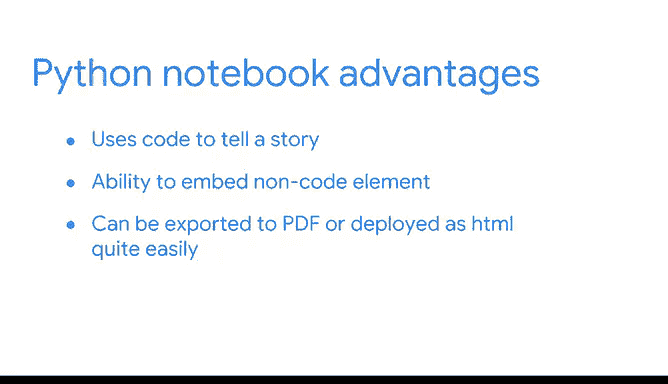

# 010：机器学习中的Python 🐍

在本节课中，我们将要学习数据分析和机器学习中常用的Python工具与文件类型。我们将了解集成开发环境（IDE）、Python脚本和Python笔记本各自的特点、适用场景以及它们如何帮助数据专业人员高效工作。

---

如今，有许多工具和程序可以帮助你进行数据分析并构建机器学习模型。作为一名数据分析专业人员，了解你的数字工具箱中有哪些可用资源，对于处理和解决问题至关重要。

在YouTube，我们需要处理海量数据。我不会每次都重新发明轮子，而是使用其他数据专业人员已经创建的工具和库，来帮助我高效地清洗、验证和可视化数据。在本课程中，你已经应用了其中许多工具。现在，让我们花点时间回顾一下你用过的一些软件、一些你尚未接触的软件，并理清它们在创建Python脚本或程序时的关系。

## 集成开发环境（IDE） 🛠️

在创建任何Python脚本或程序时，开发工作几乎总是在集成开发环境（IDE）中完成的。IDE是一种软件，它提供了一个界面来编写、运行和测试代码。

如果你学习过最初的谷歌数据分析证书课程，你使用过R语言及其配套的IDE——RStudio。虽然可以在任何标准文本编辑器中创建和运行脚本，但IDE提供了许多工具来支持你的代码开发。

在本课程中，你已经使用过一个IDE，可能甚至没有意识到。你一直在Jupyter Notebook界面中编写和执行Python代码。在这种情况下，Jupyter Notebook就是IDE。对于大多数编程语言，开发者都有许多IDE可供选择。它们的功能大体相似，但在具体功能和包含的工具上存在差异。选择哪一个通常取决于你的个人偏好或雇主的偏好。

稍后，你将了解更多关于IDE的知识。但现在，让我们来看看它们各自如何处理不同的Python文件。

## Python文件类型 📄

两种最常见的文件类型是：扩展名为 **`.py`** 的Python脚本，以及扩展名为 **`.ipynb`** 的Python笔记本文件。根据任务的不同，数据专业人员可能会同时使用这两种文件类型，甚至在处理同一个问题时交替使用。尽管这两种文件类型都能执行代码，但它们各有优势。

重要的是要记住，Python不仅仅是一种用于数据科学的语言。它是一种灵活的通用语言，可用于Web开发、自动化、加密等任务。很多时候，你只需要一个Python脚本。

### Python脚本（.py文件）

Python脚本是写在纯文本文件中的Python代码，由计算机执行，无需人工监督。在代码运行时不需要人工检查的情况下，数据专业人员通常更倾向于使用Python脚本。

以下是Python脚本的一些优势：
*   **多文件协作**：当程序包含多个文件时，脚本尤其有用。
*   **调试便利**：当程序中存在许多需要调试的错误时，脚本很有帮助，因为它们可以利用笔记本所不具备的额外功能。

### Python笔记本（.ipynb文件）

然而，Python脚本通常并非数据科学的理想选择。数据分析专业人员，尤其是在进行探索性数据分析（EDA）时，需要使用Python交互式地探索数据集，并近乎实时地查看代码输出。这些结果通常需要与同事共享，并且必须是人类可读的格式。

对于使用代码来讲述故事的数据任务，Python笔记本更为可取。笔记本在将代码与人类可读的描述和输出配对方面非常有用。非代码元素，如图像、链接和普通文本，可以直接嵌入到文件中。它们还具有一些很好的功能优势，例如能够将文件导出为PDF。

## 工具选择与总结 🎯

看起来`.py`文件可能比`.ipynb`文件更受欢迎，但这并不一定正确。Python笔记本只是数据领域中另一个常见的工具，对学习者和行业专业人士都是如此。许多雇主都在寻找有使用现有Python笔记本经验并知道如何创建新笔记本的候选人。

在本课程的这一部分，你将继续使用Jupyter笔记本。然而，你所学的所有代码和概念在标准的`.py`文件中同样适用，如果你遇到需要该文件类型的情况。

Python脚本、笔记本和IDE只是工具箱的一部分。请将它们视为你将在本课程以及作为数据专业人员将要进行的其余项目的基础。选择合适的工具组合将帮助你成功完成任何给定的任务。

---

本节课中，我们一起学习了数据分析和机器学习工作流中Python的核心工具。我们明确了集成开发环境（IDE）的作用，并对比了Python脚本（.py）和Python笔记本（.ipynb）两种文件类型的特点与适用场景。理解这些基础工具，将为你后续高效地进行数据探索、模型构建和协作沟通打下坚实的基础。