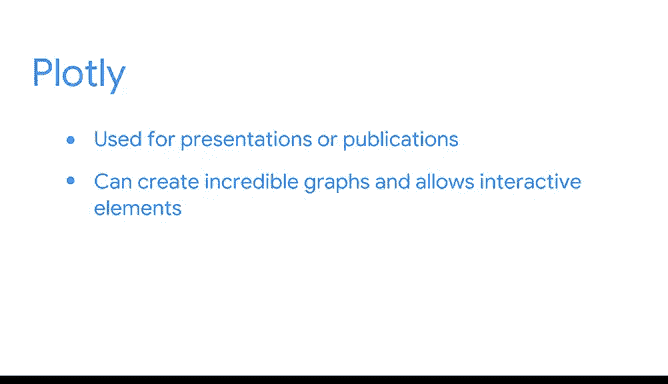

# 012：深入理解Python包 📦

在本节课中，我们将要学习Python包的基础知识。包是Python生态系统的核心，它们提供了大量预构建的功能，能极大地提升我们的工作效率。我们将了解包的分类、常见包的作用以及它们如何协同工作以完成数据分析任务。

---

在本课程中，你已经学习了许多关于Python及其内置函数的知识。你也使用了一些Python包和库进行编程。

Python包是模块的集合，包含了基础Python语言中不一定存在的功能。模块用于以结构化的方式组织函数、类和其他数据。Python中的库就是包的集合。

在本视频中，你将探索一些常见的包，包括它们能做什么以及它们如何协同工作以帮助你完成任务。

---

通常，作为数据专业人士，你会使用三种类型的Python包。它们可以用来完成相同的任务。然而，它们通常存在细微差别，这些差别可能使得某个包在特定情况下更有用。

## 第一类：操作型包 🛠️

操作型包也是你在分析过程中通常会首先使用的包。这类包用于加载、构建和准备数据集以供进一步分析。

当创建一个用于分析的Python文件时，你首先要做的是读取数据。`pandas` 包通常是完成此任务最有用的工具。但 `pandas` 的 `read_csv` 函数（用于将数据读入数据框）只是该包功能的冰山一角。

为了进行高效的分析和建模，你可以使用 `pandas` 包内置的函数。这使得完成任务变得更加容易，包括：
*   初步数据检查
*   数据清洗
*   数据框的合并与连接

其他操作型包，如 `NumPy` 和 `SciPy`，提供了用于高级数学运算的函数。

## 第二类：数据可视化包 📊

有许多不同的包可以帮助你根据项目需求创建完美的图表和图形。虽然最流行的包中都存在简单的绘图函数，但它们之间存在细微差别。你应该尽可能多地熟悉它们。

以下是几个重要的可视化包：

*   **Matplotlib**：通常是Python中基础可视化的首选库。它功能广泛，可能难以精通，但极其强大，允许开发者创建几乎任何他们能想象到的图形。
*   **Seaborn**：另一个专注于统计可视化的包。使用Seaborn创建统计图很简单，但创建其他类型的图表有时不可能或需要付出太多努力。
*   **Plotly**：通常用于演示或出版物，例如为交互式仪表板创建数据可视化。在难以精通这一点上，它与Matplotlib类似，但它可以创建令人惊叹的图形，甚至允许你为可视化添加交互元素。

## 第三类：机器学习包 🤖

本课程中使用的最后一类包是用于机器学习的。`scikit-learn` 是一个机器学习库，它建立在我们已经讨论过的许多包之上。

这个库使你能够构建各种类型的模型，包括监督学习和无监督学习。它还提供了一个很好的界面来分析模型的结果。

---

包极大地扩展了Python的功能，经验丰富的数据专业人士会在工作中使用许多包。随着你对所有这些令人兴奋的工具和功能越来越熟悉，你将为一个成功的数据职业生涯做好更充分的准备。

---

**本节课总结**

本节课我们一起学习了Python包的分类与核心功能。我们了解到：
1.  **操作型包**（如 `pandas`, `NumPy`）用于数据的加载、处理和准备。
2.  **可视化包**（如 `Matplotlib`, `Seaborn`, `Plotly`）用于创建静态或交互式的数据图表。
3.  **机器学习包**（如 `scikit-learn`）提供了构建和分析机器学习模型的工具。

掌握这些包是成为一名高效数据专业人士的关键。