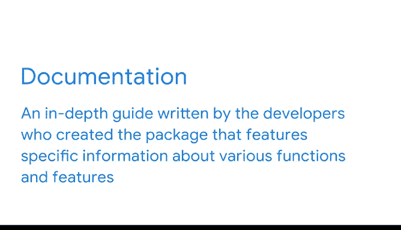

# 013：编程问题解答资源 📚


在本节课中，我们将学习当你在数据分析或编程过程中遇到问题时，如何有效地寻找解决方案。掌握这些资源的使用方法，是每位数据专业人士必备的技能。

---

## 关于数据领域的一个小秘密

数据领域有一个小秘密：几乎没有人能在所有时间都清楚自己在做什么。即使是最有经验的专业人士，也会在代码或数据分析过程中遇到问题，并需要寻找答案。

因此，理解有哪些可用资源能帮助你找到所需解决方案，就显得尤为重要。

---

## 遇到问题时的情景与第一步

让我们设想一个情景：你刚写完一段代码并按下运行按钮，但出现了一个错误。这可能是数据导入方式的问题，也可能是数据准备过程中的某个环节不完全正确。


此时你能做什么？第一步通常是搜索这个错误信息。因为大多数问题都曾被其他开发者遇到过。

---

## 利用错误信息与集成开发环境（IDE）

Python 特别擅长告诉你错误发生在哪里，无论是简单的语法错误还是其他异常。你的集成开发环境（IDE）通常会明确指出问题所在，并附带捕获到错误的确切行号。

你可以将错误输出信息复制下来，并在网上进行搜索。这通常能带来非常有帮助的结果。事实上，你经常会在前几个搜索结果中找到与你完全相同的错误。

**示例代码：**
```python
# 假设你遇到了一个常见的错误，比如未定义变量
print(variable_name)  # 如果 variable_name 未定义，Python会抛出 NameError
```

---

## 核心求助平台：Stack Overflow

如果你在常规搜索中得不到所需的帮助，可以直接在 Stack Overflow 这样的公共平台上搜索。Stack Overflow 是解决编码问题的首选资源，被许多数据专业人士视为编码问答的权威集合。

不仅如此，其社区响应迅速且乐于助人，因此你应该放心地提出自己的问题。

---

## 官方文档的重要性

另一个极好的资源是你正在使用的包或模块的官方文档。文档是由创建该包的开发者编写的深入指南，包含了关于各种函数和特性的具体信息，并且通常附有有用的示例。



**核心概念：** 始终将 `官方文档` 作为理解工具功能的第一手资料。

---

## Kaggle：学习与实践的社区

Kaggle 是许多数据专业人士在其职业生涯中某个阶段会使用的另一个资源。这个在线社区拥有数万个公共数据集，以及提供了如何完成各种分析的示例的 Python 笔记本。

许多刚进入数据科学行业的人使用 Kaggle，因为它提供了学习与实践机器学习技术的教程和数据集。在行业工作多年的数据专业人士也使用 Kaggle 来了解技术的新进展，并保持技能的敏锐。

---

## 保持工具更新

当你遇到错误信息或其他编码问题时，最佳实践之一是考虑你的工具是否是最新的。包的更新有时会破坏已有的代码，或改变特定函数的访问和使用方式。

你的代码通常会抛出一个错误来告诉你某个包或软件是否过时，但保持主动更新可以首先预防这些问题。因此，请确保你拥有所有软件和工具的正确版本。

**核心概念：** 定期使用包管理器（如 `pip`）更新你的 Python 包。
```bash
pip install --upgrade package_name
```

---

## 总结与展望

本节课我们一起学习了在编程中遇到问题时可以求助的几种核心资源：从利用错误信息和 IDE 提示，到搜索 Stack Overflow 和查阅官方文档，再到利用 Kaggle 社区进行学习，以及保持工具更新的重要性。

这些资源只是你寻求编程帮助时可以考虑的一部分。你会发现开发者在互联网的各个角落进行协作。你学得越多，自己找到解决方案就会越容易。记住，遇到问题是学习过程中的正常部分，善于利用资源解决问题才是关键。