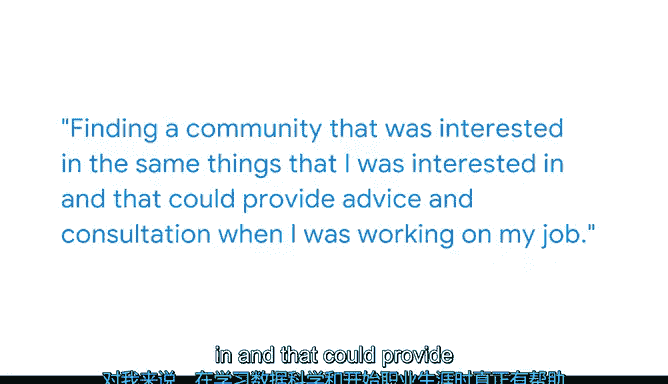

# 015：连接数据专业社区 📚

在本节课中，我们将跟随产品分析师Samantha，了解数据科学从业者如何通过连接专业社区来保持知识更新、解决实际问题并推动职业发展。

## 概述

数据科学是一个快速发展的新兴领域，持续学习并与同行交流至关重要。本节将探讨如何利用线上平台和线下会议，构建你的专业支持网络。

## 社区的价值与参与方式

上一节我们介绍了数据科学的基础概念，本节中我们来看看从业者如何在实际工作中成长。Samantha指出，数据科学领域不断涌现新技术、新语言和新方法。保持与时俱进的最佳方式之一是积极参与专业社区。

以下是几种有效的社区参与途径：

*   **关注社交媒体专家**：在Twitter上关注数据科学家，或浏览Reddit的相关论坛。
*   **阅读专业博客**：关注由公司或个人贡献者维护的数据科学博客。
*   **参与问题讨论**：寻找能与其他数据科学家交流、讨论项目难题的场所。

这些社区资源非常实用，当你需要寻找未曾想到的方法、有用的技术，或是一些教科书里学不到的小技巧时，它们总能提供参考。在日常工作中，Samantha也常会使用社区中其他数据科学家自行开发的代码库，这些资源常能帮助解决一些此前无法处理的难题。

## 线下会议与行业交流

除了线上社区，线下会议也是连接行业网络的重要桥梁。数据科学传统上是一个学术性很强的领域，有众多学术会议可供参加。

对于业界从业者而言，**开放数据科学会议（Open Data Science Conference）** 是一个绝佳的选择。在那里，你可以遇到来自全球各大公司的分析师、科学家和工程师。大家齐聚一堂，共同学习最新技术、拓展人脉、相互结识。

这是一个结识业内其他数据科学家的宝贵机会，尤其是那些可能没有传统学术背景或不符合招聘启事上典型头衔的从业者。

## 构建支持网络对职业发展的帮助

对Samantha而言，在她学习数据科学和职业起步阶段，找到一群志趣相投、并能提供建议和咨询的社区伙伴，起到了关键作用。

这个支持网络可以提供多方面的帮助：

*   **招聘与求职**：交流数据科学相关的招聘信息和面试经验。
*   **技术问题解答**：协助解决那些在互联网上难以找到答案的编码问题。
*   **项目合作**：寻找伙伴共同完成数据科学项目。

在完成你的第一个数据科学项目时，拥有可以协作的伙伴只会让事情变得更容易。

## 总结

本节课中我们一起学习了数据科学从业者连接专业社区的重要性与方法。通过积极参与线上论坛、关注行业领袖、阅读专业博客以及参加线下会议，你可以建立一个强大的支持网络。这个网络不仅能帮助你保持知识更新、解决技术难题，还能为你的职业发展和项目合作提供宝贵的资源与人脉。记住，在快速变化的数据科学领域，你永远不是独自前行。