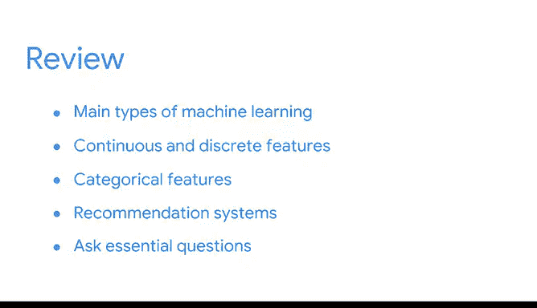

# 016：《机器学习的基础知识》课程总结 🎯

在本节课中，我们将回顾并总结《机器学习的基础知识》这一模块的核心内容。我们已经学习了许多新的、复杂的概念，现在是时候巩固一下了。

---

## 回顾学习历程 📚

首先，让我们花点时间回顾一下我们已经走过的路程。我们涵盖了不少新的、复杂的概念。

以下是本模块中我们学习到的核心知识点：

*   **机器学习的类型**：我们识别并区分了机器学习的主要类型，包括**监督学习**、**无监督学习**、**强化学习**和**深度学习**。
*   **特征的类型**：我们讨论了**连续特征**与**离散特征**的区别。同时，我们也学习了**分类特征**，它是离散特征的一个有限集合。
*   **推荐系统概述**：我们概述了推荐系统，以及它们如何用于从音乐到冰淇淋口味等各种内容的推荐。你现在已经熟悉了推荐系统的工作原理。
*   **推荐系统方法**：你能够识别**基于内容的过滤**与**协同过滤**之间的区别，以及它们各自的优点和缺点。
*   **数据责任**：最后，我们学习了为什么成为负责任的数据管理者很重要，以及如何在模型开发的每一步提出关键问题。

---

## 伦理考量与影响 🤔

通过思考伦理影响，你学会了如何减少模型可能导致的意外或有害后果。所有这些概念和技能对于成为一名数据专业人士至关重要。

---

## 展望未来 🚀

掌握这些知识对你继续本课程的学习将特别有帮助。在接下来的课程中，你将：
*   选择机器学习模型。
*   学习衡量模型的方法。
*   使用Python构建模型。

这些重要的技能将使你能够成为一名**数据驱动的故事讲述者**，无论你在哪里工作，都能成为推动变革的强大影响者。

---

## 总结 ✨

本节课中，我们一起学习了机器学习的基础分类、不同类型的数据特征、推荐系统的基本原理与两种主要方法，以及数据科学实践中的伦理责任。这些构成了你迈向数据科学领域的坚实基石。

恭喜你完成本模块的学习！我们下一部分课程再见。