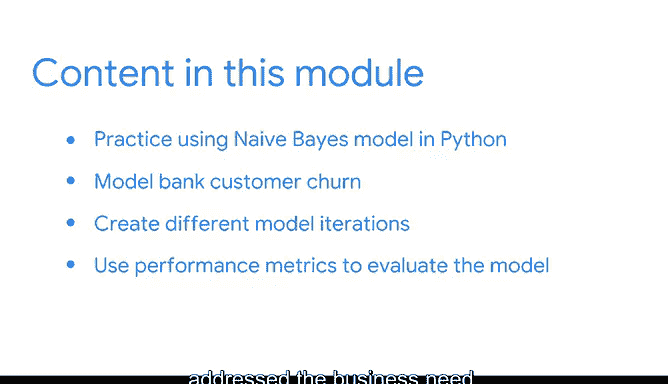

# 018：机器学习中的节奏 🎯

在本节课中，我们将学习如何运用PACE工作流程来构建有效的机器学习模型。PACE代表计划、分析、构建和执行四个阶段，它能帮助数据专业人员将数据和模型与业务需求对齐。我们将通过一个预测银行客户流失率的实例，全面理解数据、进行特征工程、处理类别不平衡问题，并使用朴素贝叶斯模型进行建模与评估。

---

## 回顾PACE工作流程 📋

上一节我们介绍了机器学习的基本概念，本节中我们来看看构建模型的具体节奏——PACE工作流程。

PACE由四个阶段组成：
*   **P**lan（计划）
*   **A**nalyze（分析）
*   **C**onstruct（构建）
*   **E**xecute（执行）

PACE工作流程能指导数据专业人员采取步骤，确保我们的数据和模型与业务需求保持一致。

---

## 应用PACE：预测客户流失 🏦

我们将使用PACE框架来更全面地理解数据，并为建模做好准备。这包括运用特征工程和处理类别不平衡的技术。

接下来，我们将使用Python中的一种监督学习模型——朴素贝叶斯进行实践。目标是建立银行客户流失率模型，以预测客户是否会关闭其银行账户。在此语境下，**流失率**是指在一定时间内客户停止与公司业务往来的比率。为了持续改进，我们将创建不同的模型迭代版本。

最后，我们将使用性能指标来评估模型在多大程度上成功地解决了业务需求。

---

## 工作流程的价值与总结 ✅

使用PACE工作流程不仅为解决问题提供了良好的基线，还能帮助数据专业人员在整个过程中保持专注。

通过应用和参考这个框架，你将掌握在职业生涯中处理数据驱动问题的技能。

本节课中我们一起学习了PACE工作流程及其在构建机器学习模型中的应用。我们从计划阶段开始，经历了数据分析和准备，实践了朴素贝叶斯模型的构建，并最终通过评估来验证模型对业务需求的满足程度。掌握这一节奏，是高效解决实际数据科学问题的关键。