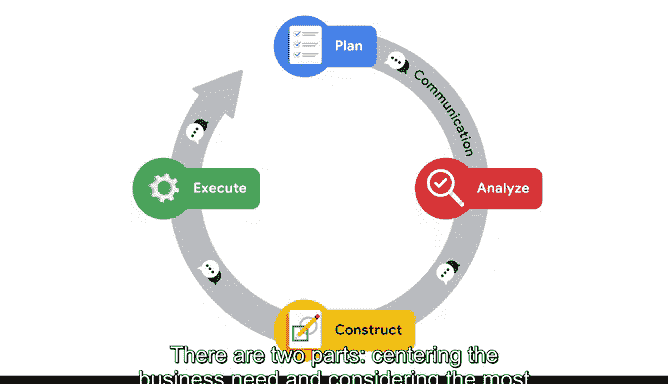

# 019：规划机器学习项目 📋

在本节课中，我们将学习如何规划一个机器学习项目。这是PACE工作流程的第一步，其核心是围绕业务需求进行规划，并选择最合适的机器学习模型。我们将通过一个预测房价的实例来具体说明这一过程。

---

## 规划阶段：围绕业务需求

上一节我们介绍了PACE工作流程，本节中我们来看看其第一步——规划阶段。规划阶段的核心是确保你的机器学习项目与业务目标保持一致。

使用PACE工作流程时，必须确保你的计划与业务团队和数据团队的目标一致。这意味着你计划构建的机器学习模型需要满足实际的业务需求。这一点看似显而易见，但考虑到问题的潜在复杂性，最终产出很可能涉及多个部门的协作。在进入模型构建的其他流程之前，你还必须考虑你可用的数据。

请记住，你通常是为公司或组织构建模型。因此，你需要确保在PACE的其他阶段（如分析、构建和评估）中，你的数据建模、指标和优化策略始终聚焦于你在规划阶段制定的目标。

---

## 规划阶段：选择机器学习模型

在明确了业务需求之后，规划阶段的第二部分是根据业务需求的背景和要求，考虑哪种类型的机器学习模型最适合解决当前问题。

以下是选择模型时需要考虑的关键因素：
*   **问题类型**：明确是分类、回归还是聚类问题。
*   **数据性质**：数据是带标签的（监督学习）还是无标签的（无监督学习）。
*   **输出目标**：需要的是离散类别、连续数值还是数据分组。

让我们通过一个例子来具体探索。假设你在金融行业工作，你的公司正试图预测房价。你拥有某个地区房屋的大量数据集。这个数据集包含了房屋的信息，例如面积、卧室和浴室的数量以及地理位置。最重要的是，数据集中还包含每栋房屋最近的售价。

基于你对机器学习模型的了解，你需要创建一个**监督学习、连续模型**来获得所需的数值结果。对于这个预测房价的例子，回归模型是唯一能帮助你达成目标的模型类型。

**回归模型**的核心公式可以简化为寻找一个函数 `f`，使得：
`预测房价 = f(面积， 卧室数量， 浴室数量， 地理位置， ...)`

---

## 总结与过渡

本节课中，我们一起学习了机器学习项目规划阶段的两个核心部分：首先是围绕业务需求进行规划并确保跨团队对齐，其次是基于业务问题选择最合适的机器学习模型类型。

现在，你已经为业务问题制定了计划，并明确了机器学习模型的范围，接下来就可以准备进入PACE工作流程的下一步：**分析（Analyze）**。我们下节课再见。