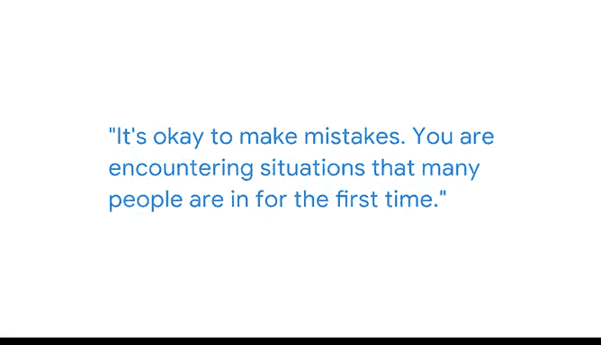

# 020：从错误中学习 📚

在本节课中，我们将跟随Waymo的数据科学经理Ganesh，学习他在进行A/B测试时遇到的一个具体挑战，以及如何通过分析问题根源并调整策略来克服它。我们将重点理解在数据科学实践中，从错误中学习并避免重复犯错的重要性。

## 背景介绍

我是Ganesh，是Waymo的数据科学团队经理。Waymo是Alphabet旗下的自动驾驶汽车公司，我们的目标是实现驾驶自动化，让用户能够随时随地召唤车辆并前往目的地。

我管理的团队主要目标是寻找优化和改进Waymo日常流程的机会。每天都是新的挑战，因为今天处理的问题可能与明天的完全不同。我们团队的一项重要职责是为Waymo运行实验。

## 实验设计与挑战

每当有人考虑进行流程变更或推出新功能时，我们就会运行实验，也就是通常所说的A/B测试，以确定这个变更是否真正有益，是否按预期工作，以及我们将从这些变更中获得什么影响。

有一次，我们正在进行一项A/B测试，以衡量某个流程改进带来的效果。

*   **对照组**：执行旧流程。
*   **实验组**：执行新流程。

我们预期这个新流程会带来巨大的改进，因为我们非常确信。我们进行了一些演示，并认为新流程明显优于旧流程。

## 意料之外的结果

然而，当我们启动测试后，并没有发生任何显著的变化。我们等待了一段时间，结果依然如故。

这令人感到棘手，因为许多项目经理和产品经理都为此投入了大量精力。

## 深入调查与发现

我们进行了一些实地研究，去探究问题出在哪里。

我们发现，用户已经**非常习惯于旧流程**，以至于他们**完全不愿意尝试新流程**。他们又回到了旧的工作方式。这就是我们的测试没有达到预期的原因。

## 关键教训与策略调整

这对我们来说是一个重要的学习时刻，对我个人而言尤其如此，因为这是启动A/B测试的一个重要环节。

正是在那时，我意识到，**不应该让现有用户或客户来尝试流程变更**。最好使用**新用户**来测试这些新流程。

*   **原因**：新用户没有使用习惯的包袱，能提供**无偏见的反馈**，从而可以**真实衡量新流程的影响**。

试想，如果问题没有得到解决，我们可能会错误地认为新流程不好，从而放弃一个真正对公司有益的项目。因此，解决这个问题、找出根源，确保我们没有放弃它，并最终推出了对公司真正重要的东西。

## 总结与心态建议

犯错是可以接受的。你遇到的很多情况，对许多人来说可能都是第一次。所以，**寻求帮助是可以的，犯错也是可以的**。

但关键在于，我们**不应该一次又一次地重复同样的错误**。

因此，保持这种**尝试、实践、学习的心态**，是任何数据科学家都必须具备的最重要的素质。