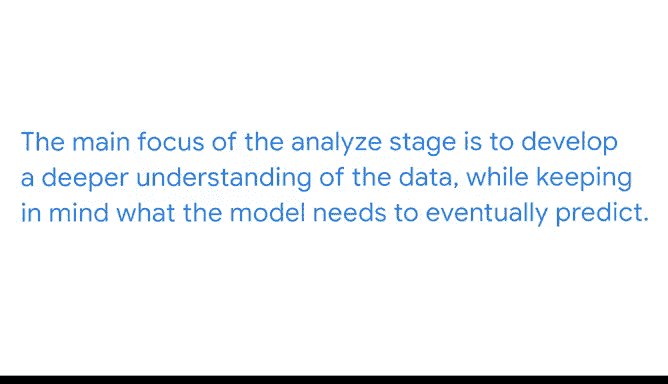

# 021：为机器学习模型分析数据 📊

在本节课中，我们将学习PACE框架中的“分析”阶段。我们将探讨如何为机器学习模型准备和分析数据，重点关注理解响应变量和预测变量，并初步了解特征工程的概念。

---

在上一节中，我们探讨了PACE框架的“计划”阶段。现在，您已经完成了初步规划，是时候进入PACE的“分析”阶段了。

在计划阶段，将业务需求作为核心焦点至关重要。这一原则在开发机器学习模型的整个过程中也同样重要。业务需求告知数据专业人员模型需要产出什么，其结果指明了需要何种类型的模型。业务需求还告知数据专业人员，需要哪些数据来训练模型以达到预期结果。

分析阶段的主要重点是更深入地理解数据，同时始终牢记模型最终需要预测什么。

例如，如果您正在创建一个监督学习模型，您首先需要知道您的模型试图预测什么。换句话说，您需要理解您的**响应变量**。您在本课程前面决定使用哪种类型的监督学习模型时已经做过这件事：是连续型还是分类型。

让我们以天气为例。如果您需要预测精确的降水量，您可能会选择连续型模型。但如果业务需要一个能够预测是雨天、阴天还是晴天的模型，那就需要一个分类型模型。

通常，作为一名数据专业人员，您的数据可能不会完全按照您需要的方式结构化。这时，您可以利用之前学到的许多探索性数据分析原则。您将使用迄今为止学到的所有技术，来了解您拥有哪些可用数据以及它们的结构如何。

让我们回到预测降水量的连续型模型例子。在您的数据集中，记录的降雨量可能不是所需的精确单位，或者数据可能在雨、雪和其他类型的降水之间分开。这些都是数据专业人员在构建模型本身之前需要分析的细节。

对于预测雨天、阴天还是晴天的分类型模型例子，您的数据集可能没有标注您需要的类别。数据集中的各个日子可能只标注了云量指标，这是您必须更改才能有效分析结果的内容。

在牢固理解了响应变量是什么以及它们的结构之后，下一步是探索您的**预测变量**。理解数据集中变量之间存在的关联对于构建能产生有价值结果的模型至关重要。

与响应变量类似，预测变量可能不是您想要的格式或样式。在这些情况下，同样的考虑因素适用。您需要在构建模型之前确定您希望数据如何结构化。

这种仔细考虑您拥有的变量和您需要什么的流程，将引导我们进入分析阶段的下一部分：特征工程。接下来，您将学习特征工程、可用的各种技术、在哪些场景中使用它们，以及它们能为您的数据做什么。

---

本节课中，我们一起学习了机器学习模型开发中“分析”阶段的核心任务。我们明确了理解业务需求对定义响应变量和模型类型的重要性，并探讨了如何检查和处理响应变量与预测变量的数据格式。最后，我们引入了特征工程的概念，为下一阶段的学习做好了准备。