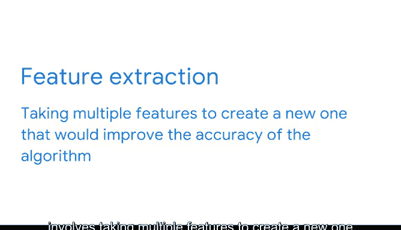

# 022：特征工程入门 🛠️

在本节课中，我们将要学习特征工程的基础知识。特征工程是数据分析阶段的核心环节，它通过选择、转换或提取原始数据的特征，为构建高性能的机器学习模型奠定基础。

---

## 概述

上一节我们介绍了分析阶段的主要目标是深入理解数据。仔细考虑已有的变量和所需的信息，会自然引导我们进入分析阶段的下一部分：特征工程。特征工程技术旨在解决数据结构化的问题，如果执行得当，可以显著提升模型的性能。本节视频将详细介绍特征工程的概念、工作原理及其应用场景。

---

## 什么是特征工程？

特征工程是运用实践、统计学和数据科学知识，从原始数据中选择、转换或提取特征、属性和特性的过程。这个定义包含几个关键点。首先，特征工程的过程高度依赖于你正在处理的数据类型。

在我们深入探讨之前，先看一些例子。之前，我们学习过连续型和分类型特征（或变量）。请记住：
*   **连续型变量**是通过测量获得的变量，因此可以取无限且不可数的一系列值。
*   **分类型变量**则包含有限数量的组别、类别或可数的数值。

特征工程的过程，就是改变和调整这些变量，最终目标是将其用于训练模型。这通常是一个具有挑战性的过程。工作中使用的数据集有时需要多轮探索性数据分析和特征工程，才能将所有数据调整到适合训练模型的格式。

这个过程突显了PACE框架对数据专业人员如此有益的一个原因。分析阶段直接建立在计划阶段之上，或者更简单地说，计划指导着你的分析方式。如果没有战略上一致的商业和技术计划，分析阶段和特征工程过程就像试图在没有蓝图的情况下建造摩天大楼。

---

## 特征工程的三大类别

特征工程主要分为三大类：**特征选择**、**特征转换**和**特征提取**。以下是关于这些类别的详细介绍。

### 1. 特征选择

这类特征工程的目标是选择数据中对预测响应变量贡献最大的特征。换句话说，就是剔除那些对做出预测没有帮助的特征。这可以手动完成，也可以通过算法实现。

我们用一个简单的天气数据集作为例子。它包含五个不同的变量和14个数据点。最右边的变量代表基于其他数据，你是否愿意在外面踢足球。

在我们的例子中，外面是否刮风可能不会影响我们踢足球的决定。如果是这种情况，那么我们会选择`outlook`、`temperature`和`humidity`，并从数据集中剔除`windy`。特征选择意味着选择对做出预测最有帮助的变量。

### 2. 特征转换

在特征转换中，数据专业人员获取数据集中的原始数据，并创建适合建模的特征。这个过程通过修改现有特征来完成，目的是在训练模型时提高准确性。

在我们的天气数据集例子中，你的数据可能包含精确的温度值，但你可能只需要一个指示天气是热、冷还是温和的特征。为了实现这种转换，你可以为数据定义一些分界点，并从数值数据中创建一个新的分类特征。

例如，你可以定义：
*   任何高于**80华氏度**为“热”。
*   任何低于**70华氏度**为“冷”。
*   两者之间的任何温度为“温和”。

特征转换意味着将度数转换为你定义的温度类别。

### 3. 特征提取

这类特征工程涉及组合多个特征以创建一个新的特征，从而提高算法的准确性。

例如，假设我们想创建一个名为`muggy`的新变量，用于模拟我们是否踢足球。如果温度温暖且湿度高，变量`muggy`将为真。如果温度或湿度任一较低，则`muggy`为假。

---

## 特征工程的重要性

请记住，特征工程技术旨在提高模型的性能。虽然你可以通过调整和优化模型来获得很多改进，但最稳定、最显著的性能提升往往来自于将变量开发成最适合模型的格式。

在我的工作中，这通常表现为需要将结果变量变为二元的。例如，我们可能会获得用户从一星到五星的评分，但我们需要预测某条内容是“好”还是“坏”。在这种情况下，我们需要通过将星级评分映射到“好”或“坏”的标签来改变我们的响应变量。这是数据专业人员在分析阶段更好地理解其数据的一个例子。

在探索性数据分析期间，你只是开始对数据形成初步理解。特征工程则是超越探索性数据分析的一步：你正在为机器学习模型的构建，从数据集中选择、提取或转换变量或特征。

---

## 总结

本节课中，我们一起学习了特征工程的基础概念。我们了解到特征工程是分析阶段的关键步骤，包括特征选择、转换和提取三大类。它的核心目标是通过优化数据的结构和表示，为机器学习模型提供更有效的输入，从而提升模型性能。现在你对特征工程的概念有了更好的理解，已经准备好在未来使用Python进行自己的特征工程实践了。