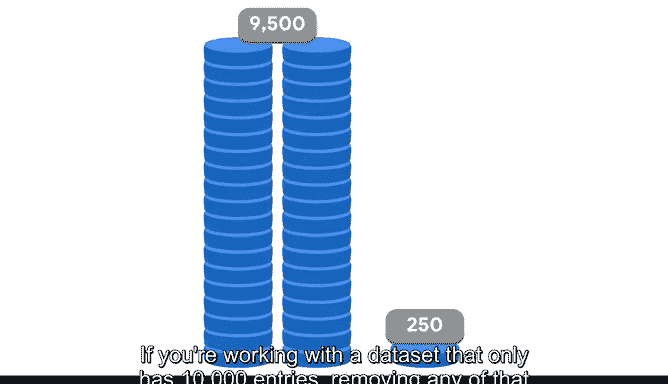

# 023：解决类别不平衡问题 🎯

在本节课中，我们将要学习机器学习中一个常见且重要的问题：**类别不平衡**。当数据集中某个类别的样本数量远多于另一个类别时，就会发生类别不平衡，这可能导致模型预测出现偏差。我们将探讨其定义、影响以及两种核心的解决技术：**上采样**和**下采样**。

## 理解类别不平衡 ⚖️

上一节我们介绍了数据分析阶段需要理解变量及其结构。本节中我们来看看分类问题中另一个关键方面：**响应变量的频率分布**。

作为数据专业人员，你可能会遇到响应变量分布不均的数据集。一个典型的例子是欺诈检测：你可能拥有数百万条非欺诈交易记录，但只有几千条真正的欺诈交易记录。在这种情况下，如何构建一个能够有效检测欺诈的模型呢？

这个问题被称为**类别不平衡**。类别不平衡是指数据集的预测变量中，一个结果类别的实例数量远多于另一个结果类别。实例数量多的类别称为**多数类**，而实例数量少的类别称为**少数类**。

一个数据集的结果类别完美地按50/50分割是极其罕见的，通常都存在某种程度的不平衡。然而，这不一定是个问题。信不信由你，70/30或80/20的分割比例通常是可以接受的。只有当多数类占数据集的90%或更多时，才会出现重大问题。通常，只有在模型构建完成后，你才能知道是否存在不平衡问题。

## 解决不平衡的技术：上采样与下采样 🔧

为了解决潜在的类别不平衡问题，主要有两种技术：**上采样**和**下采样**。这两种技术都涉及以某种方式调整数据，在消除不平衡的同时，尽可能保留数据中的信息。

### 下采样 📉

下采样涉及通过使用更少的原始数据集来调整多数类，以产生更均匀的分割。多数类的条目数量减少，从而带来更好的平衡。

以下是实现下采样的常见方法：
*   **随机下采样**：随机选择多数类中的条目进行移除。
*   **公式化下采样**：例如，计算多数类中两个数据点的平均值，移除这两个原始数据点，并添加这个平均数据点。

### 上采样 📈

上采样与下采样相反。它不是减少多数类的频率，而是人为地增加少数类的频率。与下采样类似，也有多种实现方式。

以下是实现上采样的常见方法：
*   **随机过采样**：随机复制少数类中的数据点，并将其添加回数据集。
*   **合成采样**：使用数学技术（如SMOTE）生成非完全相同的合成样本，然后将它们添加到数据集中。

## 如何选择：上采样还是下采样？ 🤔

既然上采样和下采样都能达到平衡类别的结果，你可能会想知道该使用哪一种。大多数时候，在构建模型并观察其性能之前，你无法确定哪种方法更优。不过，有一些通用规则可以参考。

*   **下采样**通常在处理**极大型数据集**时更有效。如果你有一个包含1亿个数据点但存在类别不平衡的数据集，你并不需要全部数据来构建一个好模型，也肯定不需要通过上采样产生的额外数据。
*   **上采样**在处理**小型数据集**时可能更好。如果你处理的数据集只有10,000个条目，减少任何数据都极有可能对模型性能产生负面影响。

请记住，类别平衡是一个微妙的过程，可能需要一些试错。通过使用上采样数据和下采样数据分别构建模型，可以确定在特定情况下哪种技术更优。

此外，你还需要试验重新平衡后达到的分割比例。将数据平衡到50/50的分割并不总是最优的。另一方面，将99/1的分割变为70/30的分割可能就足够了。这是在模型开发过程中需要考虑的因素。

## 总结 📝

本节课中，我们一起学习了机器学习中的**类别不平衡问题**。我们了解到，当多数类占比过高（如超过90%）时，会严重影响模型性能。为了解决这个问题，我们介绍了两种核心方法：**下采样**（减少多数类样本）和**上采样**（增加少数类样本）。选择哪种方法取决于数据集的大小，通常需要通过实验来确定最佳方案以及最合适的类别平衡比例。掌握这些技术，将帮助你构建出在真实不平衡数据上表现更稳健的机器学习模型。