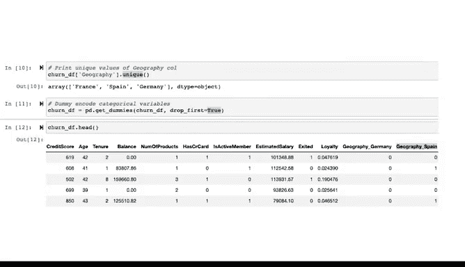

# 024：特征工程与类别平衡 🛠️⚖️


在本节课中，我们将学习如何使用Python完成PACE框架中“分析”阶段的收尾工作。我们将通过一个银行客户流失预测的案例，实践特征工程的核心步骤，为后续的模型构建打下坚实基础。

## 概述

在“分析”阶段，我们的目标是深入理解数据，并对其进行预处理，使其适用于模型训练。之后，我们将进入PACE工作流程的“构建”阶段。在本课程接下来的部分，我们将构建多个模型来预测银行的客户流失情况。

客户流失是一个商业术语，用于描述停止使用产品或服务、或完全终止与公司业务往来的客户数量和比率。我们将构建的是**监督分类模型**，因为它们预测的是一个分类目标变量。在本案例中，这是一个**二元分类**问题：预测每位客户是流失了还是留下来了。

## 数据准备与导入

在开始处理数据之前，我们需要导入必要的工具包。由于我们目前仅进行建模前的数据准备，因此只需要NumPy和pandas。

```python
import numpy as np
import pandas as pd
```

现在，我们将从一个CSV文件中读取数据集到一个pandas DataFrame中，并将其命名为`df_original`，然后使用`head`函数查看其内容。

```python
df_original = pd.read_csv('bank_data.csv')
df_original.head()
```

我们用于解决此问题的数据包含客户信息，其中数据中的每个条目代表一位客户。对于每位客户，有多个特征描述其与银行的关系以及财务状况。此外，还有每位客户的元数据，如姓名、性别和客户识别号。

其中两个可能不那么直观的特征是：
*   **`tenure`**：代表客户使用该银行的年数。
*   **`geography`**：标识客户居住的国家。

此外，我们有一个标记为 **`Exited`** 的特征。这表示客户是否离开了银行：`1`表示他们终止了与银行的业务，`0`表示他们仍然是客户。变量`Exited`将作为**响应变量**，即我们的模型将要尝试预测的变量。

## 特征工程流程

在建模时，最佳实践是在开始特征工程和特征选择之前，对数据进行严格的检查。这个过程很重要，因为它不仅能帮助你理解数据在告诉你什么、没有告诉你什么，还能为你提供创建新特征的线索。

你已经学习了探索性数据分析的基础知识，因此本教程将跳过建模过程中的这一关键部分。但请记住，一个优秀的数据科学项目总会包含EDA。

首先，让我们快速浏览一下数据，使用`info`函数来检查DataFrame。

```python
df_original.info()
```

从输出表中，我们可以确认数据有14个特征和10,000个观测值。我们还知道有9个特征是整数类型，2个是浮点数类型，3个是字符串类型。最后，我们可以判断没有空值，因为共有10,000个观测值，且每列都有10,000个非空值。

接下来，我们将准备这个数据集，使其可用于训练模型。

### 特征选择

我们要做的第一件事是**特征选择**。回想一下，这是挑选出我们希望模型用来预测结果的特征，并丢弃对模型无用的特征的过程。

在我们的银行数据中，请注意第一列名为`RowNumber`。这只是对行的编号。由于行号本身不应与我们的响应变量有任何内在相关性，因此我们将从数据集中删除此特征。

`CustomerId`和`Surname`列也是如此。`CustomerId`似乎是出于管理目的分配给客户的编号，`Surname`是客户的姓氏。我们将删除这两列。

在进行特征选择时，请牢记课程早期学到的伦理考量，考虑你的数据及由此产生的模型可能带来的影响。例如，在本建模练习中，我们将不包含`Gender`列。这个数据特征引发了一系列复杂的技术、文化和伦理问题。我们认识到，最严谨的方法是分别包含和不包含此特征进行建模，并检查它如何影响预测。

无论采用何种方法，都应以实现公平结果为目标。针对我们这个特定用例，我们将通过调用DataFrame的`drop`函数来删除这些列。

```python
churn_df = df_original.drop(['RowNumber', 'CustomerId', 'Surname', 'Gender'], axis=1)
churn_df.head()
```

我们将要删除的列名列表传递给该函数，并通过设置`axis=1`来表明我们删除的是列而不是行。我们将结果赋值给一个名为`churn_df`的新DataFrame。调用`head`方法可以显示结果DataFrame。

然而，在开始训练模型之前，我们还有更多工作要做。

### 特征提取

接下来，让我们实践**特征提取**。这是获取两个或多个特征并用它们创建一个全新特征的过程，目的是使模型更准确。

通常，特征提取会使用统计分析每个变量的预测能力，并判断提取的新特征是否比原始变量本身更具预测性。目前，我们将作为一个示例来提取一个特征，而不进行我们在尝试构建生产就绪模型时通常会执行的分析。

让我们创建一个名为`Loyalty`的新变量。我们将通过取客户的`tenure`（使用年限）除以其`age`（年龄）来实现。

```python
churn_df['Loyalty'] = churn_df['tenure'] / churn_df['Age']
churn_df.head()
```

使用`tenure`除以客户`age`背后的逻辑是，它代表了客户人生中作为该银行客户的时间百分比。百分比更高的人可能是更忠诚的客户。现在，我们有了一个名为`Loyalty`的新列，可以通过检查DataFrame来验证。

### 特征转换

这个数据集中有一些特征需要进行**转换**。请记住，特征转换是改变单个特征在数据集中表示方式的过程，目的是提高模型的准确性。

许多分类模型要求你将分类特征转换为数值形式。我们的数据中有一个名为`Geography`的分类特征。让我们通过对该序列使用`unique`函数来检查此特征的数据中有多少个类别。

```python
churn_df['Geography'].unique()
```

有三个唯一值：`France`、`Spain`和`Germany`。

让我们对这部分数据进行编码，使其可以用布尔特征表示。我们将使用一个名为`get_dummies`的pandas函数来实现。

```python
# 对‘Geography’列进行独热编码，并删除第一列以避免多重共线性
geography_encoded = pd.get_dummies(churn_df['Geography'], drop_first=True)
# 将编码后的列连接到原DataFrame，并删除原始的‘Geography’列
churn_df = pd.concat([churn_df.drop('Geography', axis=1), geography_encoded], axis=1)
churn_df.head()
```

当我们对此特征调用`pd.get_dummies`时，它将用三个新的布尔列替换`Geography`列，每一列对应原始列中包含的一个可能类别。

当我们在函数调用中指定`drop_first=True`时，意味着它将用两列而不是三列来替换`Geography`列。我们可以这样做是因为没有信息丢失，并且数据集更短、更简单。

在这种情况下，我们最终得到两个名为`Geography_Germany`和`Geography_Spain`的新列。我们不需要`Geography_France`列。为什么？因为如果客户在`Geography_Germany`和`Geography_Spain`列上的值都是`0`，我们就知道他们来自法国。

## 总结



本节课中，我们一起学习了PACE框架“分析”阶段的收尾工作。我们通过一个银行客户流失预测的案例，系统性地实践了特征工程的三个核心步骤：**特征选择**、**特征提取**和**特征转换**。我们移除了不相关或存在伦理问题的特征，创建了可能提升模型表现的新特征（如`Loyalty`），并将分类变量（如`Geography`）转换为适合机器学习模型的数值格式。

完成这些步骤后，我们的数据集已经为建模做好了准备。在接下来的“构建”和“执行”阶段，我们将使用这个处理好的数据集进行大部分建模工作。你现在已经为PACE框架的后续阶段奠定了坚实的基础。