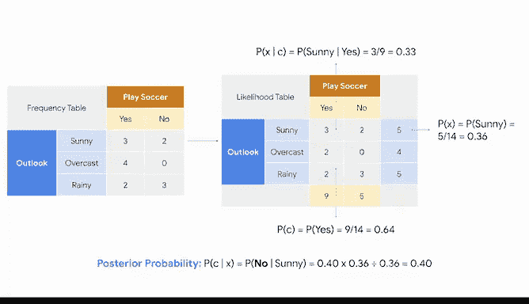

# 025：朴素贝叶斯入门 🧠


在本节课中，我们将学习朴素贝叶斯分类器的基础知识。这是一种基于贝叶斯定理的监督学习分类技术，其核心假设是特征之间相互独立。我们将通过一个简单的天气预测示例，一步步理解其工作原理。

---

## 概述

上一节我们介绍了特征工程，将数据转换为适合训练的格式。本节中，我们将进入构建阶段，学习如何构建一个名为“朴素贝叶斯”的模型。这是一种基于贝叶斯定理的分类方法，它假设所有预测变量（特征）之间相互独立。

---

## 贝叶斯定理与后验概率

朴素贝叶斯的核心是贝叶斯定理。该定理提供了一种计算**后验概率**的方法，即在考虑新信息后，某个事件发生的可能性。换句话说，当你计算某事发生的概率时，你会将相关的观察结果纳入考量。

后验概率可以用以下公式表示：

```
P(C|X) = [P(X|C) * P(C)] / P(X)
```

其中：
*   **`P(C|X)`** 是给定特征 `X` 时，类别 `C` 的后验概率。
*   **`P(X|C)`** 是给定类别 `C` 时，特征 `X` 的概率（似然）。
*   **`P(C)`** 是类别 `C` 的先验概率。
*   **`P(X)`** 是特征 `X` 的先验概率。

当模型使用多个预测变量时，后验概率公式可以展开。例如，对于两个特征 `X1` 和 `X2`，公式近似为：

```
P(C|X1, X2) ∝ P(X1|C) * P(X2|C) * P(C)
```

这看起来有些复杂，接下来我们通过一个具体例子来理解。

---

## 应用示例：天气与足球赛

为了更好地理解，让我们回到之前视频中讨论过的基于天气的例子，并应用朴素贝叶斯。

这个天气数据集将帮助你构建一个模型，以决定是否外出踢足球。数据集包含五列：前四列是预测变量（特征），最后一列是数据集的标签（目标），显示我们是否应该踢足球。

以下是数据特征：
*   **Outlook**：天气是雨天、阴天还是晴天。
*   **Humidity**：相对湿度。
*   **Windy**：是否有风。

我们的目标是预测“Play”这个标签（是或否）。

### 计算后验概率的步骤

我们将以“Outlook”变量为例，计算其中一个特征的后验概率。

**第一步：构建频率表**
为每个属性（例如，Outlook 的“Sunny”）针对目标（Play）构建一个频率表，统计在给定属性下踢球和不踢球的次数。

**第二步：转换为似然表**
将频率表转换为似然表，计算每个属性下踢球和不踢球的概率。这为我们提供了公式中的 `P(X|C)`。

**第三步：计算所需概率**
使用这些信息，我们可以找到：
*   预测变量给定类别的概率 `P(X|C)`。
*   类别的先验概率 `P(C)`。
*   预测变量的先验概率 `P(X)`。

有了这些值，我们就可以代入贝叶斯公式计算后验概率 `P(C|X)`。

> 提示：如果需要，可以暂停并回顾视频中的计算细节。

### 进行预测

我们需要为每一个可能被预测的类别计算后验概率。在这个例子中，只有两个结果：“Play”或“Don‘t Play”。

一旦找到这些值，预测就基于具有**最高后验概率**的类别做出。

例如，计算后发现，在晴天（Sunny）条件下，“Play”的后验概率高于“Don‘t Play”的后验概率。因此，如果外面是晴天，朴素贝叶斯模型会预测条件适合踢足球。

---

## 扩展到多个预测变量

稍后，你将探索如何使用多个预测变量来进行预测。无论使用多少个变量，所有核心概念都适用。



朴素贝叶斯通过计算后验概率，并基于概率最高的结果进行预测。处理多个变量时，只需在似然计算中考虑所有特征的条件概率乘积。

---

## 总结

本节课中，我们一起学习了朴素贝叶斯分类器的基础。我们了解了其背后的贝叶斯定理公式，并通过一个天气预测的实例，逐步演示了如何从数据中计算频率表、似然，最终得到后验概率并做出分类决策。记住，其“朴素”之处在于假设特征相互独立，这简化了计算，并在许多实际应用中表现良好。